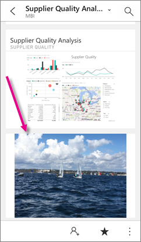

<properties 
   pageTitle="Crear iconos de imagen con la aplicación de iPhone"
   description="Puede agregar cualquier imagen en su iPhone a cualquier panel que posee en la aplicación móvil de Power BI para iOS. Obtenga información acerca de cómo."
   services="powerbi" 
   documentationCenter="" 
   authors="maggiesMSFT" 
   manager="mblythe" 
   backup=""
   editor=""
   tags=""
   qualityFocus="no"
   qualityDate=""/>
 
<tags
   ms.service="powerbi"
   ms.devlang="NA"
   ms.topic="article"
   ms.tgt_pltfrm="NA"
   ms.workload="powerbi"
   ms.date="10/03/2016"
   ms.author="maggies"/>

# Crear iconos de imagen con la aplicación de iPhone (Power BI para iOS)

Puede agregar cualquier imagen en su iPhone a cualquier panel que posee en la aplicación móvil de Power BI para iOS. Power BI agrega la imagen como el último mosaico en el panel, en su iPhone y lo agrega a la esquina inferior derecha del panel en el servicio Power BI. Todos los usuarios que puede ver el panel pueden ver la imagen en el panel. En el servicio Power BI, puede moverlo desde cualquier lugar que desee en el panel.

## Crear un icono de imagen

1.  Abrir un [panel en la aplicación de iPhone](powerbi-mobile-dashboards-in-the-iphone-app.md). Debe tener permisos de edición para este panel.

2.  Puntee en el botón de puntos suspensivos para abrir el menú del panel.

    

3.  Puntee en **Agregar un mosaico de la imagen**.

    

4.  Permitir que Power BI tener acceso a la cámara o la rotación. 

4.  Seleccione una imagen en el álbum de cámara o tomar una nueva imagen.

    

5.  Escriba un título, si desea uno y puntee **Agregar**.

6.  Puede tardar un poco de tiempo para cargar la imagen. Puede continuar explorando los otros paneles e informes en Power BI mientras espera.

6.  Verá una notificación de que la imagen está lista. Puntee en la notificación para ir al panel. Desplácese hasta el final del panel para ver la imagen. 

     

Iconos de imagen actúan igual que otros iconos en su iPhone. Puede:  

 - Abrir en modo de enfoque.
 - 
            [Anotar y compartirlos](powerbi-mobile-annotate-and-share-a-tile-from-the-iphone-app.md) en correo electrónico. 

### Consulte también

- [Introducción a la aplicación de iPhone para Power BI](powerbi-mobile-iphone-app-get-started.md)
- [Introducción a Power BI](powerbi-service-get-started.md)
- ¿Tiene preguntas? [Pruebe a formular a la Comunidad de Power BI](http://community.powerbi.com/)
