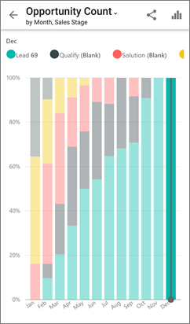

<properties
   pageTitle="Analizar un código QR de Power BI desde tu teléfono Android"
   description="Códigos QR en Power BI pueden conectarse a cualquier cosa en el mundo real directamente a la información relacionada de BI en la aplicación móvil de Power BI, ninguna búsqueda necesitada."
   services="powerbi"
   documentationCenter=""
   authors="maggiesMSFT"
   manager="mblythe"
   backup=""
   editor=""
   tags=""
   qualityFocus="no"
   qualityDate=""/>

<tags
   ms.service="powerbi"
   ms.devlang="NA"
   ms.topic="article"
   ms.tgt_pltfrm="NA"
   ms.workload="powerbi"
   ms.date="10/03/2016"
   ms.author="maggies"/>

# Analizar un código QR de Power BI desde tu teléfono Android

Códigos QR en Power BI pueden conectarse a cualquier elemento en el mundo real directamente a la información relacionada de BI & #151; ninguna exploración o la búsqueda necesitado.

Digamos que tiene un colega [crea un código QR en el servicio Power BI](powerbi-service-qr-code-for-tile.md) para un informe o un icono en un panel, comparte el panel o informe con usted y coloca el código QR en una ubicación de la clave & #151; por ejemplo, en un correo electrónico o en un elemento específico. 

Puede analizar el código QR para un acceso inmediato en el icono correspondiente, directamente desde su teléfono Android, con el escáner en la aplicación Power BI o cualquier otro escáner instalado en su teléfono Android.

## Examinar un código QR de Power BI con el analizador de Power BI

1. En la aplicación móvil de Power BI, abrir el botón de navegación global  en la parte superior izquierda. 

2. Desplácese hacia abajo hasta **QR escáner**  y selecciónelo. 

3. Si la cámara no está habilitada, debe aprobar la aplicación Power BI para usar la cámara. Se trata de una aprobación única. 

4. Seleccione el escáner en el código QR de Power BI. 

    

5. El icono se abre automáticamente en Power BI.

    

## Examinar un código QR desde un escáner externo en su teléfono Android

1. Desde cualquier escáner instalado en su teléfono Android, seleccione el escáner al código QR de Power BI pertinente para un acceso inmediato en el mosaico. 

2. Si no tiene instalada la aplicación de Power BI, se le redirigirá a [Google Play descargarlo](http://go.microsoft.com/fwlink/?LinkID=544867). 

### Consulte también

- [Crear un código QR para un mosaico en Power BI](powerbi-service-qr-code-for-tile.md)
- [Iconos de panel en Power BI](powerbi-service-dashboard-tiles.md)
- [Introducción a la aplicación Power BI para Android](powerbi-mobile-android-app-get-started.md)
- ¿Tiene preguntas? [Pruebe a formular a la Comunidad de Power BI](http://community.powerbi.com/)
