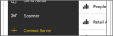
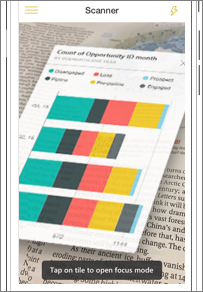

<properties
   pageTitle="Examinar un código QR de BI de energía en su iPhone"
   description="Códigos QR en Power BI pueden conectarse a cualquier cosa en el mundo real directamente a la información relacionada de BI en la aplicación móvil de Power BI, ninguna búsqueda necesitada."
   services="powerbi"
   documentationCenter=""
   authors="maggiesMSFT"
   manager="mblythe"
   backup=""
   editor=""
   tags=""
   qualityFocus="no"
   qualityDate=""/>

<tags
   ms.service="powerbi"
   ms.devlang="NA"
   ms.topic="article"
   ms.tgt_pltfrm="NA"
   ms.workload="powerbi"
   ms.date="10/03/2016"
   ms.author="maggies"/>

# Examinar un código QR de BI de energía en su iPhone

Códigos QR en Power BI pueden conectarse a cualquier elemento en el mundo real directamente a la información relacionada de BI & #151; ninguna exploración o la búsqueda necesitado.

Digamos que tiene un colega [crea un código QR en el servicio Power BI](powerbi-service-qr-code-for-tile.md) para un informe o un icono en un panel, comparte el panel o informe con usted y coloca el código QR en una ubicación de la clave & #151; por ejemplo, en un correo electrónico o en un elemento específico. 

Puede analizar el código QR para un acceso inmediato al mosaico correspondiente o el informe, directamente desde el teléfono, mediante el analizador en la aplicación de Power BI o cualquier otro escáner instalado en su teléfono.

## Examinar un código QR de Power BI con el analizador de Power BI

1. En la aplicación móvil de Power BI, abra el menú de navegación global  en la parte superior izquierda. 

2. Desplácese hacia abajo hasta **Analizador** y selecciónelo. 

    

3. Si la cámara no está habilitada, debe aprobar la aplicación Power BI para usar la cámara. Se trata de una aprobación única. 

4. Seleccione el escáner en el código QR de Power BI. 

    

5. El mosaico o informe aparece al mantener el mouse sobre el fondo en realidad aumentada.

    

6. Puede pulsar el mosaico para abrirlo en modo de enfoque, o regresar al analizador.

## Examinar un código QR desde un escáner en el teléfono externo

1. Desde cualquier escáner instalado en su teléfono, seleccione el escáner al código QR de Power BI pertinente para un acceso inmediato al mosaico o informe. 

2. Si no tiene instalada la aplicación de Power BI, se le redirigirá a la [Apple App Store descargarlo](http://go.microsoft.com/fwlink/?LinkId=522062) en su iPhone.

### Consulte también

-  
            [Conectarse a los datos de Power BI del mundo real](powerbi-mobile-data-in-real-world-context.md) con las aplicaciones móviles
-  [Crear un código QR para un mosaico en Power BI](powerbi-service-qr-code-for-tile.md)
-  [Crear un código QR para un informe en Power BI](powerbi-service-qr-code-for-report.md)
-  [Iconos de panel en Power BI](powerbi-service-dashboard-tiles.md)
-  [Paneles de Power BI](powerbi-service-dashboards.md)
-  ¿Tiene preguntas? [Pruebe a formular a la Comunidad de Power BI](http://community.powerbi.com/)
