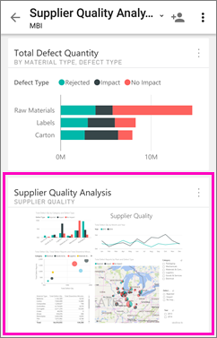

<properties 
   pageTitle="View report page tiles in the Android app"
   description="Read about viewing and interacting with live report tiles in a dashboard in the Power BI mobile app for Android."
   services="powerbi" 
   documentationCenter="" 
   authors="maggiesMSFT" 
   manager="erikre" 
   backup=""
   editor=""
   tags=""
   qualityFocus="no"
   qualityDate=""/>
 
<tags
   ms.service="powerbi"
   ms.devlang="NA"
   ms.topic="article"
   ms.tgt_pltfrm="NA"
   ms.workload="powerbi"
   ms.date="10/14/2016"
   ms.author="maggies"/>

# View report page tiles in the Power BI for Android app

When you <bpt id="p1">[</bpt>create a dashboard<ept id="p1">](powerbi-service-dashboards.md)</ept> in the Power BI service, you add individual visuals from Power BI reports as tiles on the dashboard. You can also <bpt id="p1">[</bpt>pin a whole Power BI report page as a live tile<ept id="p1">](powerbi-service-pin-a-live-tile-to-a-dashboard-from-a-report.md)</ept>. You can view these report tiles in the Power BI app for the Android phone.

1.  When you open a <bpt id="p1">[</bpt>dashboard in the Android app<ept id="p1">](powerbi-mobile-dashboards-in-the-android-app.md)</ept>, you see a small image of the report.

    

2. Tap the tile. The pinned live report page opens in landscape mode. 

    

### Consulte también

- <bpt id="p1">[</bpt>Tiles in the Android app<ept id="p1">](powerbi-mobile-tiles-in-the-android-app.md)</ept>
- Questions? <bpt id="p1">[</bpt>Try asking the Power BI Community<ept id="p1">](http://community.powerbi.com/)</ept>

