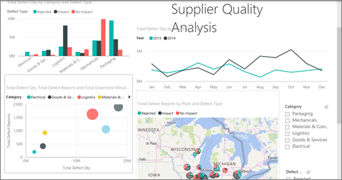

<properties 
   pageTitle="Iconos de página de informe de vista en la aplicación Android"
   description="Lea acerca de cómo ver e interactuar con iconos de informe activo en un panel en la aplicación móvil de Power BI para Android."
   services="powerbi" 
   documentationCenter="" 
   authors="maggiesMSFT" 
   manager="erikre" 
   backup=""
   editor=""
   tags=""
   qualityFocus="no"
   qualityDate=""/>
 
<tags
   ms.service="powerbi"
   ms.devlang="NA"
   ms.topic="article"
   ms.tgt_pltfrm="NA"
   ms.workload="powerbi"
   ms.date="10/14/2016"
   ms.author="maggies"/>

# Ver los iconos de página de informe en la aplicación Power BI para Android

Cuando se [crear un panel](powerbi-service-dashboards.md) en el servicio Power BI, agregar efectos visuales individuales de informes de Power BI como iconos en el panel. También puede [Anclar una página de informe de Power BI completa como un icono dinámico](powerbi-service-pin-a-live-tile-to-a-dashboard-from-a-report.md). Puede ver estos iconos de informe en la aplicación de Power BI para el teléfono Android.

1.  Cuando se abre un [panel en la aplicación Android](powerbi-mobile-dashboards-in-the-android-app.md), verá una pequeña imagen del informe.

    

2. Puntee en el icono. Se abre la página de informe directo anclado en modo horizontal. 

    

### Consulte también

- 
            [Iconos de la aplicación Android](powerbi-mobile-tiles-in-the-android-app.md)
- ¿Tiene preguntas? 
            [Pruebe a formular a la Comunidad de Power BI](http://community.powerbi.com/)

