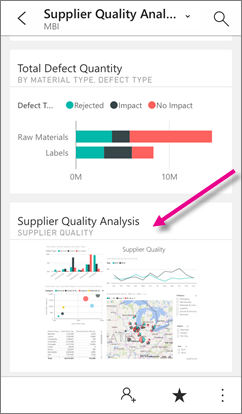
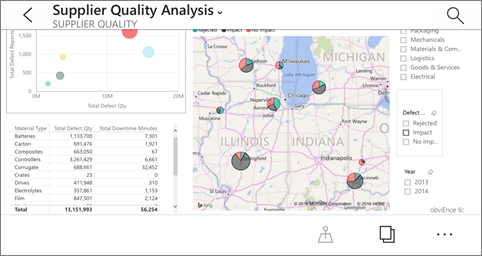
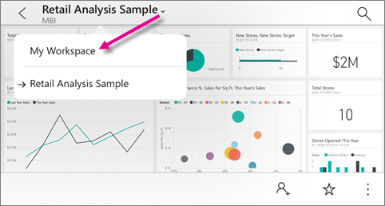

<properties 
   pageTitle="Ver los iconos de página de informe en la aplicación de iPhone"
   description="Lea acerca de cómo ver e interactuar con iconos de informe activo en un panel en la aplicación móvil de Power BI para iOS en su iPhone."
   services="powerbi" 
   documentationCenter="" 
   authors="maggiesMSFT" 
   manager="mblythe" 
   backup=""
   editor=""
   tags=""
   qualityFocus="no"
   qualityDate=""/>
 
<tags
   ms.service="powerbi"
   ms.devlang="NA"
   ms.topic="article"
   ms.tgt_pltfrm="NA"
   ms.workload="powerbi"
   ms.date="10/03/2016"
   ms.author="maggies"/>

# Ver los iconos de página de informe en la aplicación de iPhone (Power BI para iOS)

Cuando se [crear un panel](powerbi-service-dashboards.md) en el servicio Power BI, agregar efectos visuales individuales de informes de Power BI como iconos en el panel. También puede [Anclar una página de informe de Power BI completa como un icono dinámico](powerbi-service-pin-a-live-tile-to-a-dashboard-from-a-report.md). Puede ver estos iconos de informe en la aplicación de Power BI para el iPhone.

1.  Cuando se abre un [panel en la aplicación de iPhone](powerbi-mobile-dashboards-in-the-iphone-app.md), verá una pequeña imagen del informe.

    

2. Puntee en el icono. Abre el informe en la página de informe directo anclado en modo horizontal. 

    

6.  Para volver a la lista de paneles, puntee en la flecha situada junto al título de página de informe y, a continuación, puntee en **Mi área de trabajo**.

    

### Consulte también

- [Iconos de la aplicación de iPhone](powerbi-mobile-tiles-in-the-iphone-app.md)
- [Introducción a la aplicación de iPhone para Power BI](powerbi-mobile-iphone-app-get-started.md)
- [Introducción a Power BI](powerbi-service-get-started.md)
- ¿Tiene preguntas? [Pruebe a formular a la Comunidad de Power BI](http://community.powerbi.com/)