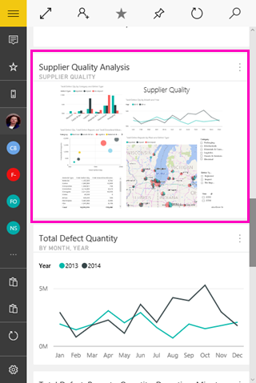

<properties 
   pageTitle="View report page tiles in the Power BI mobile app for Windows 10"
   description="Read about viewing and interacting with live report tiles in a dashboard in the Power BI mobile app for Windows 10."
   services="powerbi" 
   documentationCenter="" 
   authors="maggiesMSFT" 
   manager="erikre" 
   backup=""
   editor=""
   tags=""
   qualityFocus="no"
   qualityDate=""/>
 
<tags
   ms.service="powerbi"
   ms.devlang="NA"
   ms.topic="article"
   ms.tgt_pltfrm="NA"
   ms.workload="powerbi"
   ms.date="10/14/2016"
   ms.author="maggies"/>

# View report page tiles in the Power BI mobile app for Windows 10

When you <bpt id="p1">[</bpt>create a dashboard<ept id="p1">](powerbi-service-dashboards.md)</ept> in the Power BI service, you add individual visuals from Power BI reports as live tiles on the dashboard. You can also <bpt id="p1">[</bpt>pin a whole Power BI report page as a live tile<ept id="p1">](http://blogs.msdn.com/b/powerbi/archive/2015/12/10/power-bi-weekly-service-update-1210.aspx#reportpin)</ept>. You can view these report tiles in the Power BI mobile app for Windows 10.

1.  When you open a <bpt id="p1">[</bpt>dashboard in the Power BI mobile app for Windows 10<ept id="p1">](powerbi-mobile-dashboards-in-the-win10phone-app.md)</ept>, you see a small image of the report.

    

2. Tap the tile. The pinned report page opens in landscape mode. 

    

3.   Tap the back arrow or the back button to close the tile and return to the dashboard.

### Consulte también

- <bpt id="p1">[</bpt>Tiles in the Power BI mobile app for Windows 10<ept id="p1">](powerbi-mobile-tiles-in-the-win10phone-app.md)</ept>
- Questions? <bpt id="p1">[</bpt>Try asking the Power BI Community<ept id="p1">](http://community.powerbi.com/)</ept>

