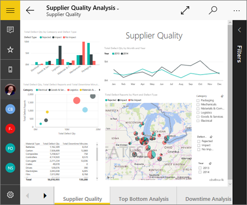

<properties 
   pageTitle="Ver los iconos de página de informe en la aplicación móvil de Power BI para Windows 10"
   description="Lea acerca de cómo ver e interactuar con iconos de informe activo en un panel en la aplicación móvil de Power BI para Windows 10."
   services="powerbi" 
   documentationCenter="" 
   authors="maggiesMSFT" 
   manager="erikre" 
   backup=""
   editor=""
   tags=""
   qualityFocus="no"
   qualityDate=""/>
 
<tags
   ms.service="powerbi"
   ms.devlang="NA"
   ms.topic="article"
   ms.tgt_pltfrm="NA"
   ms.workload="powerbi"
   ms.date="10/14/2016"
   ms.author="maggies"/>

# Ver los iconos de página de informe en la aplicación móvil de Power BI para Windows 10

Cuando se [crear un panel](powerbi-service-dashboards.md) en el servicio Power BI, agregar efectos visuales individuales de los informes de Power BI como iconos dinámicos en el panel. También puede [Anclar una página de informe de Power BI completa como un icono dinámico](http://blogs.msdn.com/b/powerbi/archive/2015/12/10/power-bi-weekly-service-update-1210.aspx#reportpin). Puede ver estos iconos de informe en la aplicación móvil de Power BI para Windows 10.

1.  Cuando se abre un [panel en la aplicación móvil de Power BI para Windows 10](powerbi-mobile-dashboards-in-the-win10phone-app.md), verá una pequeña imagen del informe.

    

2. Puntee en el icono. Se abre la página de informe anclado en modo horizontal. 

    

3.   Puntee en la flecha hacia atrás o en el botón Atrás para el icono de cerrar y volver al panel.

### Consulte también

- 
            [Iconos de la aplicación móvil de Power BI para Windows 10](powerbi-mobile-tiles-in-the-win10phone-app.md)
- ¿Tiene preguntas? 
            [Pruebe a formular a la Comunidad de Power BI](http://community.powerbi.com/)

