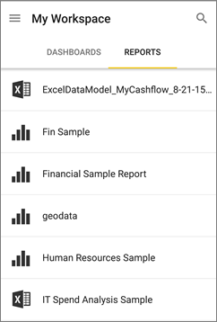
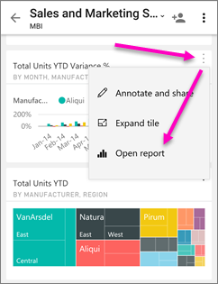

<properties 
   pageTitle="Reports in the Android app"
   description="Learn about viewing reports in the Power BI mobile app for Android phones. You create reports in the Power BI service, then interact with them in the mobile apps."
   services="powerbi" 
   documentationCenter="" 
   authors="maggiesMSFT" 
   manager="erikre" 
   backup=""
   editor=""
   tags=""
   qualityFocus="no"
   qualityDate=""/>
 
<tags
   ms.service="powerbi"
   ms.devlang="NA"
   ms.topic="article"
   ms.tgt_pltfrm="NA"
   ms.workload="powerbi"
   ms.date="10/14/2016"
   ms.author="maggies"/>

# Reports in the Power BI app for Android phones

A report is an interactive view of your data, with visuals representing different findings and insights from that data. You <bpt id="p1">[</bpt>create and customize reports<ept id="p1">](powerbi-service-create-a-new-report.md)</ept> in the Power BI service <bpt id="p2">[</bpt>(https://powerbi.com)<ept id="p2">](https://powerbi.com)</ept>.

Then you view and interact with those reports in the <bpt id="p1">[</bpt>Android app<ept id="p1">](powerbi-mobile-android-app-get-started.md)</ept>.

## Open a Power BI report

- On the main page of the Power BI mobile app, tap Reports, then the report you want to open. 

     

    Here you see the same Power BI reports <ph id="ph1"></ph> and Excel workbooks that you have in the Power BI service.

- On a dashboard, tap the ellipsis (<bpt id="p1">**</bpt>...<ept id="p1">**</ept>) on a tile &gt; <bpt id="p2">**</bpt>Open Report<ept id="p2">**</ept>.

    

    The report opens in landscape mode.

    

     > [AZURE.NOTE]  Not all tiles can open in a report. For example, tiles you create by asking a question in the Q&amp;A box don't open reports when you tap them. 

## See other pages in a Power BI report

-   Swipe from one side or the other, or 

-   Tap the Pages icon <ph id="ph1"></ph> in the lower-right corner, then tap a page name. 

## Cross-filter and highlight a Power BI report page

-   Tap a value in a chart.

    

    Tapping the red "030-Kids" bubble in the bubble chart highlights related values in the other charts. Because the column chart in the upper-right shows percentages, some highlighted values are larger than the total values, and some are smaller. 

## Use slicers to filter the report page

When designing a report in the Power BI service <bpt id="p1">[</bpt>(https://powerbi.com)<ept id="p1">](https://powerbi.com)</ept>, it's good to <bpt id="p2">[</bpt>add slicers to a report page<ept id="p2">](powerbi-service-tutorial-slicers.md)</ept>. Then when you or your colleagues view your reports on your mobile devices, you can use the slicers to filter the page.

-   Select a value in a slicer on the report page.

    

### Consulte también

- <bpt id="p1">[</bpt>Get started with the Android app<ept id="p1">](powerbi-mobile-android-app-get-started.md)</ept>
- Questions? <bpt id="p1">[</bpt>Try asking the Power BI Community<ept id="p1">](http://community.powerbi.com/)</ept>
