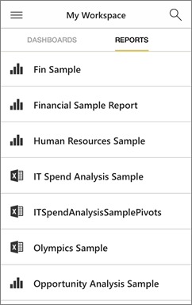
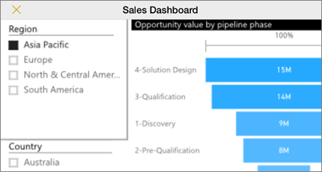

<properties 
   pageTitle="Reports in the iPhone app"
   description="Learn about viewing and interacting with reports in the Power BI mobile app for iOS on your iPhone. Reports present your data visually. "
   services="powerbi" 
   documentationCenter="" 
   authors="maggiesMSFT" 
   manager="mblythe" 
   backup=""
   editor=""
   tags=""
   qualityFocus="no"
   qualityDate=""/>
 
<tags
   ms.service="powerbi"
   ms.devlang="NA"
   ms.topic="article"
   ms.tgt_pltfrm="NA"
   ms.workload="powerbi"
   ms.date="10/03/2016"
   ms.author="maggies"/>

# Reports in the iPhone app (Power BI for iOS)

A report is an interactive view of your data, with visuals representing different findings and insights from that data. You <bpt id="p1">[</bpt>create and customize reports<ept id="p1">](powerbi-service-create-a-new-report.md)</ept> in the Power BI service <bpt id="p2">[</bpt>(https://powerbi.com)<ept id="p2">](https://powerbi.com)</ept>. 

Then you view and interact with those reports in the <bpt id="p1">[</bpt>iPhone app (Power BI for iOS)<ept id="p1">](powerbi-mobile-iphone-app-get-started.md)</ept>.

## Open a Power BI report

-   On your iPhone, in <bpt id="p1">**</bpt>My workspace<ept id="p1">**</ept> or in a group, tap Reports.

    

    You see Power BI reports and Excel workbooks together.

-   Or: On a dashboard, tap a tile to open it in focus mode, then tap the Open Report icon <ph id="ph1"></ph>.

    

The report opens in landscape mode.

><bpt id="p1">**</bpt>Note<ept id="p1">**</ept>: Not all tiles can open in a report. For example, tiles you create by asking a question in the Q&amp;A box don't open reports when you tap them. 

## See other pages in a Power BI report

-   Swipe side to side, or tap the pages icon <ph id="ph1"></ph> &gt; tap a page. 

## Cross-filter and highlight a Power BI report page

-   Tap a value in a chart.

    

    Tapping the red "030-Kids" bubble in the bubble chart highlights related values in the other charts. Because the column chart in the upper-right shows percentages, some highlighted values are larger than the total values, and some are smaller. 

## Use slicers to filter the report page

When designing a report in the Power BI service <bpt id="p1">[</bpt>(https://powerbi.com)<ept id="p1">](https://powerbi.com)</ept>, you can <bpt id="p2">[</bpt>add slicers to a report page<ept id="p2">](powerbi-service-tutorial-slicers.md)</ept>. Then when you or your colleagues view your reports on your mobile devices, you can use the slicers to filter the page.

-   Select a value in a slicer on the report page.

    

## Go back to My Workspace

*   Tap the arrow next to the tile name and tap <bpt id="p1">**</bpt>My Workspace<ept id="p1">**</ept>.

    

### Consulte también

- [Get started with the iPhone app (Power BI for iOS)](powerbi-mobile-iphone-app-get-started.md)
- Questions? [Try asking the Power BI Community](http://community.powerbi.com/)
