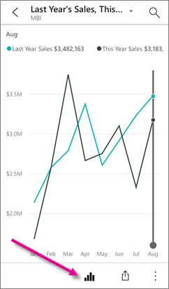
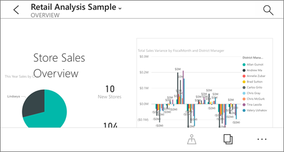

<properties 
   pageTitle="Informes en la aplicación de iPhone"
   description="Obtenga información sobre cómo ver e interactuar con los informes en la aplicación móvil de Power BI para iOS en su iPhone. Los informes presentan los datos visualmente. "
   services="powerbi" 
   documentationCenter="" 
   authors="maggiesMSFT" 
   manager="mblythe" 
   backup=""
   editor=""
   tags=""
   qualityFocus="no"
   qualityDate=""/>
 
<tags
   ms.service="powerbi"
   ms.devlang="NA"
   ms.topic="article"
   ms.tgt_pltfrm="NA"
   ms.workload="powerbi"
   ms.date="10/03/2016"
   ms.author="maggies"/>

# Informes en la aplicación de iPhone (Power BI para iOS)

Un informe es una vista interactiva de los datos, con elementos visuales que representan diferentes resultados e información de esos datos. Se [crear y personalizar informes](powerbi-service-create-a-new-report.md) en el servicio Power BI [(https://powerbi.com)](https://powerbi.com). 

A continuación, puede ver e interactuar con los informes en el [aplicación de iPhone (Power BI para iOS)](powerbi-mobile-iphone-app-get-started.md).

## Abrir un informe de Power BI

-   En su iPhone en **Mi área de trabajo** o en un grupo, puntee en informes.

    

    Ver informes de Power BI y libros de Excel juntos.

-   O bien: En un panel, puntee en un mosaico para abrirlo en modo de enfoque, a continuación, puntee en el icono de abrir el informe .

    

El informe se abre en modo horizontal.

>
            **Nota**: no todos los mosaicos se pueden abrir en un informe. Por ejemplo, los iconos para crear, hacer una pregunta en el cuadro de preguntas y respuestas no abrir informes al puntear en ellos. 

## Vea otras páginas de un informe de Power BI

-   Desplácese hacia los lados o puntee en el icono de páginas  > puntee en una página. 

## Filtro cruzado y resalte una página de informe de Power BI

-   Puntee en un valor en un gráfico.

    

    Punteando en rojos "030-hijos" burbuja en el gráfico de burbujas resalta los valores relacionados en los demás gráficos. Dado que el gráfico de columnas en la superior derecha muestra los porcentajes, algunos valores destacados son más grandes que los valores totales y algunas son más pequeños. 

## Usar segmentaciones de datos para filtrar la página del informe

Al diseñar un informe en el servicio Power BI [(https://powerbi.com)](https://powerbi.com), puede [Agregar segmentaciones de datos a una página de informe](powerbi-service-tutorial-slicers.md). A continuación, cuando usted o sus colegas de visualización de los informes en sus dispositivos móviles, puede utilizar las segmentaciones de datos para filtrar la página.

-   Seleccione un valor en una segmentación de datos en la página del informe.

    

## Volver a mi área de trabajo

*   Puntee en la flecha situada junto al nombre de mosaico y en **Mi área de trabajo**.

    

### Consulte también

- [Introducción a la aplicación de iPhone (Power BI para iOS)](powerbi-mobile-iphone-app-get-started.md)
- ¿Tiene preguntas? [Pruebe a formular a la Comunidad de Power BI](http://community.powerbi.com/)
