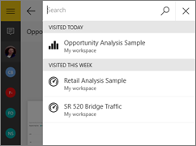
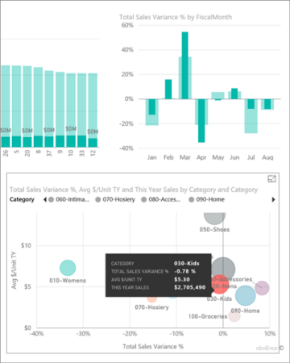

<properties 
   pageTitle="Informes en la aplicación móvil de Power BI para Windows 10"
   description="Obtenga información acerca de cómo ver los informes en la aplicación móvil de Power BI para Windows 10. Crear informes en el servicio Power BI y luego interactuar con ellos en las aplicaciones móviles. "
   services="powerbi" 
   documentationCenter="" 
   authors="maggiesMSFT" 
   manager="erikre" 
   backup=""
   editor=""
   tags=""
   qualityFocus="no"
   qualityDate=""/>
 
<tags
   ms.service="powerbi"
   ms.devlang="NA"
   ms.topic="article"
   ms.tgt_pltfrm="NA"
   ms.workload="powerbi"
   ms.date="10/12/2016"
   ms.author="maggies"/>
# Informes en la aplicación móvil de Power BI para Windows 10

Un informe es una vista interactiva de los datos, con elementos visuales que representan diferentes resultados e información de esos datos. Se [crear y personalizar informes](powerbi-service-create-a-new-report.md) en el servicio Power BI [(https://powerbi.com)](https://powerbi.com).

A continuación, puede ver e interactuar con los informes en el [aplicación móvil de Power BI para Windows 10](powerbi-mobile-win10phone-app-get-started.md).

## Abrir un informe de Power BI

Puede abrir informes en **Mi área de trabajo** o en un grupo en el teléfono de Windows 10 de varias maneras: 

-   Desplácese hacia abajo hasta los informes, o 
-   Puntee en **Ver todo el contenido** > **informes**. 
    
    

-   O pulse el icono de búsqueda  para ver la lista de informes que ha visitado recientemente o para buscar por nombre.

    

    > [AZURE.NOTE]  Si se [importar archivos completos de Excel en Power BI](powerbi-bring-in-whole-excel-files.md), tienen un icono de Excel. Al puntear en la aplicación, que se abran en el [servicio Power BI](https://powerbi.com) en una ventana del explorador.

-   O en un panel, puntee en los puntos suspensivos verticales en el mosaico, puntee en el **informe abierto** icono .

    

    > [AZURE.NOTE]  No todos los mosaicos se pueden abrir en un informe. Por ejemplo, los iconos para crear, hacer una pregunta en el cuadro de preguntas y respuestas no abrir informes al puntear en ellos.   

## Vea otras páginas de un informe de Power BI

-   Puntee en las fichas en la parte inferior de la página. 

## Ordenar un gráfico en un informe de Power BI

> [AZURE.NOTE]  La ordenación no está disponible en los teléfonos Windows 10.

1.  Puntee en el gráfico. 

2.  Puntee en el botón de puntos suspensivos (...) en la esquina superior derecha, puntee el **Ordenar por** flecha y, a continuación, puntee en el nombre del campo.

    

3.  Para invertir el criterio de ordenación, puntee en el **Ordenar por** flecha y, a continuación, puntee en el mismo nombre de campo nuevo. 

## Filtro cruzado y resalte una página de informe de Power BI

-   Puntee en un valor en un gráfico.

    

    Punteando en rojos "030-hijos" burbuja en el gráfico de burbujas resalta los valores relacionados en los demás gráficos. Dado que el gráfico de columnas en la superior derecha muestra los porcentajes, algunos valores destacados son más grandes que los valores totales y algunas son más pequeños. 

## Usar segmentaciones de datos para filtrar la página del informe

Al diseñar un informe en el servicio Power BI [(https://powerbi.com)](https://powerbi.com), puede [Agregar segmentaciones de datos a una página de informe](powerbi-service-tutorial-slicers.md). A continuación, cuando usted o sus colegas de visualización de los informes en sus dispositivos móviles, puede utilizar las segmentaciones de datos para filtrar la página.

-   Seleccione un valor en una segmentación de datos en la página del informe.

    

## Filtrar un informe de Power BI

Siempre puede filtrar elementos visuales individuales en un informe de Power BI con los campos en el propio objeto visual como filtros. También puede filtrar las páginas completas en un informe, si usted o el creador del informe tiene [Agregar filtros a la página](powerbi-service-add-a-filter-to-a-report.md) en el servicio Power BI ([https://powerbi.com](http://powerbi.com/)). En el servicio Power BI, también puede agregar otros campos como filtros para un objeto visual específico. 

> [AZURE.NOTE]  
> 
> - Si no tiene permiso de edición de un informe, puede cambiar los filtros, pero no puede guardar los cambios. 
> - Filtrado de informes no está disponible en los teléfonos Windows 10. Sin embargo, las segmentaciones de datos están disponibles en los teléfonos. Consulte [utilizar segmentaciones de datos para filtrar la página del informe](powerbi-mobile-reports-in-the-windows-app.md#use-slicers-to-filter-the-report-page).

1. En un informe, expanda el panel filtros.

    

    Si el creador del informe se establece filtros de nivel de página, cuando se selecciona un elemento visual verá *filtros de nivel visual* para que visual y *filtros de nivel de página* para toda la página.

    

2. Seleccione las casillas de verificación de los valores que desee.

3. O bien, puede cambiar el modo de filtrado. Puntee en **filtrado básico** y seleccione **filtrado avanzado** para seleccionar valores mediante expresiones en su lugar.

    

    Campos de número ofrecen expresiones como **es menor que**, **es mayor que**, **no**, y **está en blanco**.

       

    Los campos de texto proporcionan expresiones como **contiene**, **no empieza por**, y **no**.

4.  Para agregar otros campos en el panel filtros, vaya al servicio Power BI ([https://powerbi.com](http://powerbi.com/)), [Agregar filtros a la página](powerbi-service-add-a-filter-to-a-report.md), y guarde el informe.

## Explorar e inactivos en un gráfico

En los gráficos con flechas en las esquinas superiores arriba y abajo, puede explorar en profundidad para ver los valores que constituyen una parte del gráfico. Para [Agregar detalles a un objeto visual](powerbi-service-drill-down-in-a-visualization.md), editar el informe en el servicio Power BI ([https://powerbi.com](https://powerbi.com/)).

> [AZURE.NOTE]  Obtención de detalles y no está disponible en los teléfonos Windows 10.

1.   Puntee en la flecha en la esquina superior derecha para activar la exploración en profundidad.
   
    

2.   Puntee una barra, columna u otra parte de un gráfico para profundizar en los detalles de esa parte, en este caso, la columna OH almacena en Ohio.

3.   Para obtener detalles de copia de seguridad, puntee y mantenga o haga clic en el gráfico y puntee en la flecha hacia arriba en la esquina superior derecha.

    

## Volver a mi área de trabajo

-  Puntee en la flecha hacia atrás o puntee en el nombre de informe > **Mi área de trabajo**.

    

### Consulte también

- 
            [Introducción a la aplicación de Power BI para dispositivos Windows 10](powerbi-service-windows-app-get-started.md)
- ¿Tiene preguntas? 
            [Pruebe a formular a la Comunidad de Power BI](http://community.powerbi.com/)

