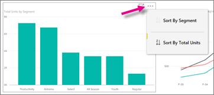
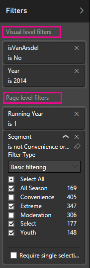
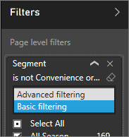

<properties 
   pageTitle="Reports in the Power BI mobile app for Windows 10"
   description="Learn about viewing reports in the Power BI mobile app for Windows 10. You create reports in the Power BI service, then interact with them in the mobile apps. "
   services="powerbi" 
   documentationCenter="" 
   authors="maggiesMSFT" 
   manager="erikre" 
   backup=""
   editor=""
   tags=""
   qualityFocus="no"
   qualityDate=""/>
 
<tags
   ms.service="powerbi"
   ms.devlang="NA"
   ms.topic="article"
   ms.tgt_pltfrm="NA"
   ms.workload="powerbi"
   ms.date="10/12/2016"
   ms.author="maggies"/>
# Reports in the Power BI mobile app for Windows 10

A report is an interactive view of your data, with visuals representing different findings and insights from that data. You <bpt id="p1">[</bpt>create and customize reports<ept id="p1">](powerbi-service-create-a-new-report.md)</ept> in the Power BI service <bpt id="p2">[</bpt>(https://powerbi.com)<ept id="p2">](https://powerbi.com)</ept>.

Then you view and interact with those reports in the <bpt id="p1">[</bpt>Power BI mobile app for Windows 10<ept id="p1">](powerbi-mobile-win10phone-app-get-started.md)</ept>.

## Open a Power BI report

You can open reports in <bpt id="p1">**</bpt>My workspace<ept id="p1">**</ept> or in a group on your Windows 10 phone in several ways: 

-   Scroll down to your reports, or 
-   Tap <bpt id="p1">**</bpt>View all content<ept id="p1">**</ept><ph id="ph1"> &gt; </ph><bpt id="p2">**</bpt>Reports<ept id="p2">**</ept>. 
    
    

-   Or tap the search icon <ph id="ph1"></ph> to see the list of reports you've visited recently or to search for it by name.

    

    > [AZURE.NOTE]  If you <bpt id="p1">[</bpt>import whole Excel files into Power BI<ept id="p1">](powerbi-bring-in-whole-excel-files.md)</ept>, they have an Excel icon. When you tap them in the app, they open in the <bpt id="p1">[</bpt>Power BI service<ept id="p1">](https://powerbi.com)</ept> in a browser window.

-   Or on a dashboard, tap the vertical ellipsis on the tile, then tap the <bpt id="p1">**</bpt>Open Report<ept id="p1">**</ept> icon <ph id="ph1"></ph>.

    

    > [AZURE.NOTE]  Not all tiles can open in a report. For example, tiles you create by asking a question in the Q&amp;A box don't open reports when you tap them.   

## See other pages in a Power BI report

-   Tap the tabs at the bottom of the page. 

## Sort a chart in a Power BI report

> [AZURE.NOTE]  Sorting isn't available on Windows 10 phones.

1.  Tap the chart. 

2.  Tap the ellipsis (...) in the upper-right corner, tap the <bpt id="p1">**</bpt>Sort by<ept id="p1">**</ept> arrow, then tap the field name.

    

3.  To reverse the sort order, tap the <bpt id="p1">**</bpt>Sort by<ept id="p1">**</ept> arrow, then tap the same field name again. 

## Cross-filter and highlight a Power BI report page

-   Tap a value in a chart.

    

    Tapping the red "030-Kids" bubble in the bubble chart highlights related values in the other charts. Because the column chart in the upper-right shows percentages, some highlighted values are larger than the total values, and some are smaller. 

## Use slicers to filter the report page

When designing a report in the Power BI service <bpt id="p1">[</bpt>(https://powerbi.com)<ept id="p1">](https://powerbi.com)</ept>, you can <bpt id="p2">[</bpt>add slicers to a report page<ept id="p2">](powerbi-service-tutorial-slicers.md)</ept>. Then when you or your colleagues view your reports on your mobile devices, you can use the slicers to filter the page.

-   Select a value in a slicer on the report page.

    

## Filter a Power BI report

You can always filter individual visuals in a Power BI report by using the fields in the visual itself as filters. You can also filter whole pages in a report, if you or the report creator has <bpt id="p1">[</bpt>added filters to the page<ept id="p1">](powerbi-service-add-a-filter-to-a-report.md)</ept> in the Power BI service (<bpt id="p2">[</bpt>https://powerbi.com<ept id="p2">](http://powerbi.com/)</ept>). In the Power BI service, you can also add other fields as filters for a specific visual. 

> [AZURE.NOTE]  
> 
> - If you don't have Edit permission for a report, you can change the filters, but you can't save those changes. 
> - Report filtering isn't available on Windows 10 phones. However, slicers are available on phones. See <bpt id="p1">[</bpt>Use slicers to filter the report page<ept id="p1">](powerbi-mobile-reports-in-the-windows-app.md#use-slicers-to-filter-the-report-page)</ept>.

1. In a report, expand the Filters pane.

    

    If the report creator has set page-level filters, when you select a visual you see <bpt id="p1">*</bpt>visual-level filters<ept id="p1">*</ept> for that visual, and <bpt id="p2">*</bpt>page-level filters<ept id="p2">*</ept> for the whole page.

    

2. Select check boxes for the values you want.

3. Or you can switch the filtering mode. Tap <bpt id="p1">**</bpt>Basic filtering<ept id="p1">**</ept> and select <bpt id="p2">**</bpt>Advanced filtering<ept id="p2">**</ept> to select values using expressions instead.

    

    Number fields offer expressions such as <bpt id="p1">**</bpt>is less than<ept id="p1">**</ept>, <bpt id="p2">**</bpt>is greater than<ept id="p2">**</ept>, <bpt id="p3">**</bpt>is not<ept id="p3">**</ept>, and <bpt id="p4">**</bpt>is blank<ept id="p4">**</ept>.

       

    Text fields offer expressions such as <bpt id="p1">**</bpt>contains<ept id="p1">**</ept>, <bpt id="p2">**</bpt>doesn't start with<ept id="p2">**</ept>, and <bpt id="p3">**</bpt>is not<ept id="p3">**</ept>.

4.  To add other fields to the Filters pane, go to the Power BI service (<bpt id="p1">[</bpt>https://powerbi.com<ept id="p1">](http://powerbi.com/)</ept>), <bpt id="p2">[</bpt>add filters to the page<ept id="p2">](powerbi-service-add-a-filter-to-a-report.md)</ept>, and save the report.

## Drill down and up in a chart

In charts with up and down arrows in the upper corners, you can drill down to see the values that make up one part of the chart. To <bpt id="p1">[</bpt>add drill down to a visual<ept id="p1">](powerbi-service-drill-down-in-a-visualization.md)</ept>, edit the report in the Power BI service (<bpt id="p2">[</bpt>https://powerbi.com<ept id="p2">](https://powerbi.com/)</ept>).

> [AZURE.NOTE]  Drill down and up isn't available on Windows 10 phones.

1.   Tap the arrow in the upper-right corner to turn on drill-down.
   
    

2.   Double-tap a bar, column, or other part of a chart to drill into the details for that part — in this case, the OH column for stores in Ohio.

3.   To drill back up, tap and hold or right-click the chart, and tap the up arrow in the upper-right corner.

    

## Go back to My Workspace

-  Tap the back arrow, or tap the report name &gt; <bpt id="p1">**</bpt>My Workspace<ept id="p1">**</ept>.

    

### Consulte también

- <bpt id="p1">[</bpt>Get started with the Power BI app for Windows 10 devices<ept id="p1">](powerbi-service-windows-app-get-started.md)</ept>
- Questions? <bpt id="p1">[</bpt>Try asking the Power BI Community<ept id="p1">](http://community.powerbi.com/)</ept>

