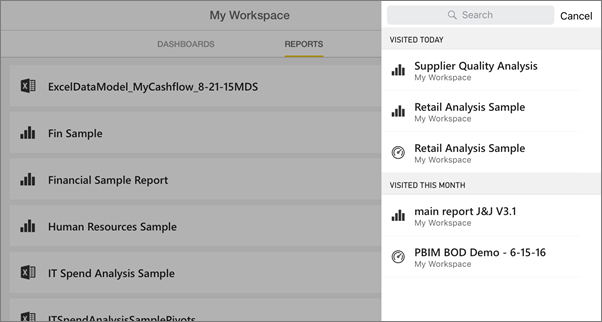
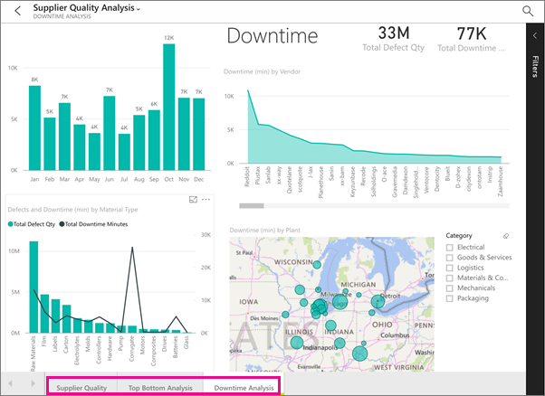
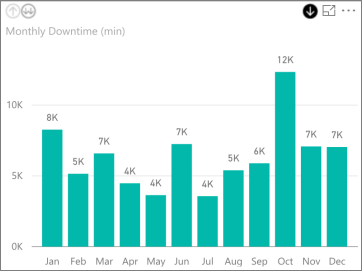
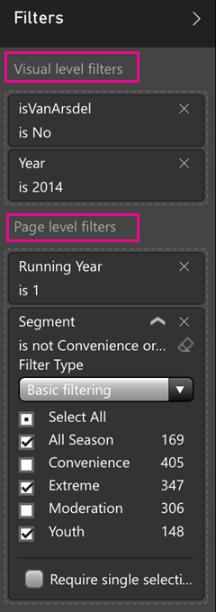

<properties 
   pageTitle="Informes sobre la aplicación de iPad"
   description="Obtenga información acerca de cómo ver los informes en la aplicación móvil de Power BI para iOS en el iPad. Crear informes en el servicio Power BI y luego interactuar con ellos en las aplicaciones móviles."
   services="powerbi" 
   documentationCenter="" 
   authors="maggiesMSFT" 
   manager="erikre" 
   backup=""
   editor=""
   tags=""
   qualityFocus="no"
   qualityDate=""/>
 
<tags
   ms.service="powerbi"
   ms.devlang="NA"
   ms.topic="article"
   ms.tgt_pltfrm="NA"
   ms.workload="powerbi"
   ms.date="10/10/2016"
   ms.author="maggies"/>
# Informes sobre la aplicación de iPad (Power BI para iOS)

Un informe es una vista interactiva de los datos con visualizaciones que representan diferentes resultados e información de esos datos. Se [crear y personalizar informes](powerbi-service-create-a-new-report.md) en el servicio Power BI [(https://powerbi.com)](https://powerbi.com).

A continuación, puede ver e interactuar con informes en el [aplicación de iPad para Microsoft Power BI](http://go.microsoft.com/fwlink/?LinkId=522062) para iOS.

## Abrir informes

-   Puntee en **informes** en la parte superior de **Mi área de trabajo**.

-   O puntee en un mosaico en un panel y pulse el icono de informe .

    > [AZURE.NOTE]  No todos los mosaicos se pueden abrir en un informe. Por ejemplo, mosaicos creados por formulando preguntas con preguntas y respuestas no abrir informes.

-   O pulse el icono de búsqueda  en la esquina superior derecha para buscar por nombre o consulte la lista de informes que ha visitado recientemente.

    

## Vea otras páginas del informe

-   Puntee en las fichas en la parte inferior de la aplicación.

    

## Filtro de entre una página de informe

-   Puntee en una barra o columna de un gráfico.

    

    Al puntear en el **materias primas** columna en el gráfico inferior resalta los valores relacionados en el gráfico superior.

## Ordenar un gráfico

-  Puntee en el gráfico, puntee en el botón de puntos suspensivos (**...**) y puntee en el nombre del campo.

    

-   Para invertir el criterio de ordenación, puntee en el **Ordenar por** flecha y, a continuación, puntee en el mismo nombre de campo nuevo.

## Explorar e inactivos en un gráfico

A veces puede profundizar en los gráficos para ver los valores que constituyen una parte del gráfico. Puede desplazarse hacia arriba y abajo en la aplicación de iPad, pero no se puede agregar a una visualización. Sólo puede [Agregar explore en profundidad hasta una visualización](powerbi-service-drill-down-in-a-visualization.md) en un informe en Power BI. 

> [AZURE.NOTE]  Actualmente, detalle no funciona en los mapas en el iPad.

-   Puntee en un objeto visual. Si tiene una flecha hacia abajo en la esquina superior derecha, a continuación, puede explorar en profundidad. Puntee en la flecha, a continuación, puntee en un valor en el objeto visual & #151; en este caso, el **Oct** columna.

    

-   Para obtener detalles de copia de seguridad, puntee en la flecha hacia arriba en la esquina superior izquierda.

    

## Filtrar un informe de Power BI

Siempre puede filtrar elementos visuales individuales en un informe de Power BI con los campos en el propio objeto visual como filtros. También puede filtrar las páginas completas en un informe, si usted o el creador del informe tiene [Agregar filtros a la página](powerbi-service-add-a-filter-to-a-report.md) en el servicio Power BI ([https://powerbi.com](http://powerbi.com/)). En el servicio Power BI, también puede agregar otros campos como filtros para un objeto visual específico. 

> [AZURE.NOTE]  Si no tiene permiso de edición de un informe, puede cambiar los filtros, pero no puede guardar los cambios. 

1. En un informe, expanda el panel filtros.

    

    Si el creador del informe se establece filtros de nivel de página, cuando se selecciona un elemento visual verá *filtros de nivel visual* para que visual y *filtros de nivel de página* para toda la página.

    

2. Seleccione las casillas de verificación de los valores que desee.

3. O bien, puede cambiar el modo de filtrado. Puntee en **filtrado básico** y seleccione **filtrado avanzado** para seleccionar valores mediante expresiones en su lugar.

    

     Campos de número ofrecen expresiones como **es menor que**, **es mayor que**, **no**, y **está en blanco**.

     Los campos de texto proporcionan expresiones como **contiene**, **no empieza por**, y **no**.

       

4.  Para agregar otros campos en el panel filtros, vaya al servicio Power BI ([https://powerbi.com](http://powerbi.com/)), [Agregar filtros a la página](powerbi-service-add-a-filter-to-a-report.md), y guarde el informe.

## Volver a mi área de trabajo

-  Puntee en la flecha hacia atrás o puntee en el nombre de informe > **Mi área de trabajo**.

    

### Consulte también 

-  
            [Introducción a la aplicación de iPad](powerbi-mobile-iphone-app-get-started.md) para Power BI.
- ¿Tiene preguntas? 
            [Pruebe a formular a la Comunidad de Power BI](http://community.powerbi.com/)

