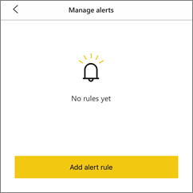
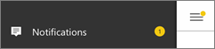

<properties
   pageTitle="Establecer alertas de datos en la aplicación de Power BI para iOS en iPhone y iPad"
   description="Aprenda a configurar alertas para recibir notificaciones cuando cambian los datos en un panel más allá de los límites se configuran en la aplicación móvil de Power BI para iOS y el servicio Power BI."
   services="powerbi"
   documentationCenter=""
   authors="maggiesMSFT"
   manager="mblythe"
   backup=""
   editor=""
   tags=""
   qualityFocus="no"
   qualityDate=""/>

<tags
   ms.service="powerbi"
   ms.devlang="NA"
   ms.topic="article"
   ms.tgt_pltfrm="NA"
   ms.workload="powerbi"
   ms.date="10/10/2016"
   ms.author="maggies"/>

# Establecer alertas de datos en la aplicación de Power BI para iOS en iPhone y iPad

Puede establecer alertas en la aplicación móvil de Power BI en iPhone y iPad y en el servicio Power BI recibir una notificación cuando cambian los datos en un panel más allá de los límites establezca. Funcionan las alertas en los mosaicos que incluye un número único, como las tarjetas y medidores. Puede establecer alertas de datos en su iPhone o iPad y verlos en el servicio Power BI y viceversa. Sólo puede ver las alertas de datos que se establece, aunque compartan un panel o una instantánea de un mosaico.

> [AZURE.WARNING] Notificaciones de alerta controlada por datos proporcionan información acerca de los datos. Si roban el dispositivo, se recomienda pasar al servicio Power BI para desactivar todas las reglas de alertas controlada por datos. 
> 
> Obtenga más información sobre [Administrar alertas de datos en el servicio Power BI](powerbi-service-set-data-alerts.md).

## Establecer una alerta

1.  Puntee en un número o medidor mosaico en un panel para abrirlo en modo de enfoque.  

    

2.  Puntee en el icono de campana  para agregar una alerta.  

3.  Puntee en **Agregar regla de alerta**.

    

4.  Elija esta opción recibir alertas por encima o por debajo de un valor, a continuación, establezca el valor.

    

4.  Decidir si desea recibir cada hora o alertas diarias y si también desea recibir un correo electrónico cuando se recibe la alerta.

    >
            **Nota**: no recibir alertas cada hora o cada día a menos que realmente se actualizan los datos en ese momento.

6.  También puede cambiar el título de la alerta.

6.  Puntee en **Guardar**.

7.  Un solo mosaico puede tener alertas para los valores por encima y por debajo de los umbrales. En **Administrar alertas**, puntee **Agregar regla de alerta**.

    

## Recepción de alertas

Recibir alertas en Power BI [Centro de notificaciones](powerbi-mobile-notification-center.md) en su dispositivo móvil o en el servicio Power BI, junto con las notificaciones de los nuevos paneles que alguien ha compartido con usted.

Orígenes de datos a menudo se establecen para actualizar diariamente, aunque algunos con más frecuencia de actualización. Cuando se actualizan los datos en el panel, si los datos de seguimiento llegan a uno de los umbrales que ha establecido, se realizará varias acciones.

1.  Power BI se comprueba ver si han pasado más de una hora o más de 24 horas (según la opción seleccionada) desde la última alerta se envió.

    Siempre que los datos están más allá del umbral, obtendrá una alerta cada hora o cada 24 horas.

2.  Si ha establecido la alerta para enviar un correo electrónico, encontrará algo parecido a esto en su Bandeja de entrada.

    

3.  Power BI agrega un mensaje a su **Centro de notificaciones** y agrega un nuevo icono de alerta en el mosaico aplicable .

4. Puntee en el botón de navegación global  a [abrir su **Centro de notificaciones**](powerbi-mobile-notification-center.md) y ver los detalles de alerta.

      

>
            **Nota**: las alertas sólo funcionan en los datos que se actualizan. Cuando los datos se actualicen, Power BI busca para ver si se ha configurado una alerta para los datos. Si los datos ha alcanzado un umbral de alerta, se activará una alerta.

## Administrar alertas en su iPhone o iPad

Puede administrar las alertas individuales en el dispositivo móvil o [administrar todas las alertas en el servicio Power BI](powerbi-service-set-data-alerts.md).

1.  En un panel, puntee en un número o medidor mosaico con una alerta.  

    

2.  Puntee en el icono de campana .  

3. Puntee en el nombre de la alerta para editarlo, puntee en el control deslizante para desactivar las alertas de correo electrónico o puntee en el puede de elementos no utilizados para eliminar la alerta.

    

## Sugerencias y solución de problemas
- Las alertas no se admiten actualmente para mosaicos de Bing o iconos de tarjeta con medidas de fecha y hora.
- Las alertas sólo funcionan con datos numéricos.
- Las alertas sólo funcionan en los datos que se actualizan. No funcionan con datos estáticos.

### Consulte también  
- [Administrar las alertas en el servicio Power BI](powerbi-service-set-data-alerts.md)
- [Centro de notificaciones de Power BI Mobile](powerbi-mobile-notification-center.md)
- [Introducción a Power BI](powerbi-service-get-started.md)  
- ¿Tiene preguntas? [Pruebe a formular a la Comunidad de Power BI](http://community.powerbi.com/)
