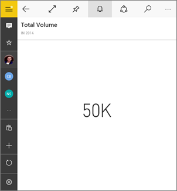
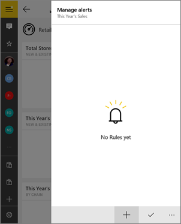
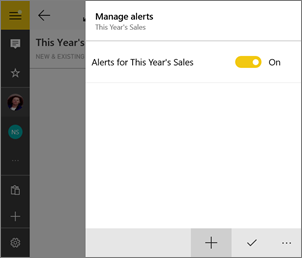

<properties
   pageTitle="Establecer alertas de datos en la aplicación móvil de Power BI para Windows 10"
   description="Aprenda a configurar alertas para recibir notificaciones cuando cambian los datos en un panel más allá de los límites se configuran en la aplicación móvil de Power BI para Windows 10 y el servicio Power BI."
   services="powerbi"
   documentationCenter=""
   authors="maggiesMSFT"
   manager="mblythe"
   backup=""
   editor=""
   tags=""
   qualityFocus="no"
   qualityDate=""/>

<tags
   ms.service="powerbi"
   ms.devlang="NA"
   ms.topic="article"
   ms.tgt_pltfrm="NA"
   ms.workload="powerbi"
   ms.date="10/04/2016"
   ms.author="maggies"/>

# Establecer alertas de datos en la aplicación móvil de Power BI para Windows 10  

Puede establecer alertas en la aplicación móvil de Power BI para Windows 10 y en el servicio Power BI para notificar cuando cambian los datos en un panel más allá de los límites establece. Funcionan las alertas en los mosaicos que incluye un número único, como las tarjetas y medidores. Puede establecer alertas de datos en la aplicación móvil de Power BI y verlos en el servicio Power BI y viceversa. Sólo puede ver las alertas de datos que se establece, aunque compartan un panel o una instantánea de un mosaico.

> [AZURE.WARNING] Notificaciones de alerta controlada por datos proporcionan información acerca de los datos. Si roban el dispositivo, se recomienda pasar al servicio Power BI para desactivar todas las reglas de alertas controlada por datos. 
> 
> Obtenga más información sobre [Administrar alertas de datos en el servicio Power BI](powerbi-service-set-data-alerts.md).

## Establecer alertas de datos

1.  Puntee en un número o medidor mosaico en un panel para abrirlo.  

2.  Puntee en el icono de campana  para agregar una alerta.  

    

3.  Puntee en el icono del signo más (+).

    

4.  Elija esta opción para recibir alertas por encima o por debajo de un valor y escriba el valor.

    

4.  Decidir si desea recibir cada hora o alertas diarias y si también desea recibir un correo electrónico cuando se recibe la alerta.

    >
            **Nota**: no recibir alertas cada hora o cada día a menos que realmente se actualizan los datos en ese momento.

6.  También puede cambiar el título de la alerta.

6.  Puntee en la marca de verificación.

7.  Un solo mosaico puede tener alertas para los valores por encima y por debajo de los umbrales. En **Administrar alertas**, puntee en el signo más (+).

    

## Recepción de alertas

Recibir alertas en Power BI [Centro de notificaciones](powerbi-mobile-notification-center.md) en la aplicación móvil de Power BI o en el servicio Power BI, junto con las notificaciones de los nuevos paneles que alguien ha compartido con usted.

Orígenes de datos a menudo se establecen para actualizar diariamente, aunque algunos con más frecuencia de actualización. Cuando se actualizan los datos en el panel, si los datos de seguimiento llegan a uno de los umbrales que ha establecido, se realizará varias acciones.

1.  Power BI se comprueba ver si han pasado más de una hora o más de 24 horas (según la opción seleccionada) desde la última alerta se envió.

    Siempre que los datos están más allá del umbral, obtendrá una alerta cada hora o cada 24 horas.

2.  Si ha establecido la alerta para enviar un correo electrónico, encontrará algo parecido a esto en su Bandeja de entrada.

    

3.  Power BI agrega un mensaje a su [**Centro de notificaciones**](powerbi-mobile-notification-center.md)  y agrega un nuevo icono de alerta en el mosaico aplicable  .

4. Abra el centro de notificaciones para ver los detalles de alerta.

>
            **Nota**: las alertas sólo funcionan en los datos que se actualizan. Cuando los datos se actualicen, Power BI busca para ver si se ha configurado una alerta para los datos. Si los datos ha alcanzado un umbral de alerta, se activará una alerta.

## Administrar alertas

Puede administrar las alertas individuales en la aplicación móvil de Power BI o [administrar todas las alertas en el servicio Power BI](powerbi-service-set-data-alerts.md).

### Administrar alertas en la aplicación móvil de Power BI

1.  En un panel, puntee en una tarjeta o medidor mosaico con una alerta.  

2.  Puntee en el icono de campana .  

    

3. Puntee en la alerta para cambiar un valor o desactivarlo.

    

4. Para eliminar por completo la alerta, haga clic en o tap y hold > **Eliminar**.

## Sugerencias y solución de problemas
- Las alertas no se admiten actualmente para mosaicos de Bing o iconos de tarjeta con medidas de fecha y hora.
- Las alertas sólo funcionan con datos numéricos.
- Las alertas sólo funcionan en los datos que se actualizan. No funcionan con datos estáticos.

### Consulte también  
- [Administrar las alertas en el servicio Power BI](powerbi-service-set-data-alerts.md)
- [Centro de notificaciones de Power BI Mobile](powerbi-mobile-notification-center.md)
- [Introducción a Power BI](powerbi-service-get-started.md)  
