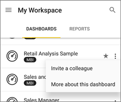

<properties 
   pageTitle="Compartir un panel de la aplicación Android"
   description="Aprenda a invitar a compañeros para ver los paneles mediante el uso compartido de los vínculos de la aplicación Android para Power BI."
   services="powerbi" 
   documentationCenter="" 
   authors="maggiesMSFT" 
   manager="mblythe" 
   backup=""
   editor=""
   tags=""
   qualityFocus="no"
   qualityDate=""/>
 
<tags
   ms.service="powerbi"
   ms.devlang="NA"
   ms.topic="article"
   ms.tgt_pltfrm="NA"
   ms.workload="powerbi"
   ms.date="10/14/2016"
   ms.author="maggies"/>
# Compartir un panel de la aplicación móvil Android para Power BI

Invite a sus compañeros para ver los paneles mediante el uso compartido de vínculos desde el [aplicación Android para Microsoft Power BI](powerbi-mobile-android-app-get-started.md). 

## Compartir un panel

1.  En la página de inicio de paneles, puntee en el botón de puntos suspensivos (...) y en **Invitar a un colega**.

    

2.  O bien, en la esquina superior derecha de un panel, pulse el icono de invitación .

 
    Si usted es el propietario del panel, verá la lista de compañeros con los que ha compartido este panel, con estas notas:

    -   
            **Puede ver**: se ha visto el panel, pero no puede compartirlo.

    -   
            **Puede ver & Invitar**: se ha visto el panel y compartirlos con otros compañeros.

2.  Escriba las direcciones de correo electrónico y un mensaje para acompañar a la invitación del panel. De lo contrario, Power BI envía un mensaje predeterminado.

3.  Para permitir volver a compartir, dejar **Permitir a los destinatarios a compartir este panel** seleccionado.

    >
            **Nota**: volver a compartir permite que sus compañeros reenviar la invitación de correo electrónico a otras personas de su organización, ya sea mediante el explorador o las aplicaciones móviles.

4.  Puntee en el icono de avión  en la esquina superior derecha para enviar el correo.

    Sus compañeros obtienen una invitación de correo electrónico con un vínculo directo al escritorio. La invitación expira transcurrido un mes. Cuando abra en un explorador o en una de las aplicaciones móviles, se agrega a su cuenta de Power BI.

    >
            **Nota**: más [notas acerca de cómo compartir paneles con sus colegas](powerbi-service-share-unshare-dashboard.md#notes-about-sharing).

## Dejar de compartir un panel

Sólo el propietario del panel puede dejar de compartir un panel.

1.  En la esquina superior derecha del panel del, puntee en el icono de invitación . 

    Consulte la lista de compañeros con los que ha compartido este panel.

2.   Para dejar de compartir el panel con un colega, puntee en el **X** junto al nombre de \> **quitar**.

### Consulte también

- 
            [Descargue la aplicación Android](http://go.microsoft.com/fwlink/?LinkID=544867) de Google play
- 
            [Anotar y compartir un icono de la aplicación Android](powerbi-mobile-annotate-and-share-a-tile-from-the-android-app.md)
- ¿Tiene preguntas? 
            [Pruebe a formular a la Comunidad de Power BI](http://community.powerbi.com/)
