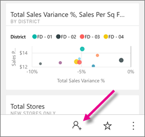
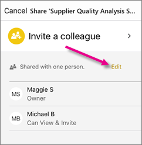

<properties 
   pageTitle="Compartir un panel de la aplicación de iPhone"
   description="Puede invitar a compañeros de trabajo para ver los paneles mediante el uso compartido de los vínculos de la aplicación móvil de Power BI para iOS. Obtenga información acerca de cómo"
   services="powerbi" 
   documentationCenter="" 
   authors="maggiesMSFT" 
   manager="mblythe" 
   backup=""
   editor=""
   tags=""
   qualityFocus="no"
   qualityDate=""/>
 
<tags
   ms.service="powerbi"
   ms.devlang="NA"
   ms.topic="article"
   ms.tgt_pltfrm="NA"
   ms.workload="powerbi"
   ms.date="10/03/2016"
   ms.author="maggies"/>
# Compartir un panel de la aplicación de iPhone (Power BI para iOS)

Invitar a compañeros para ver los paneles mediante el uso compartido de los vínculos de la aplicación de iPhone para Power BI. Sólo puede compartir paneles con sus colegas en el mismo dominio de correo electrónico que usted.

## Compartir un panel

1.  En la barra de acciones en la parte inferior del panel, pulse el icono de recurso compartido .

    

3.  Puntee en **Invitar a un colega**.

2.  Escriba nombres, separados por comas y un mensaje que acompañe a la invitación del panel.

3.  Para permitir volver a compartir, dejar **Permitir a los destinatarios a compartir este panel** seleccionado.

    >
            **Nota**   Resharing permite que sus compañeros reenviar la invitación de correo electrónico a otras personas de su organización, ya sea a través de la web o las aplicaciones móviles.

4.  Puntee en **Enviar** en la esquina superior derecha.

    Sus compañeros obtienen una invitación de correo electrónico con un vínculo directo al escritorio. La invitación expira transcurrido un mes. Cuando abra, en un explorador o en la aplicación de iPhone o iPad, se agrega a sus Power BI.

    >
            **Nota**: más [notas acerca de cómo compartir paneles con sus colegas](powerbi-service-share-unshare-dashboard.md#notes-about-sharing).

## Dejar de compartir un panel

Sólo se puede hacer que un panel si eres el propietario del panel.

1.  En la barra de acciones en la parte inferior del panel, pulse el icono de recurso compartido .

3.  Puntee en **Invitar a un colega**.

    Consulte la lista de compañeros con los que ha compartido este panel, con estas frases:

    -   
            **Puede ver**: puede ver el panel pero no comparta.

    -   
            **Puede ver & Invitar**: puede ver el panel y compartirla con otros colegas.

2.  Puntee en **Editar**.

     

3.  Para dejar de compartir, puntee en el círculo rojo junto al nombre y en **Eliminar**.

### Consulte también

- [Anotar y compartir un icono de la aplicación de iPhone para Power BI](powerbi-mobile-annotate-and-share-a-tile-from-the-iphone-app.md)
- [Introducción a la aplicación de iPhone para Power BI](powerbi-mobile-iphone-app-get-started.md)
- [Compartir un panel en Power BI](powerbi-service-share-unshare-dashboard.md)
- ¿Tiene preguntas? [Pruebe a formular a la Comunidad de Power BI](http://community.powerbi.com/)
