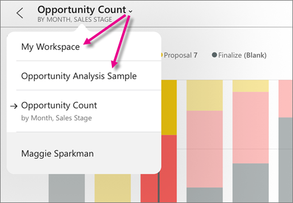

<properties 
   pageTitle="Interactuar con iconos en la aplicación móvil de Power BI en el iPad"
   description="Crear mosaicos en un panel en el servicio Power BI. Obtenga información acerca de abrir mosaicos e interactuar con ellos en la aplicación móvil de Power BI para iOS en el iPad."
   services="powerbi" 
   documentationCenter="" 
   authors="maggiesMSFT" 
   manager="erikre" 
   backup=""
   editor=""
   tags=""
   qualityFocus="no"
   qualityDate=""/>
 
<tags
   ms.service="powerbi"
   ms.devlang="NA"
   ms.topic="article"
   ms.tgt_pltfrm="NA"
   ms.workload="powerbi"
   ms.date="10/11/2016"
   ms.author="maggies"/>

# Interactuar con iconos en la aplicación móvil de Power BI para iOS en el iPad

Los iconos son instantáneas de los datos, anclados a un panel. Cambian sus valores como los cambios de datos. Se [crear mosaicos en un panel en el servicio Power BI](powerbi-service-dashboard-tiles.md).

A continuación, en [la aplicación de iPad](http://go.microsoft.com/fwlink/?LinkId=522062), abra mosaicos en modo de enfoque e interactuar con ellos. Puede abrir mosaicos con todos los tipos de efectos visuales, incluidos los mosaicos en función de Bing y R.

1.  Abrir un [panel en la aplicación de iPad](powerbi-mobile-dashboards-on-the-ipad-app.md).

2.  Puntee en un mosaico. Se abre en modo de enfoque, donde puede interactuar con los datos de mosaico:

   -   En una línea, la barra o el gráfico de columnas, arrastre la barra para ver los valores de partes específicas de la visualización.  

         

        En este gráfico de columnas 100%, se muestran los valores de marzo, en la intersección de la barra vertical y el gráfico.

  -   En un gráfico circular, puntee en un sector del gráfico circular para mostrar el valor del segmento en la parte superior del gráfico circular.  
      

  -   
            [Compartir una instantánea del mosaico](powerbi-mobile-share-dashboards-from-the-ipad-app.md)  con otros usuarios.

  -   
            [Abra el informe](powerbi-mobile-reports-on-the-ipad-app.md)  que se basa el mosaico.

3. Para salir del modo de enfoque de mosaico, puntee en el nombre de mosaico y, a continuación, puntee en el nombre del panel o **Mi área de trabajo**.

    

### Consulte también
-  
            [Introducción a la aplicación de iPad](powerbi-mobile-iphone-app-get-started.md) para Power BI.
- ¿Tiene preguntas? [Pruebe a formular a la Comunidad de Power BI](http://community.powerbi.com/)
