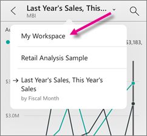

<properties 
   pageTitle="Interact with tiles in the iPhone app"
   description="Tiles are live snapshots of your data, pinned to a dashboard. Learn about interacting with tiles in the Power BI mobile app for iOS on your iPhone."
   services="powerbi" 
   documentationCenter="" 
   authors="maggiesMSFT" 
   manager="mblythe" 
   backup=""
   editor=""
   tags=""
   qualityFocus="no"
   qualityDate=""/>
 
<tags
   ms.service="powerbi"
   ms.devlang="NA"
   ms.topic="article"
   ms.tgt_pltfrm="NA"
   ms.workload="powerbi"
   ms.date="10/03/2016"
   ms.author="maggies"/>

# Interact with tiles in the iPhone app (Power BI for iOS)

Tiles are live snapshots of your data, pinned to a dashboard. Their values change as the data changes. You <bpt id="p1">[</bpt>create tiles on a dashboard in the Power BI service<ept id="p1">](powerbi-service-dashboard-tiles.md)</ept>. 

Then in <bpt id="p1">[</bpt>the iPhone app<ept id="p1">](http://go.microsoft.com/fwlink/?LinkId=522062)</ept>, you open tiles in focus mode and interact with them. You can open tiles with all kinds of visuals, including tiles based on Bing and R.

><bpt id="p1">**</bpt>Note<ept id="p1">**</ept>: You can also <bpt id="p2">[</bpt>create picture tiles with your iPhone app<ept id="p2">](powerbi-mobile-picture-tiles-in-the-iphone-app.md)</ept> and save them to your dashboards.

1.  Open a <bpt id="p1">[</bpt>dashboard in the iPhone app<ept id="p1">](powerbi-mobile-dashboards-in-the-iphone-app.md)</ept>.

2.  Tap a tile. It opens in focus mode, where it's easier to view and explore the tile data. In this mode you can:

   -   In a line, bar, or column chart, tap to view the values for specific parts of the visualization.

        

        *For example, in this line chart, the selected values are for This Year Sales and Last Year Sales in August.*  

  -   In a pie chart, spin the pie to show the values of the slice at the top of the pie.

        

3.   Tap the share icon <ph id="ph1"></ph> to <bpt id="p1">[</bpt>annotate and share a tile<ept id="p1">](powerbi-mobile-annotate-and-share-a-tile-from-the-iphone-app.md)</ept> with others.

4.   <bpt id="p1">[</bpt>Interact with a report page tile<ept id="p1">](powerbi-mobile-report-page-tiles-in-the-iphone-app.md)</ept> in the iPhone app.

5.   <bpt id="p1">[</bpt>Add an alert to the tile<ept id="p1">](powerbi-mobile-set-data-alerts-in-the-iphone-app.md)</ept>. If the values go above or below targets, Power BI will notify you.

6. Sometimes the report creator has added a link to a tile. If so, it has a link icon <ph id="ph1"></ph> when it's in focus mode:

    

    Links can go to other Power BI dashboards or to an external URL. You can <bpt id="p1">[</bpt>tap the link<ept id="p1">](powerbi-service-edit-a-tile-in-a-dashboard.md#hyperlink)</ept> to open it inside the Power BI app. If it's an external site, Power BI asks you to allow it.
    
    

    After you open the link in the Power BI app, you can copy the link and open it in a browser window instead.

## Go back to My Workspace

*   Tap the arrow next to the tile name and tap <bpt id="p1">**</bpt>My Workspace<ept id="p1">**</ept>.

    

### Consulte también

- [Get started with the iPhone app for Power BI](powerbi-mobile-iphone-app-get-started.md)
- [Get started with Power BI](powerbi-service-get-started.md)
- Questions? [Try asking the Power BI Community](http://community.powerbi.com/)
