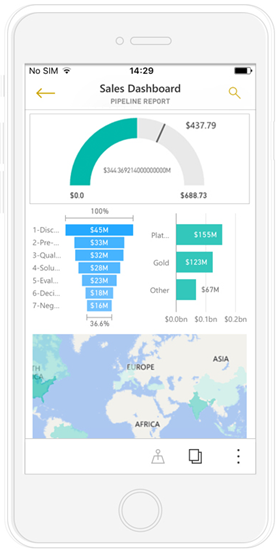

<properties 
   pageTitle="View and interact with Power BI reports optimized for your phone"
   description="Read about interacting with report pages optimized for viewing in the Power BI phone apps."
   services="powerbi" 
   documentationCenter="" 
   authors="maggiesMSFT" 
   manager="mblythe" 
   backup=""
   editor=""
   tags=""
   qualityFocus="no"
   qualityDate=""/>
 
<tags
   ms.service="powerbi"
   ms.devlang="NA"
   ms.topic="article"
   ms.tgt_pltfrm="NA"
   ms.workload="powerbi"
   ms.date="09/27/2016"
   ms.author="maggies"/>

# View and interact with Power BI reports optimized for your phone 

When you create a Power BI report in Power BI Desktop, you can also create a version of that <bpt id="p1">[</bpt>report optimized for viewing in the Power BI app on a phone<ept id="p1">](powerbi-desktop-create-phone-report.md)</ept>.

Then, when you open a Power BI report on a phone, Power BI automatically detects if the report has been optimized for phones. If a phone-optimized report exists, the Power BI phone app automatically opens the optimized report.

If a phone-optimized report doesn’t exist, you can still open the report in the non-optimized landscape view by changing the phone’s orientation.  

Even in a phone-optimized report, if you change your phone to landscape, the report will open in the non-optimized view with the original report layout.

If only some pages are optimized, you see a message in portrait view, indicating the report is available in landscape.

all the other features of Power BI reports still work in phone-optimized reports. Read more about what you can do in:

*   <bpt id="p1">[</bpt>Reports on iPhones<ept id="p1">](powerbi-mobile-reports-in-the-iphone-app.md)</ept>. 
*   <bpt id="p1">[</bpt>Reports on Android phones<ept id="p1">](powerbi-mobile-reports-in-the-android-app.md)</ept>.

## View other pages in the report

- View other pages in the report by swiping from the side or tapping the pages icon <ph id="ph1"></ph>.

## Cross-highlight visuals
Cross highlighting visuals in phone reports works the same as it does in the Power BI service and in reports on phones in landscape view: When you select data in one visual, it highlights related data in the other visuals on that page.

Read more about <bpt id="p1">[</bpt>filtering and highlighting in Power BI<ept id="p1">](powerbi-service-about-filters-and-highlighting-in-reports.md)</ept>.

## Select visuals
In phone reports when you select a visual, the phone report highlights that visual and focuses on it, neutralizing canvas gestures.

With the visual selected, you can do things like scroll within the visual. To de-select a visual, just touch anywhere outside the visual area.

## Open visuals in focus mode
Phone reports offer a focus mode, so you can focus on a single visual to get a bigger view of the visual and explore the visual and the report.

What you do in focus mode carries over to the report canvas and vice versa, for a seamless exploration experience. For example, if you highlight a value in a visual, then return to the whole report, the report as a whole will be filtered to the value you highlighted in the visual.

Some actions are only possible in focus mode, due to screen size constraints:

- <bpt id="p1">**</bpt>Drill down<ept id="p1">**</ept>, then back up into the information displayed in the visual, if hierarchy levels are defined.
    Read more about <bpt id="p1">[</bpt>drilling down and up<ept id="p1">](powerbi-service-drill-down-in-a-visualization.md)</ept> in Power BI.
- <bpt id="p1">**</bpt>Sort<ept id="p1">**</ept> the values in the visual.
- <bpt id="p1">**</bpt>Revert<ept id="p1">**</ept>: Clear exploration steps you've taken on a visual and revert to the definition set when the report was created.

    Revert is available at the report level, clear all exploration from all visuals, or at the visual level, clearing all exploration from the specific visual selected.   

### Consulte también
- [Create reports optimized for the Power BI phone apps](powerbi-desktop-create-phone-report.md)
- [Create a phone view of a dashboard in Power BI](powerbi-service-create-dashboard-phone-view.md)
- More questions? [Try asking the Power BI Community](http://community.powerbi.com/)
