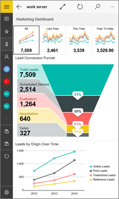
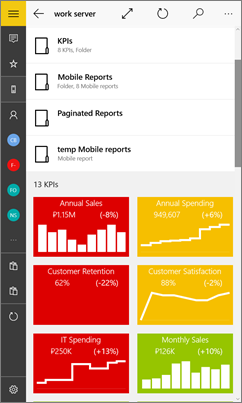
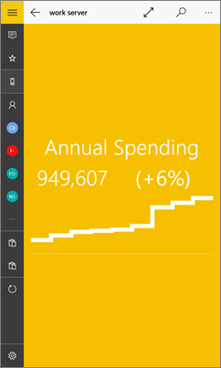

<properties 
   pageTitle="Ver informes de Reporting Services móviles y los KPI en la aplicación móvil de Power BI para Windows 10"
   description="La aplicación móvil de Power BI para Windows 10 ofrece acceso móvil directo y táctil a la información de negocios importante en local."
   services="powerbi" 
   documentationCenter="" 
   authors="maggiesMSFT" 
   manager="erikre" 
   backup=""
   editor=""
   tags=""
   qualityFocus="no"
   qualityDate=""/>
 
<tags
   ms.service="powerbi"
   ms.devlang="NA"
   ms.topic="article"
   ms.tgt_pltfrm="NA"
   ms.workload="powerbi"
   ms.date="10/14/2016"
   ms.author="maggies"/>

# Ver informes de Reporting Services móviles y los KPI en la aplicación móvil de Power BI para Windows 10 

La aplicación móvil de Power BI para Windows 10 ofrece acceso móvil directo y táctil a la información de negocios importante en local. 

            [Crear informes de Reporting Services móviles](https://msdn.microsoft.com/library/mt652547.aspx) con el publicador de SQL Server Mobile informes y publicarlos en la [portal web de Reporting Services](https://msdn.microsoft.com/library/mt637133.aspx). Crear KPI derecha en el portal web. Organizarlos en carpetas y marcar los favoritos para que pueda encontrar fácilmente. 

A continuación, en la aplicación móvil de Power BI para Windows 10, ver los informes móviles y KPI, organizados en carpetas o recopilados como favoritos. 

> [AZURE.NOTE]  El dispositivo debe estar ejecutando Windows 10. La aplicación funciona mejor en dispositivos con al menos 1 GB de RAM y 8 GB de almacenamiento interno.

## Explorar ejemplos sin un servidor SQL Server 2016 Reporting Services

Incluso si no tiene acceso a un portal web de Reporting Services, todavía puede explorar las características de informes de Reporting Services móviles. 

-  Puntee en el botón de navegación global  en la esquina superior izquierda, desplácese hacia abajo y pulsa **ejemplos de Reporting Services**.

    

Examinar los ejemplos para interactuar con informes móviles y KPI.

## Conectarse a un servidor para ver los informes de Reporting Services móviles 

1.  En el dispositivo Windows 10, abra la aplicación Power BI.
  
2.  Puntee en el botón de navegación global  en la esquina superior izquierda y puntee **Conectar con el servidor**.

    

4. Rellene la dirección del servidor y su nombre de usuario y contraseña.

    >
            **Nota**: incluir **http** o **https** delante de la cadena de conexión. Por ejemplo, http://*nombreDeServidor*/reports.

    Puntee en **opción avanzada** para asignar al servidor un nombre, si lo desea.

5.  Puntee en el **siguiente** la marca de verificación para conectarse. 

    Ahora verá que el servidor en la barra de navegación izquierda.

    

    >
            **Sugerencia**: pulse el botón de navegación global  en cualquier momento a vaya entre los informes de Reporting Services móviles y los paneles en el servicio Power BI. 

## KPI de vista Reporting Services e informes móviles en la aplicación Power BI

Reporting Services KPI e informes móviles se muestran en las mismas carpetas estuvieran en el portal web de Reporting Services.

- Puntee en un KPI para verlo en modo de enfoque.

    

- Puntee en un informe móvil para abrir e interactuar con él en la aplicación de Power BI.

    

## Ver los KPI y los informes favoritos

Puede marcar KPI e informes móviles como favoritos en el portal web de Reporting Services y, a continuación, verlos en una carpeta apropiada en el dispositivo de Windows 10, junto con los informes y paneles de Power BI favoritos.

-  Puntee en **favoritos**.

    
   
    Son los favoritos desde el portal web en esta página.

    

Obtenga más información sobre [los favoritos de las aplicaciones móviles de Power BI](powerbi-mobile-favorites.md).

## Quitar una conexión a un servidor de informes

Se puede solo se conectado a un servidor de informes a la vez desde su aplicación móvil de Power BI. Si desea conectarse a un servidor diferente, debe desconectar de la actual.

1. En la parte inferior de la barra de navegación izquierdo, puntee **configuración** .
2. Puntee y mantenga presionado el nombre del servidor que no desea estar conectado a.
3. Puntee en **quitar el servidor**.

    

## Crear informes de Reporting Services móviles y KPI

No se crean informes móviles y Reporting Services KPI en la aplicación móvil de Power BI. Se crea en el publicador de SQL Server Mobile informes y un portal web de SQL Server 2016 Reporting Services.

- 
            [Crear sus propios informes de Reporting Services móviles](https://msdn.microsoft.com/library/mt652547.aspx), y publicarlos en un portal web de Reporting Services.
- Crear [KPI en un portal web de Reporting Services](https://msdn.microsoft.com/library/mt683632.aspx)

### Consulte también  
- 
            [Introducción a la aplicación móvil de Power BI para Windows 10](powerbi-mobile-win10phone-app-get-started.md)  
- 
            [Introducción a Power BI](powerbi-service-get-started.md)  
- ¿Tiene preguntas? 
            [Pruebe a formular a la Comunidad de Power BI](http://community.powerbi.com/)