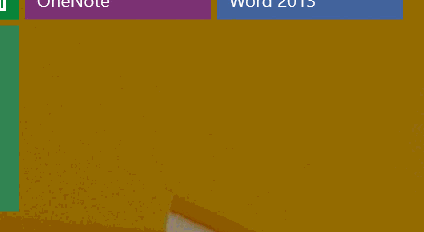
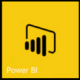
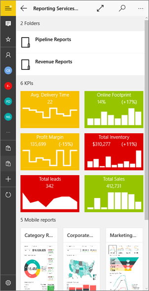
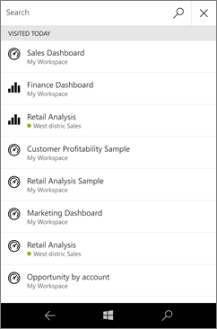
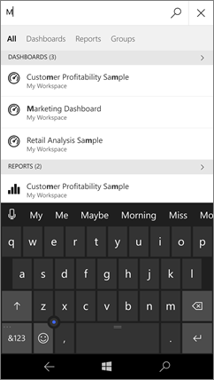

<properties 
   pageTitle="Introducción a la aplicación móvil de Power BI para Windows 10"
   description="La aplicación móvil de Power BI para Windows 10 ofrece acceso móvil actualizado y táctil a la información empresarial en su Tablet PC o un teléfono."
   services="powerbi" 
   documentationCenter="" 
   authors="maggiesMSFT" 
   manager="mblythe" 
   backup=""
   editor=""
   tags=""
   qualityFocus="no"
   qualityDate=""/>
 
<tags
   ms.service="powerbi"
   ms.devlang="NA"
   ms.topic="article"
   ms.tgt_pltfrm="NA"
   ms.workload="powerbi"
   ms.date="09/28/2016"
   ms.author="maggies"/>

# Introducción a la aplicación móvil de Power BI para Windows 10

La aplicación móvil de Power BI para Windows 10 le trae Power BI para su tableta o teléfono con acceso móvil actualizado y táctil a la información empresarial. Ver e interactuar con los paneles de la empresa desde cualquier lugar & #151; en su [pantalla de inicio de Windows](powerbi-mobile-pin-dashboard-from-win10phone-app.md).

Se [crear paneles e informes en el servicio de Power BI](powerbi-service-get-started.md) con los datos. 

A continuación, interactuar con los paneles e informes, explorar los datos y compartirlos desde la aplicación móvil de Power BI para Windows 10.

## Lo primero es lo primero

-   
            [
            **Obtener la aplicación móvil de Power BI para Windows 10**](http://go.microsoft.com/fwlink/?LinkID=526478) desde la tienda Windows.

    >
            **Nota:** el dispositivo debe estar ejecutando Windows 10. La aplicación funciona mejor en dispositivos con al menos 2 GB de RAM y 8 GB de almacenamiento interno. Se puede ejecutar en dispositivos con al menos 1 GB de RAM.

-   Descubra [Novedades en las aplicaciones móviles de Power Bi](powerbi-mobile-whats-new-in-the-mobile-apps.md).

## Registrarse para el servicio Power BI en la web

Si no ha aceptado todavía, vaya a la [servicio Power BI](http://powerbi.com/) para suscribirse a su propia cuenta para crear y almacenar informes y paneles para reunir los datos. A continuación, inicie sesión en Power BI desde su dispositivo Windows 10 para ver sus propios escritorios desde cualquier lugar.

1.  En el servicio Power BI, pulse [registrarse](http://go.microsoft.com/fwlink/?LinkID=513879) para crear una cuenta de Power BI.

2.    Iniciar [crear sus propios paneles e informes](powerbi-service-get-started.md).

## Introducción a la aplicación Power BI 

1.  En la pantalla de inicio del dispositivo de Windows 10, abra la aplicación Power BI.

    
  
2.  Para ver los informes y paneles de Power BI, puntee **Power BI**. Inicie sesión con las mismas credenciales de su cuenta de Power BI en la web. 

    Para ver los informes de Reporting Services móviles y KPI, puntee **SQL Server 2016 Reporting Services**. Inicie sesión con sus credenciales de SQL Server Reporting Services.

    

4.  Puntee en **empezar a explorar**  para ver sus propios escritorios.

## Pruebe los ejemplos de Power BI y Reporting Services  
Incluso sin registrarse, puede reproducir con los ejemplos de Power BI y Reporting Services. Después de descargar la aplicación, puede ver los ejemplos o empezar a trabajar. Volver a los ejemplos siempre que lo desee desde la página principal de paneles.

### Ejemplos de Power BI

Puede ver e interactuar con los ejemplos de panel de Power BI, pero hay algunas cosas que no puede hacer con ellos. No se puede abrir los informes de los paneles, compartir los ejemplos con otros usuarios o que sean sus favoritos.

1.   Puntee en el botón de navegación global  en la esquina superior izquierda.
  
2.   Puntee en **ejemplos de Power BI**, elija un rol y explore el panel de ejemplo para ese rol.  

    

    >
            **Nota**: no todas las características están disponibles en los ejemplos. Por ejemplo, no puede ver los informes de ejemplo que subyacen a los paneles. 

### Ejemplos de Reporting Services informe móvil

1.   Puntee en el botón de navegación global  en la esquina superior izquierda.

2.  Puntee en **ejemplos de Reporting Services**, a continuación, abra los informes de venta directa o la carpeta de informes de ventas para explorar sus KPI y los informes de dispositivos móviles.

    

## Búsqueda de los paneles, informes y grupos

Encontrar sus paneles, informes y grupos rápidamente escribiendo en el cuadro de búsqueda, siempre en la parte superior de la aplicación.

1.  Puntee en el icono de búsqueda en la esquina superior derecha.

    

    Power BI muestra los paneles, informes y grupos más reciente.

    

2.  Comience a escribir, Power BI muestra todos los resultados pertinentes.

    

## Ver los favoritos, KPI, informes y paneles

Puede ver todos los paneles de Power BI favoritos, junto con Reporting Services KPI e informes móviles, en la página Favoritos de las aplicaciones móviles. Al realizar un panel un *favorito* en la aplicación móvil de Power BI, puede tener acceso desde todos los dispositivos, incluido el servicio Power BI. 

-  Puntee en **favoritos**.

    
   
    Son los favoritos desde el portal web en esta página.

    

Obtenga más información sobre [los favoritos de las aplicaciones móviles de Power BI](powerbi-mobile-favorites.md).

## ¿Qué más?

Ver qué más puede hacer en la aplicación de Power BI para dispositivos Windows 10 con paneles e informes en Power BI y los informes de Reporting Services móviles y KPI en el portal web de Reporting Services

### Paneles de Power BI

-   Ver su [paneles](powerbi-mobile-dashboards-in-the-win10phone-app.md).
-   
            [Anclar mosaicos de Power BI y paneles](powerbi-mobile-pin-dashboard-from-win10phone-app.md) a pantalla de inicio de su dispositivo como iconos dinámicos.
-   Explorar el [iconos en los paneles](powerbi-mobile-tiles-in-the-win10phone-app.md).
-   Explore su [informes](powerbi-mobile-reports-in-the-windows-app.md).
-   
            [Compartir mosaicos](powerbi-mobile-share-a-tile-from-the-win10phone-app.md).
-   Recurso compartido [paneles](powerbi-mobile-share-a-dashboard-from-the-win10phone-app.md).
-   Ver su [paneles e informes de los grupos](powerbi-mobile-groups-in-the-win10phone-app.md).
-   Vista [notificaciones sobre las actualizaciones a su cuenta de Power BI](powerbi-mobile-notification-center.md), como paneles de colegas compartan con usted.

     

### Informes informes de servicios móviles y KPI

- 
            [Ver informes de Reporting Services móviles y KPI](powerbi-mobile-win10-kpis-mobile-reports.md) en la aplicación de Power BI para dispositivos Windows 10.
- Crear [KPI en el portal web de Reporting Services](https://msdn.microsoft.com/library/mt683632.aspx).
- 
            [Crear sus propios informes móviles con el publicador de informes de SQL Server Mobile](https://msdn.microsoft.com/library/mt652547.aspx), y publíquelos en el portal web de Reporting Services.

### Consulte también

- 
            [Descargue la aplicación de Power BI](http://go.microsoft.com/fwlink/?LinkID=526478) desde la tienda Windows  
- [Introducción a Power BI](powerbi-service-get-started.md)
- ¿Tiene preguntas? [Pruebe a formular a la Comunidad de Power BI](http://community.powerbi.com/)

