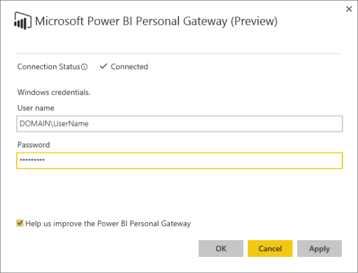

<properties 
   pageTitle="Puerta de enlace de Power BI - Personal"
   description="Puerta de enlace de Power BI - Personal"
   services="powerbi"
   documentationCenter=""
   authors="guyinacube"
   manager="mblythe"
   backup=""
   editor=""
   tags=""
   qualityFocus="no"
   qualityDate=""/>

<tags
   ms.service="powerbi"
   ms.devlang="NA"
   ms.topic="article"
   ms.tgt_pltfrm="NA"
   ms.workload="powerbi"
   ms.date="08/15/2016"
   ms.author="asaxton"/>

# Puerta de enlace de Power BI - Personal

Puerta de enlace de Power BI - Personal actúa como un puente, transferencia de datos rápida y segura entre los orígenes de datos de servicio y local de Power BI que admiten [actualizar](powerbi-refresh-data.md). Este artículo pretende proporcionar una comprensión detallada del funcionamiento de la puerta de enlace y si no es necesario que una puerta de enlace. También hemos recopilado esta [vídeo útil](https://www.youtube.com/watch?v=de58vROLqZI) acerca de la puerta de enlace personal. 

Sólo está disponible con la puerta de enlace personal [Power BI Pro](powerbi-power-bi-pro-content-what-is-it.md). Instala y se ejecuta como un servicio en el equipo. Como un servicio, se ejecuta con una cuenta de Windows que se especifica durante la configuración. En algunos casos, la puerta de enlace se ejecuta como una aplicación. Vamos a más información acerca de los más adelante.

Cuando Power BI actualiza los datos de un origen de datos local, la puerta de enlace garantiza que su cuenta de Power BI tiene los permisos adecuados para conectarse y consultar datos desde el origen.

Transferir datos entre Power BI y la puerta de enlace se protege mediante [Bus de servicio de Azure](http://azure.microsoft.com/documentation/services/service-bus/). El Bus de servicio, se crea un canal seguro entre el servicio Power BI y el equipo. Dado que la puerta de enlace proporciona esta conexión segura, normalmente es necesario abrir un puerto en el firewall.

Antes de entrar en detalles acerca de la puerta de enlace, echemos un vistazo a algunos de los términos utilizados en Power BI:

Un *conjunto de datos* se carga en el servicio Power BI desde una conexión de datos o de orígenes de datos locales. Crear un conjunto de datos cuando utilice obtener datos para conectarse a y carga de datos. Conjuntos de datos aparecen en el panel Mi área de trabajo de su área de trabajo de BI de energía en el explorador. Al crear informes y mosaicos de pin a los paneles, busca en los datos de los conjuntos de datos.

Un *origen de datos* es donde proceden los datos carga en un conjunto de datos realmente. Puede ser prácticamente cualquier cosa; una base de datos, hoja de cálculo de Excel, servicio Web, etc. Con los libros de Excel, puede crear una hoja de cálculo simple con filas de datos y que se considera un origen de datos. También puede usar Power Query o Power Pivot en Excel para conectarse y consultar datos de ambos en línea y los orígenes de datos locales, todo en el mismo libro. Con Power BI Desktop, se utilizan obtener datos para conectarse y consultar datos de ambos en línea y orígenes de datos locales.

La puerta de enlace personal se instala mediante el Gateay de datos local. Puede descargar en la [página de Power BI Gateway](https://powerbi.microsoft.com/gateway/).

## ¿Se necesita una puerta de enlace?

Antes de instalar una puerta de enlace, es importante saber si realmente necesita uno. Realmente depende de los orígenes de datos:

### Orígenes de datos locales

Una puerta de enlace personal *es necesario* para actualizar los conjuntos de datos que obtienen datos de un origen de datos local compatible en su organización.

Con una puerta de enlace, se admiten AHORA la ACTUALIZACIÓN y PROGRAMAR la ACTUALIZACIÓN para conjuntos de datos cargados desde:

-   2013 (o posteriores) libros de Microsoft Excel en Power Query o Power Pivot se usa para conectarse y consultar datos de un origen de datos local compatible. Todos los locales orígenes de datos que se muestran en obtener datos externos en la actualización de compatibilidad con Power Query o Power Pivot excepto archivo Hadoop (HDFS) y Microsoft Exchange.

-   Microsoft Power BI Desktop archivos donde obtener datos se usa para conectarse y consultar datos desde un origen de datos local compatible. Todos los orígenes de datos local que se muestra en la actualización de compatibilidad de obtener datos salvo el archivo Hadoop (HDFS) y Microsoft Exchange.

### Orígenes de datos en línea

Una puerta de enlace personal *no es necesario* para actualizar los conjuntos de datos que recopilar datos desde un origen de datos en línea.

Se admiten AHORA la ACTUALIZACIÓN y PROGRAMAR la ACTUALIZACIÓN sin puerta de enlace de conjuntos de datos cargados desde:

-   Paquetes de orígenes de datos en línea de contenido (paquetes de contenido\\servicios). De forma predeterminada, los conjuntos de datos de paquetes de contenido se actualizan automáticamente una vez al día, pero también puede actualizar manualmente o configurar una programación de actualización.

-   2013 (o posteriores) libros de Microsoft Excel en Power Query o Power Pivot se usa para conectarse y consultar datos de un origen de datos en línea.

-   Microsoft Power BI Desktop archivos donde obtener datos se usa para conectarse y consultar los datos desde un origen de datos en línea.

            **Pregunta:** ¿Qué ocurre si mi libro de Excel o un archivo de Power BI Desktop obtiene los datos de ambos en línea y orígenes de datos locales?

            **Respuesta:** una puerta de enlace *es* necesarios. Debe instalar y configurar una puerta de enlace para actualizar los datos de los orígenes de datos locales.

            **Pregunta:** ¿Qué ocurre si mi libro de Excel tiene filas de datos se ha escrito en? **

            **Respuesta:** una puerta de enlace *no* necesarios. Sólo debe instalar y configurar una puerta de enlace, si el libro usa Power Query o Power Pivot para consultar y cargar datos en el modelo de datos de un origen de datos local compatible

## Configurar una puerta de enlace por primera vez

Configurar una puerta de enlace por primera vez es un proceso de tres pasos:

1.  Descargue e instale una puerta de enlace

2.  configurar la puerta de enlace

3.  Inicie sesión en orígenes de datos en Power BI

Echemos un vistazo en cada paso.

### Descargue e instale una puerta de enlace

Se solicitará que instale una puerta de enlace al hacer clic en ACTUALIZAR AHORA o PROGRAMAR la ACTUALIZACIÓN de un conjunto de datos admitido por primera vez. O bien, para descargar la puerta de enlace, seleccione **puerta de enlace de datos** en el menú de descargas. Descargue el [puerta de enlace de datos local](http://go.microsoft.com/fwlink/?LinkID=820925).

Desea seleccionar **Personal Gateway** en lugar de **puerta de enlace de datos local** tener una puerta de enlace es para usted.

Realmente no hay mucho a la instalación de una puerta de enlace. Seleccione una ubicación para la instalación y lea y acepte el contrato de licencia como cualquier otra aplicación. Hay sin embargo importantes aspectos que debe conocer. En concreto, el tipo de equipo, instale en la puerta de enlace y el tipo de cuenta de que está conectado a Windows con en ese equipo.

> [AZURE.NOTE] La puerta de enlace debe tener acceso al origen de datos. Si su equipo personal no se puede conectar al origen de datos, puede considerar la instalación de un [puerta de enlace de datos local](powerbi-gateway-onprem.md) en un equipo que tiene acceso al origen de datos. Un ejemplo de esto sería instalado SQL Server en una máquina virtual (VM) hospedada en Azure. Máquina personal no puede tener acceso a la máquina Virtual. Puede instalar la puerta de enlace de datos local en la máquina Virtual en su lugar y configurar el origen de datos dentro del servicio Power BI.

### Tipo de equipo

El tipo de equipo que se instala en la puerta de enlace es importante.

> [AZURE.NOTE] La puerta de enlace personal sólo se admite en sistemas operativos de Windows de 64 bits.

En un equipo portátil, en orden para una actualización programada para que se produzca, la puerta de enlace debe estar en funcionamiento. Equipos portátiles se cierre normalmente inactivo o suspendido más de lo que se está ejecutando. Si la puerta de enlace se instala en un equipo portátil, asegúrese de establecer los tiempos de actualización programada para cuando el equipo portátil se ejecutarán. Si no es así, la actualización no se intentará volver a hasta la siguiente hora de actualización programada.

En un equipo de escritorio no muchos problemas aquí. Asegúrese de que el equipo y la puerta de enlace se ejecuta en el momento de actualización programada. Muchos equipos de escritorio entrar en suspensión, la actualización programada no se puede producir si está suspendido.

Una vez que instale una puerta de enlace, no tendrá que instalar otra. Una puerta de enlace funciona para cualquier número de conjuntos de datos compatibles. También no tienes que instalar la puerta de enlace en el mismo equipo que cargar Power BI Desktop archivos y su libro. Este es un ejemplo: supongamos que tiene un libro de Excel que se conecta a un origen de datos de SQL Server en su organización. Utiliza obtener datos en Power BI para cargar el libro desde su equipo portátil. También tiene un equipo de escritorio deja todo el tiempo en ejecución y que ha instalado y configurado una puerta de enlace en el equipo. En Power BI, que ha iniciado sesión en los orígenes de datos y dispone de una configuración de una programación de actualización para el conjunto de datos.  Cuando llega un momento de actualización programada, Power BI realiza una conexión segura a la puerta de enlace instalado en el equipo de escritorio. Segura conecta con los orígenes de datos para obtener las actualizaciones. Para la actualización, hay una comunicación con el libro original que ha cargado desde el equipo portátil.

> [AZURE.NOTE] Puede instalar las puertas de enlace personal y empresarial en el mismo equipo.

### Cuenta de Windows

Al instalar la puerta de enlace, que podrá iniciado sesión en el equipo con su cuenta de Windows. El tipo de permisos que tiene la cuenta de Windows tendrá un efecto sobre cómo se instala la puerta de enlace y cómo se ejecuta en Windows.

Cuando ha iniciado sesión en Windows:

||Con permisos de administrador|Sin permisos de administrador|
|---|---|---|
|**Puerta de enlace de Power BI - Personal se ejecuta como un**|Servicio|Aplicación|
|**Actualización programada**|Mientras se está ejecutando el equipo y el servicio de puerta de enlace, no es necesario que iniciar sesión en el momento de la actualización programada.|Debe iniciar sesión en el equipo en el momento de la actualización programada.|
|**Cambiar la contraseña de la cuenta de Windows**|Debe cambiar la contraseña en el servicio de puerta de enlace. Si la contraseña de la cuenta utilizada por la puerta de enlace ya no es válida, se producirá un error en la actualización.|La puerta de enlace siempre ejecutará con la cuenta y la contraseña que ha iniciado sesión. Si no inició sesión Windows, la puerta de enlace no se ejecutarán y se producirá un error en la actualización.|

### configurar la puerta de enlace

Cuando finalice el Asistente para la instalación, se solicitará para iniciar al Asistente de configuración. Realmente no hay mucho que configurar una puerta de enlace. Debe iniciar sesión en Power BI desde el asistente. Esto es necesario para que el Asistente establecer una conexión con su cuenta de Power BI en el servicio Power BI.

Si está conectado a Windows con una cuenta con permisos de administrador, se le pedirá que escriba las credenciales de cuenta de Windows. Puede especificar una cuenta de Windows, pero recuerde que los permisos determinan cómo se ejecuta la puerta de enlace. El servicio de puerta de enlace se ejecutará con esta cuenta.

### Inicie sesión en orígenes de datos

Una vez que finalice el Asistente de configuración y la puerta de enlace está en funcionamiento, tendrá que especificar un tipo de autenticación e iniciar sesión en cada uno de los orígenes de datos del conjunto de datos. Realizará este paso en Power BI.

Sólo debe especificar un tipo de autenticación e iniciar sesión una vez para un origen de datos. Iniciar sesión desde el **Administrar orígenes de datos** sección en la pantalla de configuración de un conjunto de datos. Si tiene varios orígenes de datos, tendrá que iniciar sesión en cada uno de ellos. La puerta de enlace determina un tipo de autenticación predeterminado según el origen de datos. En la mayoría de los casos, es la autenticación de Windows; Sin embargo, en algunos casos, el origen de datos puede requerir un tipo de autenticación diferentes. Si no está seguro, póngase en contacto con el Administrador de origen de datos.

## Arriba y en ejecución.

Cuando la puerta de enlace está en funcionamiento, puede hacer clic en PROGRAMAR la ACTUALIZACIÓN de un conjunto de datos donde verá la página de configuración del conjunto de datos.

Esta página muestra:

1. Actualizar estado: éxito de actualización se muestra y la siguiente vez que la actualización programada.

2. 
            **Puerta de enlace** -muestra o no una puerta de enlace está instalado y en línea. Si una puerta de enlace está instalado pero no está en línea, configuración de orígenes de datos de administrar y programar la actualización está deshabilitada.

3. 
            **Administrar orígenes de datos** -el conjunto de datos se conecta a orígenes de datos de muestra. Puede iniciar sesión o cambiar el tipo de autenticación. Sólo necesitará un inicio de sesión en cada origen de datos una vez.

4. 
            **Programar la actualización** : puede configurar una configuración de programación de actualización. Si la puerta de enlace no está en línea, esta configuración se deshabilitará.

5. Actualizar notificaciones de error: esta opción seleccionadas de forma predeterminada, enviará un correo electrónico para usted si se produce un error en una actualización programada.

## Actualizar la contraseña de cuenta de Windows

Si se registraron en el equipo con una cuenta de Windows con privilegios de administrador cuando instaló la puerta de enlace, se ejecuta como un servicio con la cuenta de Windows que especificó en el Asistente para configuración. A menudo, se trata de iniciar sesión en el equipo con la misma cuenta de Windows. Al cambiar la contraseña de cuenta de Windows, también necesitará cambiar en la puerta de enlace, de lo contrario, podría no estar ejecutándose el servicio y se producirá un error en la actualización. Para cambiar la contraseña de su cuenta de Windows para la puerta de enlace, seleccione el icono de la puerta de enlace personal en la barra de tareas del escritorio de Windows o en las aplicaciones.

Desde aquí, puede actualizar su contraseña y comprobar el estado de conexión de la puerta de enlace.

## Puertos

La puerta de enlace se comunica en puertos de salida: TCP 443 (valor predeterminado), 5671, 5672, 9350 a 9354.  La puerta de enlace no requiere los puertos de entrada.

|Nombres de dominio|Puertos de salida|Descripción|
|---|---|---|
|*. powerbi.com|443|HTTPS|
|*. analysis.windows.net|443|HTTPS|
|*. login.windows.net|443|HTTPS|
|*.servicebus.windows.net|5671-5672|Avanzadas Message Queuing Protocol (AMQP)|
|*.servicebus.windows.net|443, 9350-9354|Agentes de escucha de retransmisión de Bus de servicio sobre TCP (requiere 443 para la adquisición del token de Control de acceso)|
|*. frontend.clouddatahub.net|443|HTTPS|
|*. core.windows.net|443|HTTPS|
|Login.microsoftonline.com|443|HTTPS|
|login.windows.net|443|HTTPS|

Si necesita la lista blanca de direcciones IP en lugar de los dominios, puede descargar y usar la lista de intervalos de direcciones IP del centro de datos de Microsoft Azure. [Descarga](https://www.microsoft.com/download/details.aspx?id=41653)

## Solucionar problemas

Si tiene problemas al instalar y configurar una puerta de enlace personal, asegúrese de ver [solución de problemas de Power BI Gateway - Personal](powerbi-admin-troubleshooting-power-bi-personal-gateway.md).

## Consulte también

[Solución de problemas de puerta de enlace de Power BI - Personal](powerbi-admin-troubleshooting-power-bi-personal-gateway.md)  
[Configuración de proxy para las puertas de enlace de Power BI](powerbi-gateway-proxy.md)  
¿Preguntas más frecuentes? [Pruebe la Comunidad de Power BI](http://community.powerbi.com/)
