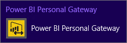

<properties 
   pageTitle="Power BI Gateway - Personal"
   description="Power BI Gateway - Personal"
   services="powerbi"
   documentationCenter=""
   authors="guyinacube"
   manager="mblythe"
   backup=""
   editor=""
   tags=""
   qualityFocus="no"
   qualityDate=""/>

<tags
   ms.service="powerbi"
   ms.devlang="NA"
   ms.topic="article"
   ms.tgt_pltfrm="NA"
   ms.workload="powerbi"
   ms.date="08/15/2016"
   ms.author="asaxton"/>

# Power BI Gateway - Personal

Power BI Gatway - Personal acts as a bridge, providing quick and secure data transfer between the Power BI service and on-premises data sources that support <bpt id="p1">[</bpt>refresh<ept id="p1">](powerbi-refresh-data.md)</ept>. This article is meant to provide you with an in-depth understanding of how the gateway works and whether or not a gateway is necessary for you. We've also put together this <bpt id="p1">[</bpt>helpful video<ept id="p1">](https://www.youtube.com/watch?v=de58vROLqZI)</ept> about the personal gateway. 

The personal gateway is only available with <bpt id="p1">[</bpt>Power BI Pro<ept id="p1">](powerbi-power-bi-pro-content-what-is-it.md)</ept>. It installs and runs as a service on your computer. As a service, it runs using a Windows account you  specify during configuration. In some cases, the Gateway runs as an application. We'll go into more about that later.

When Power BI refreshes data from an on-premises data source, the gateway assures your Power BI account has the right permissions to connect to and query data from the source.

Data transfer between Power BI and the gateway is secured through <bpt id="p1">[</bpt>Azure Service Bus<ept id="p1">](http://azure.microsoft.com/documentation/services/service-bus/)</ept>. The Service Bus creates a secure channel between the Power BI service and your computer. Because the gateway provides this secure connection, there’s usually no need to open a port in your firewall.

Before we go into details about the gateway, let’s look at some terms used in Power BI:

A <bpt id="p1">*</bpt>dataset<ept id="p1">*</ept> is data uploaded into the Power BI service from an online or on-premises data source. You create a dataset when you use Get Data to connect to and upload data. Datasets appear in the My Workspace pane of your Power BI Workspace in your browser. When you create reports and pin tiles to your dashboards, you’re looking at data from your datasets.

A <bpt id="p1">*</bpt>data source<ept id="p1">*</ept> is where the data you upload into a dataset really comes from.   You can also use Power Query or Power Pivot in Excel to connect to and query data from both online and on-premises data sources, all in the same workbook. With Power BI Desktop, you use Get Data to connect to and query data from both online and on-premises data sources.

The personal gateway is installed through the On-Premises Data Gateay. You can download it on the <bpt id="p1">[</bpt>Power BI Gateway page<ept id="p1">](https://powerbi.microsoft.com/gateway/)</ept>.

## Do I need a gateway?

Before you install a gateway, it's important to know whether or not you really need one. It really depends on your data sources:

### On-premises data sources

A personal gateway <bpt id="p1">*</bpt>is required<ept id="p1">*</ept> in order to refresh datasets that get data from a supported on-premises data source in your organization.

With a gateway, REFRESH NOW and SCHEDULE REFRESH are supported for datasets uploaded from:

-   Microsoft Excel 2013 (or later) workbooks where Power Query or Power Pivot is used to connect to and query data from a supported on-premises data source. All on-premises data sources shown in Get External Data in Power Query or Power Pivot support refresh except for Hadoop file (HDFS) and Microsoft Exchange.

-   Microsoft Power BI Desktop files where Get Data is used to connect to and query data from a supported on-premises data source. All on-premises data sources shown in Get Data support refresh except for Hadoop file (HDFS) and Microsoft Exchange.

### Online data sources

A personal gateway <bpt id="p1">*</bpt>is not required<ept id="p1">*</ept> in order to refresh datasets that get data only from an online data source.

REFRESH NOW and SCHEDULE REFRESH are supported without a gateway for datasets uploaded from:

-   Content packs from online data sources (content packs<ph id="ph1">\\</ph>services). By default, datasets from content packs are automatically updated once a day, but you can also refresh manually or setup a refresh schedule.

-   Microsoft Excel 2013 (or later) workbooks where Power Query or Power Pivot is used to connect to and query data from an online data source.

-   Microsoft Power BI Desktop files where Get Data is used to connect to and query data from an online data source.

<bpt id="p1">**</bpt>Question:<ept id="p1">**</ept> What if my Excel workbook or Power BI Desktop file gets data from both online and on-premises data sources?

<bpt id="p1">**</bpt>Answer:<ept id="p1">**</ept> A gateway <bpt id="p2">*</bpt>is<ept id="p2">*</ept> required. You will need to install and configure a gateway in order to refresh data from  your on-premises data sources.

<bpt id="p1">**</bpt>Question:<ept id="p1">**</ept> What if my Excel workbook just has rows of data I typed in?**

<bpt id="p1">**</bpt>Answer:<ept id="p1">**</ept> A gateway <bpt id="p2">*</bpt>is not<ept id="p2">*</ept> required. You only need to install and configure a gateway if your workbook uses Power Query or Power Pivot to query and load data to the data model from a supported on-premises data source

## Setting up a gateway for the first time

Setting up a gateway for the first time is a three step process:

1.  Download and install a gateway

2.  configurar la puerta de enlace

3.  Sign in to data sources in Power BI

Let’s take a closer look at each step.

### Download and install a gateway

You’ll be prompted to install a gateway when you click on REFRESH NOW or SCHEDULE REFRESH for a supported dataset for the first time. Or, to download the gateway, select <bpt id="p1">**</bpt>Data Gateway<ept id="p1">**</ept> under the Downloads menu. Download the <bpt id="p1">[</bpt>On-premises data gateway<ept id="p1">](http://go.microsoft.com/fwlink/?LinkID=820925)</ept>.

You will want to select <bpt id="p1">**</bpt>Personal Gateway<ept id="p1">**</ept> instead of <bpt id="p2">**</bpt>On-premises data gateway<ept id="p2">**</ept> to have a gateway that is for yourself.

There’s really not much to installing a gateway. You’ll select a location to install to, and read and accept the license agreement just like any other application. There are however some important things to know. In particular, the type of computer you install the gateway on and the type of account you’re logged in to Windows with on that computer.

> [AZURE.NOTE] The gateway needs to have access to the data source. If your personal machine cannot connect to the data source, you may want to consider installing an <bpt id="p1">[</bpt>On-premises Data Gateway<ept id="p1">](powerbi-gateway-onprem.md)</ept> on a machine that does have access to the data source. An example of this would be SQL Server installed on an virtual machine (VM) hosted in Azure. You personal machine may not have access to the VM. You could install the On-Premises Data Gateway on the VM instead, and configure the a data source within the Power BI service.

### Tipo de equipo

The type of computer you install the gateway on is important.

> [AZURE.NOTE] The personal gateway is supported only on 64-bit Windows operating systems.

On a laptop computer - In order for a scheduled refresh to occur, the gateway needs to be up and running. Laptop computers are usually shut down or asleep more than they’re running. If you install your gateway on a laptop, be sure to set your scheduled refresh times for when the laptop will be running. If it isn’t, the refresh will not be attempted again until the next scheduled refresh time.

On a desktop computer – Not many issues here. Just make sure the computer and the gateway is running at your scheduled refresh times. Many desktop computers go to sleep, scheduled refresh cannot occur if it’s asleep.

Once you install a gateway, you won’t have to install another. One gateway will work for any number of supported datasets. You also don’t have to install the gateway on the same computer you upload your workbook and Power BI Desktop files from. Here’s an example: Let’s say you have an Excel workbook that connects to a SQL Server data source in your organization. You used Get Data in Power BI to upload the workbook from your laptop computer. You also have a desktop computer you leave running all the time, and you’ve installed and configured a gateway on that computer. In Power BI, you’ve signed in to your data sources, and you’ve setup a refresh schedule for the dataset.  When a scheduled refresh time comes, Power BI makes a secure connection to the gateway installed on your desktop computer. It then securely connects to the data sources to get updates. For refresh, there’s no communication with the original workbook you uploaded from your laptop computer.

> [AZURE.NOTE] You can install the personal and enterprise gateways on the same computer.

### Windows account

When you install the gateway, you’ll be logged in to your computer using your Windows account. The type of permissions your Windows account has will have an effect on how the gateway is installed and how it is run in Windows.

When you’re logged into Windows:

||With Administrator permissions|Without Administrator permissions|
|---|---|---|
|**Power BI Gateway - Personal runs as a**|Servicio|Aplicación|
|**Scheduled Refresh**|As long as your computer and the gateway service is running, you do not have to be logged in at the scheduled refresh time.|You must be logged in to your computer at the scheduled refresh time.|
|**Change Windows account password**|You must change your Password in the gateway service. If the account password used by the gateway is no longer valid, refresh will fail.|The gateway will always run using the account and password you are currently logged in with. If you aren’t logged in to Windows, the gateway will not be running and refresh will fail.|

### configurar la puerta de enlace

When the Installation Wizard finishes, you’ll be prompted to launch the Configuration Wizard. There’s really not much to configuring a gateway. You’ll need to sign in to Power BI from the Wizard. This is necessary for the Wizard to establish a connection with your Power BI account in the Power BI service.

If you’re logged in to Windows with an account with Administrator permissions, you’ll be asked to enter your Windows account credentials. You can specify a different Windows account, but remember the permissions determine how the gateway is run. The gateway service will run using this account.

### Sign in to data sources

Once the Configuration Wizard finishes and your gateway is up and running, you’ll have to specify an Authentication type and sign in to each of your dataset’s data sources. You'll complete this step in Power BI.

You only need to specify an authentication type and sign in to a data source once. You sign in from the <bpt id="p1">**</bpt>Manage Data Sources<ept id="p1">**</ept> section in a dataset’s Settings screen. If you have multiple data sources, you’ll have to sign in to each one. The gateway determines a default Authentication type depending on the data source. In most cases, it’s Windows authentication; however, in some cases, your data source might require a different authentication type. If you’re unsure, check with your data source administrator.

## Up and running!

When your gateway is up and running, you can click SCHEDULE REFRESH for a dataset where you’ll see your dataset’s Settings page.

This page shows:

1. Refresh status – Shows refresh success and next scheduled refresh time.

2. <bpt id="p1">**</bpt>Gateway<ept id="p1">**</ept> - Shows whether or not a gateway is installed and online. If a gateway is installed but not online, Manage Data Sources and Schedule Refresh settings are disabled.

3. <bpt id="p1">**</bpt>Manage Data Sources<ept id="p1">**</ept> - Shows data sources the dataset connects to. You can Sign in or change the authentication type. You’ll only need to Sign in to each data source once.

4. <bpt id="p1">**</bpt>Schedule Refresh<ept id="p1">**</ept> – You can configure a refresh schedule settings here. If the gateway isn’t online, these settings will be disabled.

5. Refresh failure notifications – This option, selected by default, will send an e-mail to you if a scheduled refresh fails.

## Updating your Windows account password

If you were logged into your computer with a Windows account with administrator privileges when you installed your gateway, it runs as a service using the Windows account you specified in the Configuration Wizard. Most often, this will be the same Windows account you log in to your computer with. When you change your Windows account password, you’ll also need to change it in the gateway, otherwise the service might not be running and refresh will fail. To change your Windows account password for the gateway, select the personal gateway icon on your Windows Desktop Taskbar, or in Apps.

From here, you can update your password and check your gateway's connection status.

## Puertos

The gateway communicates on outbound ports: TCP 443 (default), 5671, 5672, 9350 thru 9354.  The gateway does not require inbound ports.

|Nombres de dominio|Outbound ports|Descripción|
|---|---|---|
|*.powerbi.com|443|HTTPS|
|*.analysis.windows.net|443|HTTPS|
|*.login.windows.net|443|HTTPS|
|*.servicebus.windows.net|5671-5672|Advanced Message Queuing Protocol (AMQP)|
|*.servicebus.windows.net|443, 9350-9354|Listeners on Service Bus Relay over TCP (requires 443 for Access Control token acquisition)|
|*.frontend.clouddatahub.net|443|HTTPS|
|*.core.windows.net|443|HTTPS|
|login.microsoftonline.com|443|HTTPS|
|login.windows.net|443|HTTPS|

If you need to white list IP addresses instead of the domains, you can download and use the Microsoft Azure Datacenter IP ranges list. [Descarga](https://www.microsoft.com/download/details.aspx?id=41653)

## Solucionar problemas

If you're having trouble when installing and configuring a personal gateway, be sure to see <bpt id="p1">[</bpt>Troubleshooting Power BI Gateway - Personal<ept id="p1">](powerbi-admin-troubleshooting-power-bi-personal-gateway.md)</ept>.

## Consulte también

[Troubleshooting Power BI Gateway - Personal](powerbi-admin-troubleshooting-power-bi-personal-gateway.md)  
[Configuring proxy settings for the Power BI Gateways](powerbi-gateway-proxy.md)  
More questions? [Try the Power BI Community](http://community.powerbi.com/)
