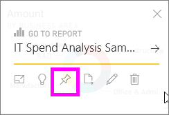

<properties
   pageTitle="Anclar un mosaico de un panel a otro panel"
   description="Anclar un mosaico de un panel a otro panel"
   services="powerbi"
   documentationCenter=""
   authors="mihart"
   manager="mblythe"
   backup=""
   editor=""
   tags=""
   qualityFocus="no"
   qualityDate=""/>

<tags
   ms.service="powerbi"
   ms.devlang="NA"
   ms.topic="article"
   ms.tgt_pltfrm="NA"
   ms.workload="powerbi"
   ms.date="10/14/2016"
   ms.author="mihart"/>

# Anclar un mosaico de un panel a otro panel  

Una manera de agregar un nuevo [icono Panel de](powerbi-service-dashboard-tiles.md) está copiando desde otro panel. Cada uno de estos iconos, al hacer clic, es un vínculo al lugar donde se creó--en Q & o un informe. 

>[AZURE.NOTE] No se puede anclar mosaicos de paneles compartidos.

1.  
            [Obtener datos](powerbi-service-get-data.md). Este ejemplo se utiliza la [ejemplo de análisis de gasto de TI](powerbi-sample-it-spend-analysis-take-a-tour.md).
2.  Abrir un [panel](powerbi-service-dashboards.md).
3.  Mantenga el mouse sobre el icono que desea anclar, seleccione el botón de puntos suspensivos (...) y elija el pin  icono.  
    

4.  Anclar el mosaico a un panel existente o a un nuevo panel. 

    -   
            **Panel existente**: seleccione el nombre del panel en la lista desplegable.
    -   
            **Nuevo panel**: escriba el nombre del nuevo panel.

    

5.  Seleccione el Pin.
    Un mensaje de confirmación (cerca de la esquina superior derecha) le permite saber que se ha agregado la visualización, como un icono en el panel seleccionado.

    
6.  En el panel de navegación, seleccione el panel con el nuevo icono. Allí, puede [cambiar el nombre, tamaño, vincular y mover](powerbi-service-edit-a-tile-in-a-dashboard.md) la visualización anclada.

## Véase también  

            [Informes de Power BI](powerbi-service-reports.md)  

            [Preguntas y respuestas en Power BI](powerbi-service-q-and-a.md)  

            [Vista previa de Power BI: conceptos básicos](powerbi-service-basic-concepts.md)  

            [Paneles de vista previa de Power BI](powerbi-service-dashboards.md)  

¿Preguntas más frecuentes? 
            [Pruebe la Comunidad de Power BI](http://community.powerbi.com/)
