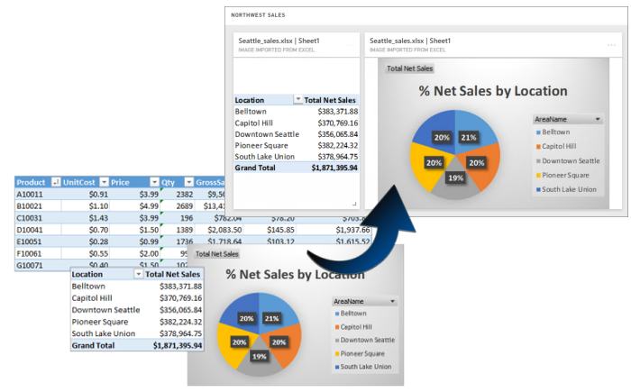

<properties
   pageTitle="Publicador de Power BI para Excel"
   description="Aprenda a usar el Editor de Power BI para Excel"
   services="powerbi"
   documentationCenter=""
   authors="davidiseminger"
   manager="mblythe"
   backup=""
   editor=""
   tags=""
   qualityFocus="complete"
   qualityDate=""/>

<tags
   ms.service="powerbi"
   ms.devlang="NA"
   ms.topic="article"
   ms.tgt_pltfrm="NA"
   ms.workload="powerbi"
   ms.date="10/12/2016"
   ms.author="davidi"/>

# Publicador de Power BI para Excel

Con Microsoft **publisher Power BI para Excel**, puede tomar instantáneas de la información más importante en Excel, como tablas dinámicas, gráficos y rangos y anclar en los paneles de Power BI.

¿Qué puede anclar? Prácticamente cualquier cosa en una hoja de cálculo de Excel. Puede seleccionar un rango de celdas de una hoja o tabla, una tabla dinámica o gráfico dinámico, ilustraciones e imágenes, textos.

¿Qué no se puede anclar: no se puede anclar 3D Maps o visualizaciones en hojas de Power View. También hay algunos elementos que se puede anclar pero no tiene mucho sentido, como un filtro de segmentación de datos o de escala de tiempo.

Al anclar un elemento desde Excel, se agrega un nuevo mosaico a un panel nuevo o existente en Power BI. El nuevo mosaico es una instantánea, por lo que no es dinámica, pero se puede actualizar. Por ejemplo, si realiza un cambio en una tabla dinámica o gráfico ya anclados, el icono Panel de Power BI no se actualiza automáticamente, pero todavía puede actualizar los elementos anclados mediante **Pin Manager**. Aprenderá más acerca de **Manager Pin** en las secciones siguientes.

## Descarga e instalación
Publicador de Power BI para Excel es un complemento que puede descargar e instalar en las versiones de escritorio de Microsoft Excel 2007 y versiones posteriores.

[Descargue el publicador de Power BI para Excel](http://go.microsoft.com/fwlink/?LinkId=715729)

Una vez que el publicador instalado, verá un nuevo **Power BI** la cinta de opciones en Excel, donde puede iniciar sesión (o cerrar sesión) de Power BI, anclar elementos a los paneles y administrar elementos anclados ya.

El **publisher Power BI para Excel** complemento está habilitado de forma predeterminada, pero si por algún motivo no aparece en la ficha de cinta de opciones de Power BI en Excel, debe habilitarla. Haga clic en **archivo** > **opciones** > **complementos** > **complementos COM**. Seleccione **Publisher de Microsoft Power BI para Excel**.

## Anclar un intervalo a un panel
Puede seleccionar cualquier rango de celdas de la hoja de cálculo y el pin de una instantánea de ese intervalo a una existente o un nuevo panel en Power BI. Puede anclar la misma instantánea a varios paneles, demasiado.

Para empezar, debe asegurarse de que ha iniciado sesión Power BI.

1.  Seleccione **perfil** desde el **Power BI** ficha de cinta de opciones en Excel. Si ya has iniciado sesión Power BI, verá un cuadro de diálogo que muestra qué cuenta se haya iniciado la sesión con. Si es la cuenta que desea utilizar, great - vaya al siguiente conjunto de pasos para anclar el intervalo. Seleccione *Cerrar sesión* Si desea usar una cuenta diferente de Power BI. Si no ha iniciado sesión, vaya al paso siguiente (paso 2).

    

2.  Si no ha iniciado sesión, seleccione la **Inicio de sesión** vínculo que aparece al seleccionar **perfil** desde el **Power BI** ficha en Excel, la cinta de opciones en el **Conectar a Power BI** cuadro de diálogo Escriba la dirección de correo electrónico de la cuenta de Power BI que desea usar y después seleccione **Inicio de sesión**.

    

Una vez iniciada la sesión, siga estos pasos para anclar un intervalo a un panel:

1.  En Excel, seleccione la **Power BI** ficha de cinta de opciones para ver la **Pin** botón de la cinta.
2.  Seleccione un intervalo en el libro de Excel.
3.  Haga clic en el **Pin** botón desde la **Power BI** cinta de opciones para mostrar el **Pin al cuadro de diálogo panel**. Si todavía no ha iniciado en Power BI, se solicitará que lo haga. Seleccione un área de trabajo desde el **área de trabajo** lista desplegable. Si desea anclar a su propio panel, compruebe **Mi área de trabajo** está seleccionada. Si desea anclar a un panel en un área de trabajo de grupo, seleccione el grupo de la lista desplegable.
4.  Elija si desea anclar a un *panel existente* o crear un *nuevo panel*.
5.  Haga clic en **bien** para anclar la selección al panel.
6.  En **Anclar a panel**, seleccione un panel existente en el área de trabajo o cree uno nuevo y, a continuación, haga clic en el **Aceptar** botón.

    

## Anclar un gráfico a un panel
Haga clic en el gráfico y, a continuación, haga clic en Anclar .

## Administrar elementos anclados
Con **Pin Manager**, puede actualizar el icono asociado del elemento (actualizar) un anclados en Power BI. También puede quitar el pin entre los elementos anclados a paneles en Power BI.

Para actualizar los iconos en el panel de **Manager Pin** Seleccione uno o varios elementos y, a continuación, seleccione **actualizar**.

Para quitar la asignación entre un elemento anclado en Excel y el icono asociado en un panel, quite **quitar**. Al seleccionar **quitar**, le *no* quitar el elemento de la hoja de cálculo de Excel o eliminar el icono asociado en el panel. Va a quitar el pin o *asignación*, entre ellos. El elemento eliminado ya no aparecerá en **Pin Manager**. Si ancla el elemento nuevo, aparecerá un nuevo mosaico.

Para quitar un elemento anclado (un mosaico) de un panel, debe hacerlo en Power BI. En el icono que desea eliminar, seleccione la **menú Abrir** icono  y, a continuación, seleccione **Delete mosaico**.   

## Conectarse a datos en Power BI

A partir de la versión de julio de 2016 de **publisher Power BI para Excel** (incluida la versión actual, vinculada al anterior), puede conectarse directamente a los datos en el servicio Power BI y analizan los datos en Excel con tablas dinámicas y gráficos dinámicos. Esta característica hace fácil de usar datos de Power BI y Excel para analizar los datos que es más importantes para usted.

Mejoras incluyen lo siguiente:

-   Todos los controladores necesarios para conectarse a datos en Power BI se actualizan automáticamente con cada lanzamiento - sin necesidad de instalar o administrar los controladores usted mismo.
-   Ya no necesita descargar los archivos .odc para crear conexiones - **publisher Power BI para Excel** crea las conexiones automáticamente cuando se selecciona el informe o el conjunto de datos que desea utilizar.
-   Ahora puede crear varias conexiones y tablas dinámicas en el mismo libro
-   Los errores son mejorada y específicas de **publisher Power BI para Excel**, en lugar de utilizar mensajes de Excel predeterminados

### Cómo conectarse a datos de Power BI en Excel

Para conectarse a datos de Power BI mediante **publisher Power BI para Excel**, siga estos pasos:

1.  Asegúrese de que ha iniciado sesión Power BI. Anteriormente en este artículo, se proporcionan los pasos que describen cómo iniciar sesión (o iniciar sesión con una cuenta diferente).

2.    Una vez que haya iniciado sesión Power BI con la cuenta que desea utilizar, seleccione **Conectar a datos** desde el **Power BI** ficha de cinta de opciones en Excel.

    

3.  Excel se conecta a Power BI mediante una conexión HTTPS y presenta la **Conectar a datos en Power BI** cuadro de diálogo, donde puede seleccionar la *área de trabajo* desde que va a seleccionar los datos (1, en la imagen siguiente), que *tipo de datos* que desea conectarse, ya sea un **informe** o un **conjunto de datos** (2), y un menú desplegable (3) que permite seleccionar qué *informe disponible o conjunto de datos* al que se conecta.

    

4.  Cuando realice sus selecciones y seleccione **Conectar** desde el **Conectar a datos en Power BI** cuadro de diálogo, prepara una tabla dinámica de Excel y muestra el **Fields de PivotTable** panel, donde puede seleccionar los campos de los datos de Power BI conectados y crear tablas o gráficos que le ayudarán a analizar los datos.

    

Si no tiene ningún dato en Power BI, Excel detecta que y ofrece la posibilidad de crear datos de ejemplo para conectarse a y pruebe.

Hay algunos aspectos que debe tener en cuenta en esta versión de **publisher Power BI para Excel**:

-   
            **Los datos compartidos** -no están disponibles en los datos que se ha compartido con usted, pero no es directamente visible para usted en Power BI, **Conectar a datos**.
-   
            **SSAS local** : Si selecciona el conjunto de datos se origina desde un local SQL Server Analysis Services (SSAS) y el conjunto de datos en Power BI usa DirectQuery para acceder a los datos **publisher Power BI para Excel** se conecta a los datos a través de la conexión de red local y realiza *no* vaya a través de Power BI para conectarse a los datos. Por lo tanto, cualquier usuario que intenta conectarse a estos conjuntos de datos debe estar conectado a la red local y es autenticado para tener acceso a datos con el método de autenticación empleado por la instancia de Analysis Services donde se almacenan los datos.
-   
            **Controladores necesarios** - **publisher Power BI para Excel** instala todos los controladores necesarios para esta característica al trabajo y no automáticamente. Entre esos controladores instalados automáticamente es el controlador de Excel OLE DB para Analysis Services; Si se quita ese controlador por el usuario (o por cualquier otra razón), la conexión a los datos de Power BI no funcionará.
-   
            **Conjunto de datos debe tener medidas** -el conjunto de datos debe tener las medidas explícitas definidas para Excel para tratar las medidas como valores en las tablas dinámicas y analizar correctamente los datos. Obtenga más información sobre [medidas](powerbi-desktop-measures.md).
-   
            **Compatibilidad con grupos de** -conjuntos de datos compartidos con personas fuera del grupo especificado no se admiten y no se puede conectar a.
-   
            **Libre frente a suscripciones Pro** -actividades asociadas a grupos no se admiten para los usuarios gratuitos de Power BI y, por tanto, no verá los conjuntos de datos o informes compartidos con un grupo en su propia área de trabajo.
-   
            **Compartir informes o conjuntos de datos** -informes o conjuntos de datos que se comparten con los no se puede conectar a.
-   
            **Uso de tablas en lugar de los modelos de datos** -conjuntos de datos y los informes que se crean mediante la importación únicamente las tablas de Excel (sin un modelo de datos) no se admiten en este momento y no se puede conectar a.

Después de crear gráficos atractivos u otros elementos visuales, como un rango de datos, puede fácilmente anclar a un panel en Power BI, tal como se describe anteriormente en este artículo.

## Artículos relacionados

Hay muchas maneras de utilizar Excel y Power BI juntos y obtener lo mejor de ambos. Eche un vistazo a los siguientes artículos para obtener más información.

-   [Analizar en Excel](powerbi-service-analyze-in-excel.md)

-   [Analizar en la solución de problemas de Excel](powerbi-desktop-troubleshooting-analyze-in-excel.md)
