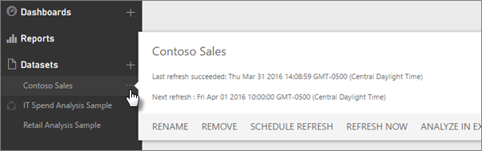
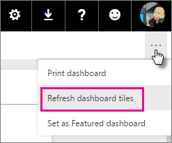

<properties
   pageTitle="Actualización de datos en Power BI"
   description="Actualización de datos en Power BI"
   services="powerbi"
   documentationCenter=""
   authors="guyinacube"
   manager="mblythe"
   backup=""
   editor=""
   tags=""
   qualityFocus="complete"
   qualityDate="03/31/2016"/>

<tags
   ms.service="powerbi"
   ms.devlang="NA"
   ms.topic="article"
   ms.tgt_pltfrm="NA"
   ms.workload="powerbi"
   ms.date="09/21/2016"
   ms.author="asaxton"/>

# Actualización de datos en Power BI  

Asegurarse de que siempre obtendrá los datos más recientes a menudo es esencial para tomar las decisiones correctas. Probablemente ya ha usado obtener datos en Power BI para conectarse a y cargar datos de creado algunos informes y un panel. Ahora, desea asegurarse de que los datos están realmente mejor y el más reciente.

En muchos casos, no es necesario hacer nada en absoluto. Algunos datos, como en una fuerza de ventas o paquete de contenido de Marketo se actualiza automáticamente para usted. Si su hace conexión será el uso de una conexión activa o DirectQuery, los datos se actualiza a fecha. Pero, en otros casos, como con un libro de Excel o Power BI Desktop que se conecta a una referencia externa en línea u origen de datos local, deberá actualizar manualmente o configurar una programación de actualización para Power BI puede actualizar los datos en los informes y paneles para usted.

En este artículo, junto con algunos otros, están diseñados para ayudarle a entender cómo funciona realmente la actualización de datos en Power BI, si no necesita configurar una programación de actualización y lo que debe ser in situ para actualizar los datos correctamente.

## Actualización de datos por tipo de suscripción 
 
Antes que avancemos, es importante saber cómo funciona según el tipo de suscripción de Power BI de actualización de datos. Hay dos tipos diferentes de las suscripciones de usuario, Power BI (gratuito) y Power BI Pro. Power BI Pro proporciona la capacidad y la frecuencia de actualización adicional.

|**Actualización de datos**|**Power BI (gratis)**|**Power BI Pro**|
|---|---|---|
|Conjuntos de datos programada para actualizar|A diario|Cada hora *|
|Transmisión de datos en los paneles e informes mediante la API de REST de Microsoft Power BI o análisis de transmisiones de Microsoft.|10 k filas por hora|1 millón de filas/hora|
|Orígenes de datos DirectQuery/Live local con una interactividad completa a través de la puerta de enlace de datos local| | |
|Orígenes de datos de nube en directo con interactividad completa (base de datos de SQL de Azure, almacenamiento de datos de SQL Azure, Spark en HDInsight)| | |
|En orígenes de datos locales que requieren una puerta de enlace de Power BI - Personal o la puerta de enlace de datos local.| | |

\* Hasta ocho veces (horas) por día.

## Actualización de datos de conocimiento  
Antes de configurar la actualización, es importante entender qué es que está actualizando y que está obteniendo los datos.

Un *origen de datos* es donde los datos explorar en los informes y paneles procede realmente; por ejemplo, un servicio en línea, como Google Analytics o QuickBooks, una base de datos en la nube como base de datos de SQL Azure, o una base de datos o archivo en un equipo local o el servidor en su propia organización. Se trata de todos los orígenes de datos. El tipo de origen de datos determina cómo se actualizan los datos del mismo. Vamos a actualizar para cada tipo de origen de datos un poco más adelante en el [lo que pueden actualizarse?](#what-can-be-refreshed) sección.

Un *conjunto de datos* se crea automáticamente en Power BI al utilizar la obtención de datos para conectarse a y carga de datos desde un paquete de contenido, archivo o conectarse a un origen de datos en directo. En Power BI Desktop y Excel 2016, también puede publicar su derecho de archivo para el servicio Power BI, que es similar a utilizar la obtención de datos.

En cada caso, un conjunto de datos se crea y aparece en los contenedores de Mi área de trabajo o grupo, en el servicio Power BI. Cuando se selecciona el **puntos suspensivos (...)** para un conjunto de datos, explorar los datos en un informe, editar la configuración y actualización de la instalación.
  

Un conjunto de datos puede obtener datos de uno o más orígenes de datos. Por ejemplo, puede usar Power BI Desktop para obtener datos de una base de datos SQL de su organización y obtener otros datos de una fuente en línea de OData. A continuación, al publicar el archivo en Power BI, se crea un único conjunto de datos, pero tendrá los orígenes de datos para la base de datos SQL y la fuente de OData.

Un conjunto de datos contiene información sobre los orígenes de datos, las credenciales del origen de datos, y en la mayoría de los casos, un conjunto de datos secundarios se copia desde el origen de datos. Al crear visualizaciones en informes y paneles, busca en el conjunto de datos o en el caso de una conexión activa como base de datos de SQL Azure, el conjunto de datos define los datos verá directamente desde el origen de datos. Para una conexión activa con Analysis Services, la definición de conjunto de datos se centra en Analysis Services directamente.

> *Al actualizar los datos, actualizando los datos del conjunto de datos que se almacena en Power BI desde el origen de datos. Esta actualización es una actualización completa y no de forma incremental.* 

Siempre que actualice los datos en un conjunto de datos, ya sea a través de actualizar ahora o mediante la configuración de una programación de actualización, Power BI usa información del conjunto de datos para conectarse a los orígenes de datos definidos para ella, la consulta para obtener datos actualizados y, a continuación, carga los datos actualizados en el conjunto de datos. Las visualizaciones en informes o paneles basados en los datos se actualizan automáticamente.

Antes que avancemos, hay algo que es muy importante comprender: 

> *Independientemente de la frecuencia con que actualice el conjunto de datos, o la frecuencia con mirar los datos en directo, es los datos en el origen de datos debe estar actualizado en primer lugar.*

La mayoría de las organizaciones procesan los datos una vez al día, normalmente por la noche. Si programa la actualización de un conjunto de datos creado a partir de un archivo de Power BI Desktop se conecta a una base de datos local y el departamento de TI realiza el procesamiento en esa base de datos SQL una vez por la noche, sólo necesitará configurar actualización programada para ejecutarse una vez al día. Por ejemplo, después de que ocurra el procesamiento en la base de datos, pero antes de que venga a trabajar. Por supuesto, esto no siempre es el caso. Power BI proporciona muchas formas de conectarse a orígenes de datos que se actualizan con frecuencia o son incluso en tiempo real.

## Tipos de actualización

Hay cuatro tipos principales de actualización que se producen dentro de Power BI. Actualización de paquetes de actualización de datos del modelo, actualización y actualización de contenedor visual en mosaico.

### Actualización de paquetes

Esto sincroniza el archivo de Power BI Desktop o Excel, entre el servicio Power BI y OneDrive o SharePoint Online. No se extrae datos del origen de datos original. Sólo se actualizará el conjunto de datos en Power BI con lo que está en el archivo en OneDrive o SharePoint Online.

### Actualización de datos del modelo

Esto hace referencia a actualizar el conjunto de datos, en el servicio de Power BI con datos procedentes del origen de datos original. Esto se realiza mediante cualquier programa de actualización o actualizar ahora. Esto requiere una puerta de enlace de orígenes de datos locales.

### Actualización de mosaico

Icono Actualizar actualiza la caché de objetos visuales del mosaico, en el panel, los cambios en los datos una vez. Esto sucede con cada quince minutos. También puede forzar una actualización de mosaico seleccionando el **puntos suspensivos (...)** en la superior derecha de un panel y seleccione **Actualizar iconos de panel**.

Para obtener detalles sobre los errores comunes de actualización de mosaico, consulte [solucionar errores de mosaico](powerbi-refresh-troubleshooting-tile-errors.md).

### Actualización de contenedor Visual

Actualizar el contenedor visual, actualizan los elementos visuales de informe almacenado en caché, dentro de un informe, una vez los cambios de datos.

## ¿Qué se puede actualizar?

En Power BI, normalmente usará obtener datos para importar datos desde un archivo en una unidad local, OneDrive o SharePoint Online, publicar un informe de Power BI Desktop o conectarse directamente a una base de datos en la nube en su propia organización. Se pueden actualizar cualquier datos en Power BI, pero si necesita o no depende de cómo se creó el conjunto de datos desde y se conecta a los orígenes de datos. Echemos un vistazo a cómo cada uno de ellos la actualización de datos.

Antes de aún más, presentamos algunas definiciones importantes de entender:

            **Actualización automática**  -Esto significa que ninguna configuración de usuario es necesaria para el conjunto de datos se actualice de forma periódica. Configuración de actualización de datos se configura que Power BI. Proveedores de servicios en línea, normalmente se produce la actualización una vez al día. Para los archivos cargados desde OneDrive, la actualización automática se produce cada hora para los datos que no proceden de un origen de datos externo. Aunque puede configurar opciones de actualización de programación diferente y actualizar manualmente, probablemente no necesite.

            **Manual de usuario configurado o actualización programada** : Esto significa que puede actualizar un conjunto de datos mediante actualizar ahora manualmente o configurar una programación de actualización mediante programación de actualización de configuración de un conjunto de datos. Este tipo de actualización es necesaria para los archivos de Power BI Desktop y libros de Excel que se conectan a externos en línea y orígenes de datos locales.

> [AZURE.NOTE] Cuando se configura una hora de actualización programada, puede haber un retraso de hasta una hora antes de que comience.

            **Live/DirectQuery** : significa que hay una conexión activa entre Power BI y el origen de datos. Para los orígenes de datos locales, administradores debe tener un origen de datos configurado dentro de una puerta de enlace de acción, pero no puede ser necesaria la interacción del usuario.

## Archivos locales y en SharePoint Online o de OneDrive

Actualización de datos es compatible con archivos de Power BI Desktop y libros de Excel que se conectan a externo en línea o los orígenes de datos locales. Sólo actualiza los datos del conjunto de datos en el servicio Power BI. No se actualizará el archivo local.

Mantener los archivos en OneDrive o SharePoint Online y conectarse a ellos desde Power BI, proporcionan una gran cantidad de flexibilidad. Pero ese de flexibilidad, también hace una del más difícil de entender. Actualización programada para archivos almacenados en OneDrive o SharePoint Online, son diferentes de actualización de paquetes. Puede obtener más información en el [tipos de actualización](#types-of-refresh) sección.

### Archivo de Power BI Desktop

|**Origen de datos**|**Actualización automática**|**Actualización manual o programada configurada por el usuario**|**Puerta de enlace necesaria**|
|---|---|---|---|
|Obtener datos (en la cinta de opciones) se utilizan para conectarse y consultar datos de cualquier origen de datos en línea indicados.|No|Sí|No|
|Obtener datos se utilizan para conectarse a y explorar una base de datos de Analysis Services activa.|Sí|No|Sí|
|Obtener datos se utilizan para conectarse a y explorar un origen de datos DirectQuery local compatible.|Sí|No|Sí|
|Obtener datos se usan para conectarse y consultar datos de una base de datos de SQL de Azure, almacenamiento de datos de SQL Azure, Azure HDInsight Spark.|Sí (cada hora)|Sí|No|
|Obtener datos se usan para conectarse y consultar datos de cualquier origen de datos local enumerados excepto archivo Hadoop (HDFS) y Microsoft Exchange.|No|Sí|Sí|

Para obtener más información, consulte [actualizar un conjunto de datos creado a partir de un archivo de Power BI Desktop en OneDrive](powerbi-refresh-desktop-file-onedrive.md).

### Libro de Excel

|**Origen de datos**|**Actualización automática**|**Actualización manual o programada configurada por el usuario**|**Puerta de enlace necesaria**|
|---|---|---|---|
|Tablas de datos en una hoja de cálculo que no se cargan en el modelo de datos de Excel.|Sí, cada hora *(OneDrive y SharePoint Online sólo)*|Sólo manual *(OneDrive y SharePoint Online sólo)*|No|
|Tablas de datos en una hoja de cálculo vinculan a una tabla en el modelo de datos de Excel (tablas vinculadas).|Sí, cada hora *(OneDrive y SharePoint Online sólo)*|Sólo manual *(OneDrive y SharePoint Online sólo)*|No|
|Consulta de alimentación * se usa para conectarse y consultar datos de cualquier origen de datos en línea enumerados y cargar datos en el modelo de datos de Excel.|No|Sí|No|
|Consulta de alimentación * se usa para conectarse y consultar datos de cualquier origen de datos local enumerados excepto archivo Hadoop (HDFS) y Microsoft Exchange y cargar datos en el modelo de datos de Excel.|No|Sí|Sí|
|Power Pivot se usa para conectarse y consultar datos de cualquier origen de datos en línea enumerados y cargar datos en el modelo de datos de Excel.|No|Sí|No|
|Power Pivot se usa para conectarse y consultar datos de los datos de origen y carga de datos enumerados en el local en el modelo de datos de Excel.|No|Sí|Sí|

*\* Power Query se conoce como Get y transformar datos en Excel 2016.*

Para obtener más información, consulte [actualizar un conjunto de datos creado a partir de un libro de Excel en OneDrive](powerbi-refresh-excel-file-onedrive.md).

### Separados por comas (.csv) de valor archivo en OneDrive o SharePoint Online

|**Origen de datos**|**Actualización automática**|**Actualización manual o programada configurada por el usuario**|**Puerta de enlace necesaria**|
|---|---|---|---|
|Valor separado por comas simple|Sí, cada hora|Sólo manual|No|

Para obtener más información, consulte [actualizar un conjunto de datos creado a partir de un archivo de (.csv) de valores separados por comas en OneDrive](powerbi-refresh-csv-file-onedrive.md).

## Paquetes de contenido  
Hay dos tipos de paquetes de contenido en Power BI:

            **Paquetes de servicios en línea de contenido**:, como Adobe Analytics, SalesForce y Dynamics CRM Online. Conjuntos de datos creados desde los servicios en línea se actualizan automáticamente una vez al día. Aunque probablemente no es necesario, puede actualizar manualmente o configurar una programación de actualización. Servicios en línea, ya están en la nube no se requiere una puerta de enlace.

            **Paquetes de contenido organizativo**: creada y compartida por los usuarios de su propia organización. Los consumidores del paquete de contenido no se pueden configurar una programación de actualización o actualizar manualmente. Sólo el creador del paquete de contenido puede configurar la actualización de los conjuntos de datos en el paquete de contenido. Actualizar la configuración se hereda el conjunto de datos.

### Paquetes de contenido de servicios en línea

|**Origen de datos**|**Actualización automática**|**Actualización manual o programada configurada por el usuario**|**Puerta de enlace necesaria**|
|---|---|---|---|
|Servicios en línea en obtener datos &gt; Services|Sí|Sí|No|

### Paquetes de contenido organizativo

Actualizar las capacidades de un conjunto de datos que se incluyen dentro de una organización de contenido del conjunto de datos depende del módulo. Consulte la información anterior en relación con los archivos locales, OneDrive o SharePoint Online.

Para obtener más información, consulte [Introducción a los paquetes de contenido organizativo](powerbi-service-organizational-content-packs-introduction.md).

## Conexiones activas y DirectQuery a orígenes de datos locales 
Con la puerta de enlace de datos local, puede emitir consultas de Power BI para los orígenes de datos locales. Cuando se interactúa con una visualización, las consultas se envían desde Power BI directamente a la base de datos. A continuación, se devuelven datos actualizados y visualizaciones se actualizan. Ya hay una conexión directa entre Power BI y la base de datos, no hay ninguna necesidad para programar la actualización. 

Cuando se configura un origen de datos con la puerta de enlace de datos local, puede utilizar ese origen de datos como la opción de actualización programada. Esto sería en lugar de utilizar la puerta de enlace personal.

> [AZURE.NOTE] Si el conjunto de datos está configurado para el activo o DirectQuery conexión, no tendrá la opción de actualización programada. Actualización programada sólo está disponible para conjuntos de datos importados.

|**Origen de datos**|**Live/DirectQuery**|**Actualización manual o programada configurada por el usuario**|**Puerta de enlace necesaria**|
|---|---|---|---|
|Analysis Services Tabular|Sí|Sí|Sí|
|Multidimensional de Analysis Services|Sí|Sí|Sí|
|SQL Server|Sí|Sí|Sí|
|SAP HANA|Sí|Sí|Sí|
|Oracle|Sí|Sí|Sí|
|Teradata|Sí|Sí|Sí|

Para obtener más información, consulte [puerta de enlace de datos local](powerbi-gateway-onprem.md)

## Bases de datos en la nube  

Con DirectQuery, hay una conexión directa entre Power BI y la base de datos en la nube. Cuando se interactúa con una visualización, las consultas se envían desde Power BI directamente a la base de datos. A continuación, se devuelven datos actualizados y visualizaciones se actualizan. Si no hay ninguna interacción del usuario en una visualización, como en un panel datos se actualizan automáticamente cada quince minutos aproximadamente. Porque no hay una conexión directa entre Power BI y la base de datos, no hay ninguna necesidad de actualizar manualmente o configurar una programación de actualización para el conjunto de datos. Y dado que el servicio Power BI y el origen de datos están en la nube, no es necesario para una puerta de enlace Personal.

|**Origen de datos**|**Live/DirectQuery**|**Actualización manual o programada configurada por el usuario**|**Puerta de enlace necesaria**|
|---|---|---|---|
|Almacenamiento de datos de Azure SQL|Sí|No|No|
|Spark en HDInsight|Sí|No|No|

Para obtener más información, consulte [Azure y Power BI](powerbi-azure-and-power-bi.md).

## Paneles en tiempo real  

Paneles en tiempo real, utilizan la API de REST de Microsoft Power BI o análisis de transmisiones de Microsoft, para asegurarse de que los datos están actualizados. Dado que los paneles en tiempo real requiere que los usuarios configurar la actualización, son fuera del ámbito de este artículo.

|**Origen de datos**|**Automático**|**Actualización manual o programada configurada por el usuario**|**Puerta de enlace necesaria**|
|---|---|---|---|
|Aplicaciones personalizadas desarrolladas con la API de Rest de Power BI o análisis de transmisiones de Microsoft|Sí, live streaming|No|No|

Para obtener más información, consulte [crear un panel en tiempo real en Power BI](https://msdn.microsoft.com/library/mt267603.aspx).

## Configurar la actualización programada

Para obtener información sobre cómo configurar la actualización programada, consulte [Configurar la actualización programada](powerbi-refresh-scheduled-refresh.md)

## Escenarios comunes de la actualización de datos  

A veces, la mejor manera para obtener información acerca de la actualización de datos en Power BI para buscar ejemplos. Estos son algunos de los escenarios de actualización de datos más comunes:

### Libro de Excel con tablas de datos  

Tiene un libro de Excel con varias tablas de datos, pero ninguna de ellas se cargan en el modelo de datos de Excel. Use obtener datos para cargar el archivo de libro de la unidad local en Power BI y crear un panel. Pero, ahora ha realizado algunos cambios a un par de tablas del libro en la unidad local, y desea actualizar el panel en Power BI con los nuevos datos.

Desafortunadamente, la actualización no se admite en este escenario. Para actualizar el conjunto de datos para el escritorio, tendrá que volver a cargar el libro. Sin embargo, hay una solución excelente: colocar el archivo de libro en OneDrive o SharePoint Online!

Cuando se conecta a un archivo en OneDrive o SharePoint Online, los informes y paneles mostrará datos como en el archivo. En este caso, el libro de Excel. Power BI comprueba automáticamente el archivo, sobre cada hora para las actualizaciones. Si realiza cambios en el libro (almacenado en OneDrive o SharePoint Online), esos cambios se reflejan en el panel y los informes en una hora. No es necesario para la instalación de actualización en absoluto. Sin embargo, si necesita ver las actualizaciones en Power BI inmediatamente, puede actualizar manualmente el conjunto de datos mediante actualizar ahora.

Para obtener más información, consulte [datos en Power BI de Excel](powerbi-service-excel-data.md),[Reemplazar un archivo de Excel, Power BI Desktop o CSV en Power BI](powerbi-replace-an-excel-power-bi-desktop-or-csv-file.md), [actualizar un conjunto de datos creado a partir de un libro de Excel en OneDrive](powerbi-refresh-excel-file-onedrive.md).

### Libro de Excel se conecta a una base de datos SQL de la compañía  

Supongamos que tiene un libro de Excel denominado SalesReport.xlsx en el equipo local. Power Query en Excel se utiliza para conectarse a una base de datos SQL en un servidor de la compañía y la consulta de datos de ventas que se cargan en el modelo de datos. Cada mañana, abra el libro y presione actualizar para actualizar las tablas dinámicas.

Ahora desea explorar los datos de ventas en Power BI, por lo que usar obtener datos para conectarse y cargar el libro SalesReport.xlsx de la unidad local.

En este caso, puede actualizar los datos del conjunto de datos SalesReport.xlsx manualmente o configurar una programación de actualización. Dado que los datos proceden realmente de la base de datos SQL de la compañía, debe descargar e instalar una puerta de enlace. Una vez que haya instalado y configurado la puerta de enlace, deberá entrar en la configuración del conjunto de datos SalesReport e inicie sesión en el origen de datos pero sólo tendrá que hacerlo una vez. Puede, a continuación, el programa de instalación de una actualización de programación para Power BI se conecta a la base de datos SQL y obtiene automáticamente los datos actualizados. Los informes y paneles también se actualizará automáticamente.

> [AZURE.NOTE] Sólo actualizará los datos dentro del conjunto de datos en el servicio Power BI. No se actualizará el archivo local como parte de la actualización.

Para obtener más información, consulte  [datos en Power BI de Excel](powerbi-service-excel-data.md), [Power BI Gateway - Personal](powerbi-personal-gateway.md), [puerta de enlace de datos local](powerbi-gateway-onprem.md), [actualizar un conjunto de datos creado a partir de un libro de Excel en una unidad local](powerbi-refresh-excel-file-local-drive.md).

### Archivo de Power BI Desktop con datos procedentes de una fuente de OData  
En este caso, utilice obtener datos en Power BI Desktop conectarse e importar datos del censo de una fuente de OData.  A continuación, crear varios informes en Power BI Desktop, nombre de archivo WACensus y guárdelo en un recurso compartido de su empresa. A continuación, publicar el archivo en el servicio Power BI.

En este caso, puede actualizar los datos del conjunto de datos WACensus manualmente o configurar una programación de actualización. Dado que los datos del origen de datos proceden de una fuente en línea de OData, no necesitará instalar una puerta de enlace, pero deberá entrar en la configuración del conjunto de datos del WACensus e inicie sesión en el origen de datos de OData. Puede, a continuación, el programa de instalación de una actualización de programación para Power BI se conecta a la fuente de OData y obtiene automáticamente los datos actualizados. Los informes y paneles también se actualizará automáticamente.

Para obtener más información, consulte [publicar desde Power BI Desktop](powerbi-desktop-upload-desktop-files.md), [actualizar un conjunto de datos creado a partir de un archivo de Power BI Desktop en una unidad local](powerbi-refresh-desktop-file-local-drive.md), [actualizar un conjunto de datos creado a partir de un archivo de Power BI Desktop en OneDrive](powerbi-refresh-desktop-file-onedrive.md).

### Compartido de paquete de contenido de otro usuario en su organización  

Se ha conectado a un paquete de contenido de organización. Incluye un panel, varios informes y un conjunto de datos.

En este escenario, no se puede configurar la actualización del conjunto de datos. El analista de datos que creó el paquete de contenido es responsable de asegurarse de que se actualiza el conjunto de datos, dependiendo de los orígenes de datos utilizados.

Si no están actualizando sus paneles e informes desde el paquete de contenido, desea hablar con el analista de datos que creó el paquete de contenido.

Para obtener más información, consulte [Introducción a los paquetes de contenido organizativo](powerbi-service-organizational-content-packs-introduction.md), [trabajar con paquetes de contenido organizativo](powerbi-service-organizational-content-packs-use-and-work-with.md).

### Paquete de contenido de un proveedor de servicios en línea como Salesforce  

En Power BI permite obtener datos conectarse e importar los datos de un proveedor de servicios en línea como Salesforce. Bueno, no hay mucho que hacer aquí. El conjunto de datos de Salesforce automáticamente está programado para actualizar una vez al día. 

Como los proveedores de servicios en línea la mayoría, Salesforce actualiza los datos una vez al día, normalmente por la noche. Puede actualizar el conjunto de datos de Salesforce manualmente o configurar una programación de actualización, pero no es necesario porque Power BI se actualizará automáticamente el conjunto de datos y los informes y paneles se actualizarán demasiado.

Para obtener más información, consulte [paquete de contenido de Salesforce para Power BI](powerbi-content-pack-salesforce.md).

## Solucionar problemas  

Cuando existe algún problema, suele ser porque Power BI no puede iniciar sesión en orígenes de datos, o el conjunto de datos se conecta a un origen de datos local y la puerta de enlace está sin conexión. Asegúrese de que Power BI puede iniciar sesión en orígenes de datos. Si cambia una contraseña que se utiliza para iniciar sesión en un origen de datos o Power BI Obtiene la sesión de un origen de datos, asegúrese de intentar iniciar sesión en los orígenes de datos en las credenciales de origen de datos.

Para obtener más información sobre cómo solucionar problemas, consulte [Herramientas para solucionar problemas de actualización](powerbi-refresh-tools-for-troubleshooting-issues.md) y [escenarios de actualización de la solución de problemas](powerbi-refresh-troubleshooting-refresh-scenarios.md).

## Consulte también

[Herramientas para solucionar problemas de actualización](powerbi-refresh-tools-for-troubleshooting-issues.md)  
[Para solucionar problemas de actualización](powerbi-refresh-troubleshooting-refresh-scenarios.md)  
[Puerta de enlace de Power BI - Personal](powerbi-personal-gateway.md)  
[Puerta de enlace de datos local](powerbi-gateway-onprem.md)  
¿Preguntas más frecuentes? [Pruebe la Comunidad de Power BI](http://community.powerbi.com/)