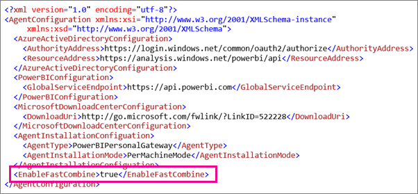

<properties
pageTitle="Deshabilitar la configuración de privacidad"
description="Cómo habilitar la combinación rápida dentro de la puerta de enlace Personal para deshabilitar la configuración de privacidad para la actualización."
services="powerbi"
documentationCenter=""
authors="guyinacube"
manager="mblythe"
backup=""
editor=""
tags=""
qualityFocus="complete"
qualityDate="04/01/2016"/>

<tags
ms.service="powerbi"
ms.devlang="NA"
ms.topic="article"
ms.tgt_pltfrm="na"
ms.workload="powerbi"
ms.date="08/15/2016"
ms.author="asaxton"/>
# Deshabilitar la configuración de privacidad en Power BI Gateway - Personal

Puede recibir el siguiente error basándose en la configuración de privacidad para los orígenes de datos cuando se usa con la puerta de enlace personal.

> *Se produjo un error al procesar los datos del conjunto de datos.*
>
> *[No se puede combinar datos] &lt;parte de la consulta&gt;/&lt;...&gt;/&lt;…&gt; tiene acceso a orígenes de datos que tienen niveles de privacidad que no pueden utilizarse juntos. Vuelva a generar esta combinación de datos.*

Para evitar este error, puede activar **combinación rápida**. 
            **Combinación rápida** pasará por alto la configuración de privacidad que permite a los orígenes de datos diferentes se combinan. 

> [AZURE.NOTE] Niveles de privacidad no se consideran al combinar datos. Esto podría exponer datos confidenciales o a otro origen de datos al combinar datos.

## ¿Qué es la combinación rápida?

Para obtener más información acerca de los niveles de privacidad y combinación rápida, puede mirar [niveles de privacidad](https://support.office.com/en-us/article/Privacy-levels-Power-Query-CC3EDE4D-359E-4B28-BC72-9BEE7900B540). De forma predeterminada, el nivel de privacidad se establecerá en privado, lo que podría provocar el error mencionado anteriormente. Esto es porque un valor de private aislará el origen de datos de otros orígenes. Un ejemplo de donde esto sería un problema sería una consulta parametrizada obtener entradas de otro origen de datos. 

Activar la combinación rápida omitirá la configuración privada y permitir la ejecución para que se produzca.

## Activar combinar rápida

Puede utilizar los pasos siguientes para habilitar la combinación rápida para la puerta de enlace personal. La puerta de enlace de datos local no tiene esta configuración.

1. Abra **ConnectorConfig.xml**.  Puede tratarse de una de estas dos ubicaciones en el equipo.  Si es administrador en el equipo, será la siguiente.

    <pre><code>C:\Program Files\Power BI Personal Gateway\1.0\Configurator\Connector</code></pre>

    Si no es un administrador, la ubicación será la siguiente.

    <pre><code>C:\Users\[username]\AppData\Local\Power BI Personal Gateway\1.0\Configurator\Connector</code></pre>

2.  Agregue el **&lt;EnableFastCombine&gt;** elemento con un valor de true para el archivo de configuración. Agregar este elemento se convertirá **combinación rápida** en.

    <pre><code>&lt;EnableFastCombine&gt;true&lt;/EnableFastCombine&gt;</code></pre>
    
    

3.  Salir y volver a iniciar la pantalla de configuración de puerta de enlace.

4.  Verá un estado que le permite que saber que la combinación rápida está habilitada.

    

## Desactive la opción de combinación rápida

1. Abra **ConnectorConfig.xml**.  Puede tratarse de una de estas dos ubicaciones en el equipo.  Si es administrador en el equipo, será la siguiente.

    <pre><code>C:\Program Files\Power BI Personal Gateway\1.0\Configurator\Connector</code></pre>

    Si no es un administrador, la ubicación será la siguiente.

    <pre><code>C:\Users\[username]\AppData\Local\Power BI Personal Gateway\1.0\Configurator\Connector</code></pre>

2.  Quitar el **&lt;EnableFastCombine&gt;** elemento desde el archivo de configuración. Quitar este elemento se convertirá **combinación rápida** off.

3.  Salir y volver a iniciar la pantalla de configuración de puerta de enlace.

4.  Ya no se verá un estado que le indica que sabe **combinación rápida** está habilitado.

## Consulte también

[Niveles de privacidad](https://support.office.com/en-us/article/Privacy-levels-Power-Query-CC3EDE4D-359E-4B28-BC72-9BEE7900B540)  
[Tareas comunes de consultas en Power BI Desktop](powerbi-desktop-common-query-tasks.md)  
¿Preguntas más frecuentes? [Pruebe la Comunidad de Power BI](http://community.powerbi.com/)
