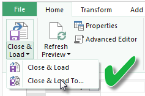

<properties
   pageTitle="Actualizar un conjunto de datos creado a partir de un libro de Excel - nube"
   description="Actualizar un conjunto de datos creado a partir de un libro de Excel en OneDrive o SharePoint Online"
   services="powerbi"
   documentationCenter=""
   authors="guyinacube"
   manager="mblythe"
   backup=""
   editor=""
   tags=""
   qualityFocus="complete"
   qualityDate="04/01/2016"/>

<tags
   ms.service="powerbi"
   ms.devlang="NA"
   ms.topic="article"
   ms.tgt_pltfrm="NA"
   ms.workload="powerbi"
   ms.date="08/15/2016"
   ms.author="asaxton"/>

# Actualizar un conjunto de datos creado a partir de un libro de Excel en OneDrive o SharePoint Online

Puede importar libros de Excel que se almacenan en el equipo local o en el almacenamiento en nube como OneDrive para SharePoint Online o de negocio. Veremos las ventajas de utilizar el almacenamiento en la nube para los archivos de excel. Para obtener más información acerca de cómo importar archivos de Excel en Power BI, consulte [obtener datos de archivos de libro de Excel](powerbi-service-excel-workbook-files.md).

## ¿Cuáles son las ventajas?  
Importación de archivos de OneDrive o de SharePoint Online es una excelente manera de asegurarse de que el trabajo que esté realizando en Excel permanece en sincronización con el servicio Power BI. Los datos que ha cargado en el modelo de su archivo se importación en el conjunto de datos y los informes que ha creado en el archivo se cargan en informes de Power BI. Si realiza cambios en el archivo en OneDrive o SharePoint Online, como agregar nuevas medidas, cambiar los nombres de columna o editar visualizaciones, una vez guardada, esos cambios se actualizarán en Power BI demasiado, normalmente dentro de una hora aproximadamente.

Cuando se importa un libro de Excel de su OneDrive personal, los datos del libro, como tablas de hojas de cálculo o datos que se cargan en el modelo de datos de Excel y la estructura del modelo de datos se importan en un nuevo conjunto de datos en Power BI. Las visualizaciones de Power View se vuelven a creadas en los informes. Power BI se conecta automáticamente al libro en OneDrive o SharePoint Online, sobre cada hora para comprobar si hay actualizaciones. Si ha cambiado el libro, Power BI actualizará el conjunto de datos e informes en el servicio Power BI.

Puede actualizar el conjunto de datos en el servicio Power BI. Cuando se actualiza manualmente, o actualización programada, el conjunto de datos, Power BI se conecta directamente a los orígenes de datos externos para consultar los datos actualizados a continuación, se carga en el conjunto de datos. Actualizar un conjunto de datos de Power BI no actualiza los datos en el libro en OneDrive o SharePoint Online. 

## ¿Qué es compatible?  
En Power BI, actualizar ahora y programar la actualización se admite para conjuntos de datos creado a partir de archivos de Power BI Desktop importados desde una unidad local donde se utiliza el Editor de datos o consulta obtener para conectarse y cargar datos desde cualquiera de los siguientes orígenes de datos:  

### Puerta de enlace de Power BI - Personal
-   Todos los orígenes de datos en línea que se muestra en el Editor de consultas y obtener datos en Power BI Desktop.
-   Todos los orígenes de datos local que se muestra en el Editor de consultas y obtener datos en Power BI Desktop excepto archivo Hadoop (HDFS) y Microsoft Exchange.

<!-- Refresh Data sources-->
[AZURE.INCLUDE [refresh-datasources](../includes/refresh-datasources.md)]

> [AZURE.NOTE] Una puerta de enlace debe estar instalado y en ejecución para Power BI para conectarse a orígenes de datos locales y actualizar el conjunto de datos.

## OneDrive o OneDrive para la empresa. ¿Cuál es la diferencia?  
Si tiene un OneDrive personal y OneDrive para la empresa, se recomienda que mantener los archivos que desea importar en Power BI en OneDrive para la empresa. Esta es la razón: es probable que utiliza dos cuentas diferentes para iniciar sesión en ellos.

Conectarse a OneDrive para la empresa en Power BI es normalmente transparente, ya que la misma cuenta de con que inicio de sesión en Power BI suele ser la misma cuenta utilizada para iniciar sesión en OneDrive para la empresa. Pero, con OneDrive personal, es probable que inicie sesión con otra [cuenta de Microsoft](http://www.microsoft.com/account/default.aspx).

Cuando inicia sesión con tu cuenta de Microsoft, no olvide seleccionar mantener la sesión iniciada. Power BI, a continuación, puede sincronizar las actualizaciones que realice en el archivo de Power BI Desktop con conjuntos de datos en Power BI  
    

Si realiza cambios en el archivo en OneDrive que no se puede sincronizar con el conjunto de datos o informes de Power BI, porque pueden haber cambiado sus credenciales de cuenta de Microsoft, debe conectarse a y vuelva a importar el archivo desde su OneDrive personal.

## Opciones para conectarse al archivo de Excel
Cuando se conecta a un libro de Excel en OneDrive para la empresa o SharePoint Online, tendrá dos opciones sobre cómo hacer lo que está en el libro en Power BI.

            [
            **Importar datos de Excel en Power BI**](powerbi-service-excel-workbook-files.md#import-or-connect-to-an-excel-workbook-from-power-bi) : cuando se importa un libro de Excel desde su OneDrive para Business o SharePoint Online, funciona como se describió anteriormente.

            [
            **Conectar, administrar y ver Excel en Power BI**](powerbi-service-excel-workbook-files.md#one-excel-workbook-two-ways-to-use-it) : al utilizar esta opción, crear una conexión de Power BI derecha a su libro en OneDrive para Business o SharePoint Online.

Cuando se conecta a un libro de Excel de esta manera, no se crea un conjunto de datos en Power BI. Sin embargo, el libro aparecerá en el servicio de Power BI con informes con un icono de Excel junto al nombre. A diferencia de con Excel Online cuando se conecta a su libro de Power BI, si el libro tiene conexiones a orígenes de datos externos que cargan datos en el modelo de datos de Excel, puede configurar una programación de actualización.

Al configurar una programación de actualización de este modo, la única diferencia se actualiza datos ingresan al modelo de datos del libro en OneDrive, o SharePoint Online, en lugar de un conjunto de datos en Power BI.

## ¿Cómo puedo asegurarme de que se cargan datos en el modelo de datos de Excel?  
Cuando usa Power Query (Get y transformación de datos en Excel 2016) para conectarse a un origen de datos, tiene varias opciones donde desea cargar los datos. Para asegurarse de que se cargan datos en el modelo de datos, debe seleccionar la **agregar estos datos al modelo de datos** opción en la **cargar a** cuadro de diálogo.

> [AZURE.NOTE] Las imágenes a continuación muestran Excel 2016.

En **Navigator**, haga clic en **cargar...**  
    

O bien, si hace clic **modificar** en Navigator, se abrirá el Editor de consultas. Se puede hacer clic en **Cerrar y cargar...**  
    

A continuación, en **cargar**, asegúrese de seleccionar **agregar estos datos al modelo de datos**.  
    

### ¿Qué ocurre si utilizo obtener datos externos en Power Pivot?  
No hay problema. Siempre que use Power Pivot para conectarse y consultar datos de una implementación local o el origen de datos en línea, los datos se cargan automáticamente al modelo de datos.

## ¿Cómo programar la actualización?  
Al configurar una programación de actualización, Power BI conectarse directamente a los orígenes de datos con información de conexión y credenciales en el conjunto de datos de consulta para obtener datos actualizados y cargar los datos actualizados en el conjunto de datos. También se actualizan las visualizaciones en informes y paneles basados en ese conjunto de datos en el servicio Power BI.

Para obtener más información acerca de cómo programar la actualización de instalación, consulte [Configurar actualización de programación](powerbi-refresh-scheduled-refresh.md).

## Cuando existe algún problema  
Cuando existe algún problema, suele ser porque Power BI no puede iniciar sesión en orígenes de datos, o si el conjunto de datos se conecta a un origen de datos local, la puerta de enlace está sin conexión. Asegúrese de que Power BI puede iniciar sesión en orígenes de datos. Si cambia una contraseña que se utiliza para iniciar sesión en un origen de datos o Power BI Obtiene la sesión de un origen de datos, asegúrese de intentar iniciar sesión en los orígenes de datos en las credenciales de origen de datos.

Asegúrese de dejar el **Enviar correo de electrónico de notificación de error de actualización a mí comprueban**. Deseará saber inmediatamente si se produce un error en una actualización programada.

## Notas importantes  
\* No se admite la actualización en las fuentes de OData conectado a y consulta de PowerPivot. Al utilizar una OData fuente como un origen de datos, use Power Query.

## Solucionar problemas

No puede ir a veces, actualizar los datos según lo esperado. Normalmente se trata de un problema conectado con una puerta de enlace. Eche un vistazo a los artículos de solución de problemas de puerta de enlace para herramientas y problemas conocidos.

[Solución de problemas de la puerta de enlace de datos local](powerbi-gateway-onprem-tshoot.md)

[Solución de problemas de la puerta de enlace de Power BI - Personal](powerbi-admin-troubleshooting-power-bi-personal-gateway.md)

¿Preguntas más frecuentes? [Pruebe la Comunidad de Power BI](http://community.powerbi.com/)