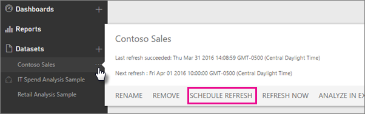
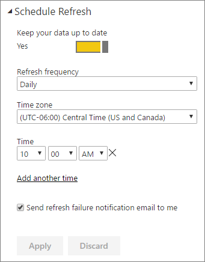

<properties
pageTitle="Configurar la actualización programada"
description="Esto cubre los pasos para seleccionar una puerta de enlace y configurar actualización programada."
services="powerbi"
documentationCenter=""
authors="guyinacube"
manager="mblythe"
backup=""
editor=""
qualityFocus="complete"
qualityDate="04/01/2016"/>

<tags
ms.service="powerbi"
ms.devlang="NA"
ms.topic="article"
ms.tgt_pltfrm="na"
ms.workload="powerbi"
ms.date="08/15/2016"
ms.author="asaxton"/>
# Configurar la actualización programada

Si el conjunto de datos admite la actualización programada, mediante actualizar ahora y programar la actualización, hay unos requisitos y opciones importantes para la actualización se realice correctamente. Estos son **conexión de puerta de enlace**, **las credenciales de origen de datos**, y **Programar actualización**. Echemos un vistazo más de cerca a cada uno.

Esto describe las opciones disponibles para ambos el [Power BI Gateway – Personal](powerbi-personal-gateway.md) y [puerta de enlace de datos local](powerbi-gateway-onprem.md).

Para llegar a la pantalla de actualización de la programación, puede hacer lo siguiente.

1. Seleccione el **puntos suspensivos (...)** junto a un conjunto de datos aparece en **conjuntos de datos**.

2. Seleccione **programar la actualización**.

    

## Conexión de puerta de enlace
Verá diferentes opciones dependiendo de si tiene una puerta de enlace personal o corporativo, en línea y disponible.

Si ninguna puerta de enlace está disponible, verá **configuración de puerta de enlace** deshabilitado. También verá un mensaje que indica cómo instalar la puerta de enlace personal.

Si tiene configurada una puerta de enlace personal, estará disponible para seleccionar, si está en línea. Se mostrará sin conexión si no está disponible.

También puede seleccionar la puerta de enlace de la empresa si está disponible para usted. Sólo verá una puerta de enlace de empresa disponible si su cuenta aparece en la ficha usuarios del origen de datos configurado una puerta de enlace especificado.

## Credenciales de origen de datos

### Puerta de enlace de Power BI - Personal

Si utiliza la puerta de enlace personal para actualizar los datos, debe proporcionar las credenciales usadas para conectarse al origen de datos back-end. Si se conecta a un paquete de contenido de un servicio en línea, se traslada las credenciales especificadas para conectarse a actualización programada.

Sólo son necesarios para iniciar sesión en orígenes de datos la primera vez que utilice la actualización en ese conjunto de datos. Una vez escrita, esas credenciales se conservan con el conjunto de datos. 

> [AZURE.NOTE] Algunos métodos de autenticación, si la contraseña que utiliza para iniciar sesión en un origen de datos caduca o se cambia, debe cambiar también el origen de datos de credenciales de origen de datos.

Cuando existe algún problema, el problema suele tener algo relacionado con cualquiera de la puerta de enlace está sin conexión porque no pudo iniciar sesión en Windows e iniciar el servicio o Power BI podría no iniciar sesión en los orígenes de datos con el fin de consultar los datos actualizados. Si se produce un error en la actualización, compruebe la configuración del conjunto de datos. Si el servicio de puerta de enlace está sin conexión, el estado de puerta de enlace es donde verá el error. Si Power BI no puede iniciar sesión en los orígenes de datos, verá un error en las credenciales de origen de datos.

### Puerta de enlace de Power BI - Enterprise

Si utiliza la puerta de enlace de la empresa para actualizar los datos, no es necesario proporcionar credenciales que se definen para el origen de datos mediante el Administrador de puerta de enlace.

## Programación de actualización

La sección actualización programada es donde se definen las ranuras de la frecuencia y la hora para actualizar el conjunto de datos. Algunos orígenes de datos no requieren una puerta de enlace está presente para estar disponibles para configurar. Otras requerirán una puerta de enlace.
 
Necesitará cambiar **mantener actualizados los datos** en Yes para configurar las opciones.

## ¿Qué es compatible?  
Algunos conjuntos de datos son compatibles con puertas de enlace diferentes para la actualización programada. Aquí es una referencia a entender lo que está disponible.

### Puerta de enlace de Power BI - Personal

**Power BI Desktop**

-   Todos los orígenes de datos en línea que se muestra en el Editor de consultas y obtener datos en Power BI Desktop.
-   Todos los orígenes de datos local que se muestra en el Editor de consultas y obtener datos en Power BI Desktop excepto archivo Hadoop (HDFS) y Microsoft Exchange.

**Excel**

> [AZURE.NOTE] En Excel 2016 y versiones posteriores, Power Query aparece ahora en la sección de la cinta de opciones, en los datos de Get y transformación de datos.

-   Todos los orígenes de datos en línea que se muestra en Power Query.
-   Todos los orígenes de datos local que se muestra en Power Query, excepto el archivo Hadoop (HDFS) y Microsoft Exchange.
-   Todos los orígenes de datos en línea que se muestra en Power Pivot.\*
-   Todos los orígenes de datos locales que se muestran en Power Pivot excepto archivo Hadoop (HDFS) y Microsoft Exchange.

<!-- Refresh Data sources-->
[AZURE.INCLUDE [refresh-datasources](../includes/refresh-datasources.md)]

## Solucionar problemas

No puede ir a veces, actualizar los datos según lo esperado. Normalmente se trata de un problema conectado con una puerta de enlace. Eche un vistazo a los artículos de solución de problemas de puerta de enlace para herramientas y problemas conocidos.

[Solución de problemas de la puerta de enlace de datos local](powerbi-gateway-onprem-tshoot.md)

[Solución de problemas de la puerta de enlace de Power BI - Personal](powerbi-admin-troubleshooting-power-bi-personal-gateway.md)

## Consulte también

[Actualización de datos en Power BI](powerbi-refresh-data.md)  
[Puerta de enlace de Power BI - Personal](powerbi-personal-gateway.md)  
[Puerta de enlace de datos local](powerbi-gateway-onprem.md)  
[Solución de problemas de la puerta de enlace de datos local](powerbi-gateway-onprem-tshoot.md)  
[Solución de problemas de la puerta de enlace de Power BI - Personal](powerbi-admin-troubleshooting-power-bi-personal-gateway.md)  
¿Preguntas más frecuentes? [Pruebe la Comunidad de Power BI](http://community.powerbi.com/)