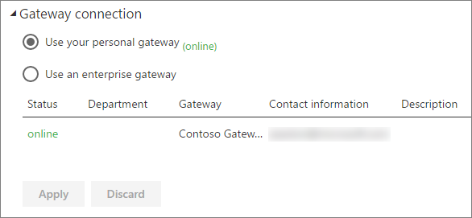

<properties
pageTitle="Configure scheduled refresh"
description="This covers the steps to select a gateway and configure scheduled refresh."
services="powerbi"
documentationCenter=""
authors="guyinacube"
manager="mblythe"
backup=""
editor=""
qualityFocus="complete"
qualityDate="04/01/2016"/>

<tags
ms.service="powerbi"
ms.devlang="NA"
ms.topic="article"
ms.tgt_pltfrm="na"
ms.workload="powerbi"
ms.date="08/15/2016"
ms.author="asaxton"/>
# Configuring scheduled refresh

If your dataset supports scheduled refresh, by using Refresh Now and Schedule Refresh, there are a few requirements and settings important for refresh to be successful. These are <bpt id="p1">**</bpt>Gateway connection<ept id="p1">**</ept>, <bpt id="p2">**</bpt>Data Source Credentials<ept id="p2">**</ept>, and <bpt id="p3">**</bpt>Schedule Refresh<ept id="p3">**</ept>. Let’s take a closer look at each.

This will describe the options available for both the <bpt id="p1">[</bpt>Power BI Gateway – Personal<ept id="p1">](powerbi-personal-gateway.md)</ept> and the <bpt id="p2">[</bpt>On-premises Data Gateway<ept id="p2">](powerbi-gateway-onprem.md)</ept>.

To get to the schedule refresh screen, you can do the following.

1. Select the <bpt id="p1">**</bpt>ellipse (...)<ept id="p1">**</ept> next to a dataset listed under <bpt id="p2">**</bpt>Datasets<ept id="p2">**</ept>.

2. Select <bpt id="p1">**</bpt>Schedule Refresh<ept id="p1">**</ept>.

    

## Gateway connection
You will see different options here depending on whether you have a personal, or enterprise, gateway online and available.

If no gateway is available, you will see <bpt id="p1">**</bpt>Gateway settings<ept id="p1">**</ept> disabled. You will also see a message indicating how to install the personal gateway.

If you have a personal gateway configured, it will be available to select, if it is online. It will show offline if it is not available.

You can also select the enterprise gateway if one is available for you. You will only see an enterprise gateway available if your account is listed in the Users tab of the data source configured for a given gateway.

## Credenciales de origen de datos

### Power BI Gateway - Personal

If you are using the personal gateway to refresh data, you will need to supply the credentials used to connect to the back end data source. If you connected to a content pack, from an online service, the credentials you entered to connect will be carried over for scheduled refresh.

You’re only required to sign in to data sources the first time you use refresh on that dataset. Once entered, those credentials are retained with the dataset. 

> [AZURE.NOTE] For some authentication methods, if the password you use to sign into a data source expires or is changed, you'll need to change it for the data source in Data Source Credentials too.

When things go wrong, the problem usually has something to do with either the gateway being offline because it could not sign in to Windows and start the service, or Power BI could not sign in to the data sources in order to query for updated data. If refresh fails, check the dataset’s settings. If the gateway service is offline, Gateway Status is where you’ll see the error. If Power BI cannot sign into the data sources, you’ll see an error in Data Source Credentials.

### Power BI Gateway - Enterprise

If you are using the enterprise gateway to refresh data, you do not need to supply credentials as they are defined for the data source by the gateway administrator.

## Schedule refresh

The scheduled refresh section is where you define the frequency and time slots to refresh the dataset. Some data sources do not require a gateway present in order to be available to configure. Others will require a gateway.
 
You will need to change <bpt id="p1">**</bpt>Keep your data up to date<ept id="p1">**</ept> to Yes in order to configure the settings.

## What’s supported?  
Certain datasets are supported against different gateways for scheduled refresh. Here is a reference to understand what is available.

### Power BI Gateway - Personal

**Power BI Desktop**

-   All online data sources shown in Power BI Desktop’s Get Data and Query Editor.
-   All on-premises data sources shown in Power BI Desktop’s Get Data and Query Editor except for Hadoop file (HDFS) and Microsoft Exchange.

**Excel**

> [AZURE.NOTE] In Excel 2016, and later, Power Query is now listed on the Data section of the ribbon, under Get &amp; Transform data.

-   All online data sources shown in Power Query.
-   All on-premises data sources shown in Power Query except for Hadoop file (HDFS) and Microsoft Exchange.
-   All online data sources shown in Power Pivot.\*
-   All on-premises data sources shown in Power Pivot except for Hadoop file (HDFS) and Microsoft Exchange.

<!-- Refresh Data sources-->
[AZURE.INCLUDE [refresh-datasources](../includes/refresh-datasources.md)]

## Solucionar problemas

Sometimes refreshing data may not go as expected. Typically this will be an issue connected with a gateway. Take a look at the gateway troubleshooting articles for tools and known issues.

[Troubleshooting the On-premises Data Gateway](powerbi-gateway-onprem-tshoot.md)

[Troubleshooting the Power BI Gateway - Personal](powerbi-admin-troubleshooting-power-bi-personal-gateway.md)

## Consulte también

[Data refresh in Power BI](powerbi-refresh-data.md)  
[Power BI Gateway - Personal](powerbi-personal-gateway.md)  
[On-premises Data Gateway](powerbi-gateway-onprem.md)  
[Troubleshooting the On-premises Data Gateway](powerbi-gateway-onprem-tshoot.md)  
[Troubleshooting the Power BI Gateway - Personal](powerbi-admin-troubleshooting-power-bi-personal-gateway.md)  
More questions? [Try the Power BI Community](http://community.powerbi.com/)