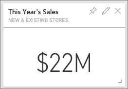
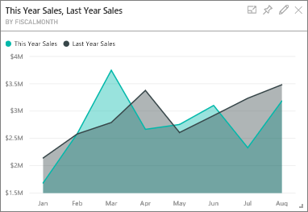
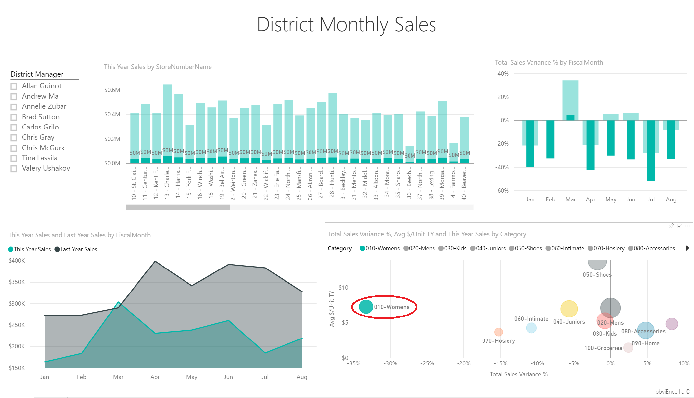
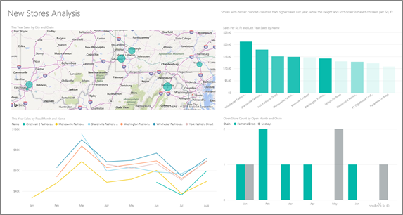

<properties
   pageTitle="Ejemplo de análisis de venta directa para Power BI: un paseo"
   description="Ejemplo de análisis de venta directa para Power BI: un paseo"
   services="powerbi"
   documentationCenter=""
   authors="amandacofsky"
   manager="mblythe"
   backup=""
   editor=""
   tags=""
   qualityFocus="no"
   qualityDate=""/>

<tags
   ms.service="powerbi"
   ms.devlang="NA"
   ms.topic="article"
   ms.tgt_pltfrm="NA"
   ms.workload="powerbi"
   ms.date="07/18/2016"
   ms.author="amac"/>

# Ejemplo de análisis de venta directa para Power BI: un paseo

##  Acerca del ejemplo de análisis de venta directa

Este panel de ejemplo del sector y el informe subyacente analizan minoristas datos de ventas de artículos vendidos en varios almacenes y distritos. Las métricas comparan el rendimiento de este año a año anterior en estas áreas: ventas, unidades, margen bruto y Varianza, así como las nuevas tiendas analysis. Se trata de datos reales de obviEnce ([www.obvience.com](http://www.obvience.com)) que se han anonimizado.

También puede [Descargar sólo el conjunto de datos (libro de Excel) para este ejemplo](http://go.microsoft.com/fwlink/?LinkId=528592).

##  Iniciar en el panel y abra el informe

1.  En el panel, seleccione el icono "Tiendas Total":

      

    Esto le lleva a la página "Información general de ventas de la tienda" en el informe. Verá que tenemos 104 almacenes total, 10 de las nuevas. Tenemos dos cadenas, modas directa y Lindseys. Almacenes directa de moda en promedio son más grandes.

2.  En el gráfico circular, seleccione **modas directa**.

      

    Observe el resultado en el gráfico de burbujas:

      

    FD-01 distrito tiene el mayor promedio de ventas por pie cuadrado, FD-02 tiene la varianza más bajo en ventas en comparación con el año pasado, FD-03 y 04 FD son peor ejecutantes general.

3.  Seleccione las burbujas individuales u otros gráficos para ver cross resaltado, revelar el impacto de las selecciones.

4.  Seleccione Power BI en la barra de navegación superior para volver al panel.

    

5.  En el panel, seleccione el icono con "Ventas de este año."

    

    Esto equivale a escribir "ventas de este año" en el cuadro de pregunta.

    Ver esta pantalla:

    

##  Revise un mosaico creado con Power BI Q & A

Vamos a obtener más específica.

1.  Agregar "ventas este año **por distrito**" a la pregunta. Observe el resultado: coloca la respuesta en un gráfico de barras y sugiere otras frases automáticamente:

    

2.  Ahora, cambie la pregunta "ventas este año **zip y cadena**".

    Observe cómo responde a la pregunta a medida que escribe con los gráficos adecuados.

3.  Jugar con más preguntas y ver qué tipo de resultados obtiene.

4.  Cuando esté listo, vuelva al panel seleccionando Power BI en la esquina superior izquierda.

##  Profundice en los datos

Ahora vamos a explorar en un nivel más detallado, examinando las prestaciones de los distritos.

1.  En el panel, seleccione el icono de comparar las ventas de este año a año pasado.

    

    Observe la gran variabilidad en variación % para el año pasado, con enero, abril y especialmente mal meses de julio.

    

    Veamos si reducir donde pueden ser los problemas.

2.  Seleccione el gráfico de burbujas y elija **020 hombres**.

      

    Observe la categoría de los hombres no fue como gravemente afectados en abril como el negocio global, pero enero y julio seguían siendo meses del problema.

3.  Ahora, seleccione la **burbujas 010-Womens**.

    

    Aviso de categoría de la mujer realiza mucho peor que el negocio global para todos los meses y mucho peor en casi todos los meses en comparación con el año anterior.

4.  Seleccione la burbuja de nuevo para borrar el filtro.

##  Pruebe la segmentación de datos

Echemos un vistazo hacen en los distritos de forma específicos.

1.  Seleccione Allan Guinot en la segmentación de datos en la parte superior izquierda.

    

    Tenga en cuenta que el distrito Allan superaba el año pasado en marzo y junio.

2.  Ahora, mientras sigue seleccionado Allan, seleccione burbujas de la mujer.

    

    Tenga en cuenta que para la categoría de la mujer, su distrito nunca cumple volumen del año pasado.

3.  ¿3. explorar los demás administradores de distrito y categorías: qué otra información puede buscar?

4.  Cuando esté listo, vuelva al panel.

## ¿Qué es nuestros datos contarnos sobre el crecimiento de ventas este año?

La última área que deseamos explorar es nuestro crecimiento: nuevos almacenes abierto este año.

1.  Seleccione el icono 'Almacenes abierto este año'.

    

    Como evidentes desde el icono – más directa de moda almacena de almacenes de Lindseys abre este año.

2.  Tenga en cuenta las ventas por Sq Ft gráfico de nombre:

    

     Hay gran cantidad de diferencia de promedio de ventas por SQF entre las nuevas tiendas.

3.  Haga clic en el elemento de leyenda modas directa en el gráfico superior derecho. Aviso, incluso para la misma cadena, el mejor almacén (Winchester modas directo) significativamente supera el peor vs $21.22 de almacén (Cincinnati 2 modas directo) $12.86 respectivamente.

    

4.  Haga clic en Winchester modas directa en la segmentación de datos y observe el gráfico de líneas. Las cifras de ventas primeras se han informado en febrero y es un almacén líder en términos de volumen para casi todos los meses.

5.  Haga clic en Cincinnati 2 modas directa en la segmentación de datos y aparecerá en el gráfico de líneas que se ha abierto en junio y parece ser el almacén de peor rendimiento.

6.  Como antes, explore haciendo clic en otras barras, líneas y burbujas a lo largo de los gráficos y vea qué información puede detectar.

Se trata de un entorno seguro para reproducir en. Siempre puede elegir no guardar los cambios. Pero si guardarlos, siempre puede ir para obtener datos de una copia nueva de este ejemplo.

## Pasos siguientes: conectarse a los datos

Esperamos que este paseo le ha mostrado cómo paneles de Power BI, preguntas y respuestas, y los informes pueden proporcionar información sobre los datos de venta directa. Ahora es su turno, conectarse a sus propios datos. Con Power BI puede conectarse a una gran variedad de orígenes de datos. Obtenga más información sobre [Introducción a Power BI](https://support.office.com/article/Get-Started-with-Power-BI-Preview-0f0237e2-f74f-49ab-82ea-1990c3c3deb8).

## Consulte también

-   
            [Descargar el paquete de contenido de ejemplo de análisis de venta directa](powerbi-sample-tutorial-connect-to-the-samples.md)
-   
            [Descargue el libro de Excel para este ejemplo de Power BI](http://go.microsoft.com/fwlink/?LinkId=528592)
-   
            [Obtener datos (Power BI)](powerbi-service-get-data.md)
-   
            [Power BI: conceptos básicos](powerbi-service-basic-concepts.md)
-  ¿Preguntas más frecuentes? 
            [Pruebe la Comunidad de Power BI](http://community.powerbi.com/)
