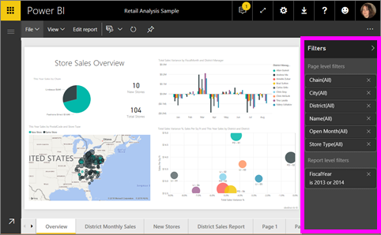
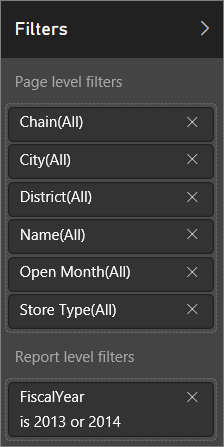
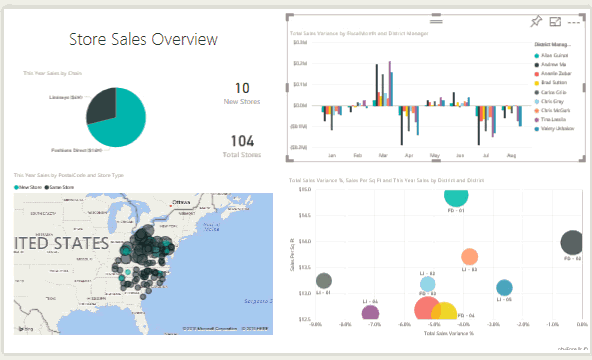

<properties
   pageTitle="Filtros y resaltado en informes de Power BI"
   description="Filtros y resaltado en informes de Power BI"
   services="powerbi"
   documentationCenter=""
   authors="mihart"
   manager="mblythe"
   backup=""
   editor=""
   tags=""
   qualityFocus="monitoring"
   qualityDate=""/>

<tags
   ms.service="powerbi"
   ms.devlang="NA"
   ms.topic="article"
   ms.tgt_pltfrm="NA"
   ms.workload="powerbi"
   ms.date="10/24/2016"
   ms.author="mihart"/>
# Filtros y resaltado en informes de Power BI

            ***Filtros*** quitar todos, pero los datos que desea centrarse.  
            ***Resaltado*** es no filtra, ya que no elimina datos sino resalta un subconjunto de los datos visibles; los datos permanecen visible pero atenuadas.

Hay muchas maneras diferentes se pueden filtrar y resaltar los informes de Power BI. Colocar toda la información en un artículo obtendría confuso, por lo que nos hemos desglosadas por similar al siguiente:

-   Introducción a los filtros y resaltado (el artículo que se está leyendo ahora)

-   Las formas, puede [crear y utilizar filtros y resaltado en la vista de edición/informes que posee](powerbi-service-add-a-filter-to-a-report.md). Cuando tenga que editar los permisos para un informe, puede crear, modificar y eliminar filtros y resaltado en informes.

-   Las formas, puede [filtros y resaltado en un informe compartido con usted o en la vista de lectura informe](powerbi-service-interact-with-a-report-in-reading-view.md). Lo que puede hacer es más limitada, pero todavía Power BI le ofrece una amplia gama de filtrado y resaltado de opciones.  

-   
            [Un repaso detallado de los controles disponibles en la vista de edición de resaltado y el filtro](powerbi-service-how-to-use-a-report-filter.md) incluida una mirada exhaustiva de tipos de filtros (por ejemplo, fecha y hora, numérico, texto) y la diferencia entre las opciones básicas y avanzadas.

-   Ahora que ha aprendido cómo archivadores y resaltado de trabajo predeterminados, [obtener información sobre cómo cambiar las visualizaciones de la forma de un filtro de página y resaltar entre sí](powerbi-service-visual-interactions.md)

>[AZURE.TIP] ¿Cómo Power BI sabe cómo se relacionan los datos?  Utiliza las relaciones entre las diferentes tablas y campos en subyacente [modelo de datos](https://support.office.com/article/Create-a-Data-Model-in-Excel-87e7a54c-87dc-488e-9410-5c75dbcb0f7b?ui=en-US&rs=en-US&ad=US) para ampliar los elementos en una página de informe interactúan entre sí.

##  Introducción a los filtros y resaltado en informes mediante el panel de filtros

Filtros y resaltado se pueden aplicar mediante el **filtros** panel o mediante la realización de selecciones directamente en el propio informe (ad-hoc, vea la parte inferior de la página). El panel filtros muestra las tablas y campos que se usa en el informe y los filtros que se han aplicado, si existe alguno. Los filtros se dividen en **página filtros de nivel de**, **filtros de nivel de informe**, y **filtros de nivel Visual**.  Si ha seleccionado una visualización en el lienzo de informe, sólo verá los filtros de nivel visuales.

>[AZURE.TIP]   Si el filtro tiene la palabra **todos los** junto a ella, significa que ese campo completo se incluye como un filtro.  Por ejemplo, **Chain(All)** en la captura de pantalla siguiente indica que esta página del informe incluye datos sobre todas las cadenas de la tienda.  Por otro lado, el nivel de informe de filtro de **FiscalYear es 2013 o 2014** nos indica que el informe sólo incluye los datos de los años fiscales de 2013 y 2014.

##  Filtros en la vista de edición de verus de vista de lectura

Existen dos modos para interactuar con los informes: [vista lectura](powerbi-service-interact-with-a-report-in-reading-view.md) y [vista de edición de](powerbi-service-interact-with-a-report-in-editing-view.md).  Y las capacidades de filtrado disponibles dependen de qué modo se encuentra en.

-   En la vista de edición, puede agregar informes, página y filtros visuales. Al guardar el informe, los filtros se guardan con él. Examinando el informe en la vista de lectura puedan interactuar con los filtros que ha agregado, pero no guardar sus cambios.

-   En la vista de lectura, puede interactuar con cualquier página y filtros visuales que ya existen en el informe, pero no podrá guardar los cambios del filtro.

### El panel de filtros en la vista de lectura

Si sólo tiene acceso a un informe en la vista de lectura, el panel de filtros se ve así:

Por lo que esta página del informe tiene 6 filtros de nivel de página y filtro de nivel 1 del informe.

Para ver si existen los filtros de nivel visuales, seleccione un objeto visual. En la imagen siguiente, el gráfico de burbujas tiene 6 filtros aplicados.

En la vista de lectura, explorar los datos modificando los filtros existentes. Obtenga información acerca de cómo hacerlo en el artículo [interactúe con los filtros en la vista de lectura](powerbi-service-interact-with-a-report-in-reading-view.md)

### El panel de filtros en la vista de edición

Cuando tiene permisos de propietario para un informe y abrirlo en la vista de edición, verá que **filtros** es sólo uno de varios paneles de edición disponibles.

Como en la vista de lectura (arriba), podemos ver que esta página del informe tiene 6 filtros de nivel de página y filtro de nivel 1 del informe. Y seleccionando el gráfico de burbujas, veríamos tiene filtros de nivel visuales 6 aplicados.

Pero en la vista de edición, hay mucho más que podemos hacer con filtros y resaltado. La diferencia principal radica en que podemos agregar nuevos filtros. Obtenga información acerca de cómo hacer esto y mucho más en el artículo [Agregar un filtro a un informe](powerbi-service-add-a-filter-to-a-report.md)

##  Filterting ad hoc y resaltado
Seleccione un campo en el lienzo de informe para filtrar y resaltar el resto de la página. Seleccione cualquier espacio vacío del mismo objeto visual para quitarlo. Este tipo de filtrado y resaltado no se guarda con el informe, pero es divertida forma rápida de explorar los impactos de datos. Para ajustar con precisión el funcionamiento de este tipo de filtro cruzado y realzado cruzado, consulte [interacciones Visual](powerbi-service-visual-interactions.md)

### Consulte también

            [Interactuar con los filtros y resaltado (en la vista de lectura)](powerbi-service-interact-with-a-report-in-reading-view.md)

            [Agregar un filtro a un informe (en la vista de edición)](powerbi-service-add-a-filter-to-a-report.md)

            [Dé un paseo por filtros de informe](powerbi-service-how-to-use-a-report-filter.md)

            [Cambiar elementos visuales de informe filtro cruzado y resaltan entre sí](powerbi-service-visual-interactions.md)

Obtenga más información sobre [informes de Power BI](powerbi-service-reports.md)

¿Preguntas más frecuentes? 
            [Pruebe la Comunidad de Power BI](http://community.powerbi.com/)
