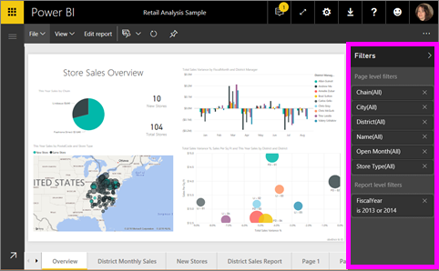
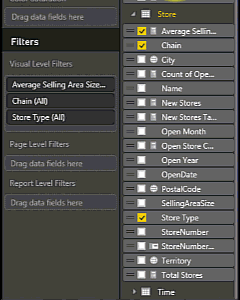

<properties
   pageTitle="Add a filter to a report in Power BI"
   description="Add a filter to a report in Power BI"
   services="powerbi"
   documentationCenter=""
   authors="mihart"
   manager="mblythe"
   backup=""
   editor=""
   tags=""
   qualityFocus="monitoring"
   qualityDate=""/>

<tags
   ms.service="powerbi"
   ms.devlang="NA"
   ms.topic="article"
   ms.tgt_pltfrm="NA"
   ms.workload="powerbi"
   ms.date="08/21/2016"
   ms.author="mihart"/>

# Add a filter to a Power BI report (in Editing view)

><bpt id="p1">**</bpt>TIP<ept id="p1">**</ept>:   We recommend first reading <bpt id="p2">[</bpt>About filters and highlighting in Power BI reports<ept id="p2">](powerbi-service-about-filters-and-highlighting-in-reports.md)</ept>.

##  What is the difference between report filters in Editing View versus Reading View

There are two modes for interacting with reports: <bpt id="p1">[</bpt>Reading View<ept id="p1">](powerbi-service-interact-with-a-report-in-reading-view.md)</ept> and <bpt id="p2">[</bpt>Editing View<ept id="p2">](powerbi-service-interact-with-a-report-in-editing-view.md)</ept>.  And the filtering capabilities available to you depend on which mode you're in.

-   In Editing View, you can add report, page, and visual filters. When you save the report, the filters are saved with it. People looking at the report in Reading View can interact with the filters you added, but not save their changes.

-   In Reading View, you can interact with any page and visual filters that already exist in the report, but you won't be able to save your filter changes.

<bpt id="p1">**</bpt>NOTE:<ept id="p1">**</ept>  This article describes how to create filters in report <bpt id="p2">**</bpt>Editing View<ept id="p2">**</ept>.  For more information on filters in Reading VIew, see <bpt id="p1">[</bpt>interacting with filters in report Reading View<ept id="p1">](powerbi-service-interact-with-a-report-in-reading-view.md)</ept>.

##  Visual filters, page filters, and report filters
A <bpt id="p1">**</bpt>page filter<ept id="p1">**</ept> applies to all the visuals on the report page. A <bpt id="p1">**</bpt>visual filter<ept id="p1">**</ept> applies to a single visual on a report page. And a <bpt id="p1">**</bpt>report filter<ept id="p1">**</ept> applies to all pages in the report.

## Add a filter to a specific visualization (aka visual filter)

### By filtering the fields already in the chart

1.  Open your <bpt id="p1">[</bpt>report in Editing View<ept id="p1">](powerbi-service-go-from-reading-view-to-editing-view.md)</ept>.

2.  Open the Visualizations and Filters pane and the Fields pane (if they're not already open).

3.  Select a visual to make it active. All the fields being used by the visual are identified in the <bpt id="p1">**</bpt>Fields<ept id="p1">**</ept> pane and also listed in the <bpt id="p2">**</bpt>Filters<ept id="p2">**</ept> pane, under the <bpt id="p3">**</bpt>Visual Level Filters<ept id="p3">**</ept> heading.

4.  Select the field you want to add as a new visual level filter, and drag it into the Visual Level Filters area.  Set either <bpt id="p1">**</bpt>Basic<ept id="p1">**</ept> or <bpt id="p2">**</bpt>Advanced<ept id="p2">**</ept> filtering controls (see <bpt id="p3">[</bpt>How to use report filters<ept id="p3">](powerbi-service-how-to-use-a-report-filter.md)</ept>).

    

The visual changes to reflect the new filter. If you save your report with the filter, report readers can interact with the filter in Reading View, selecting or clearing values.

## Add a filter to an entire page (aka page view filter)

1.  Open your <bpt id="p1">[</bpt>report in Editing View<ept id="p1">](powerbi-service-go-from-reading-view-to-editing-view.md)</ept>.

2.  Open the Visualizations and Filters pane and the Fields pane (if they're not already open).

3.  Select a field in the field list in the report and drag it below <bpt id="p1">**</bpt>Page Level Filters<ept id="p1">**</ept>.

4.  Select the values you want to filter and set either  <bpt id="p1">**</bpt>Basic<ept id="p1">**</ept> or <bpt id="p2">**</bpt>Advanced<ept id="p2">**</ept> filtering controls (see <bpt id="p3">[</bpt>How to use report filters<ept id="p3">](powerbi-service-how-to-use-a-report-filter.md)</ept>).

    The visualization changes to reflect the new filter. 

    

If you save your report with the filter, report readers can interact with the filter in Reading View, selecting or clearing values.

## Add a filter to an entire report (aka Report filter)

1. Open your <bpt id="p1">[</bpt>report in Editing View<ept id="p1">](powerbi-service-go-from-reading-view-to-editing-view.md)</ept>.

2. Open the Visualizations and Filters pane and the Fields pane (if they're not already open).

3. Select a field in the field list and drag it below <bpt id="p1">**</bpt>Report Level Filters<ept id="p1">**</ept>.

4. Select the values you want to filter (see <bpt id="p1">[</bpt>How to use report filters<ept id="p1">](powerbi-service-how-to-use-a-report-filter.md)</ept>).

The visuals on the active page, and on all pages in the report, changes to reflect the new filter. If you save your report with the filter, report readers can interact with the filter in Reading View, selecting or clearing values.

##  Solucionar problemas

### Why your visual level filter and page level filter may return different results

When you add a visual level filter, Power BI filters on the aggregated results.  The default aggregation is Sum, but you can <bpt id="p1">[</bpt>change the aggregation type<ept id="p1">](powerbi-service-aggregates.md)</ept>.  

When you add a page level filter, Power BI filters without aggregating.  It does this because a page can have many visuals which can each utilize different aggregation types.  So the filter is applied on each data row.

## Consulte también

 [How to use report filters](powerbi-service-how-to-use-a-report-filter.md)

  [Filters and highlighting in reports](powerbi-service-about-filters-and-highlighting-in-reports.md)

[Interact with filters and highlighting in report Reading View](powerbi-service-interact-with-a-report-in-reading-view.md)

[Change how report visuals cross-filter and cross-highlight each other](powerbi-service-visual-interactions.md)

Read more about <bpt id="p1">[</bpt>reports in Power BI<ept id="p1">](powerbi-service-reports.md)</ept>

[Power BI - Basic Concepts](powerbi-service-basic-concepts.md)

More questions? [Try the Power BI Community](http://community.powerbi.com/)
