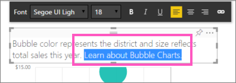

<properties
   pageTitle="Agregar un hipervínculo a un cuadro de texto en un informe de Power BI"
   description="Agregar un hipervínculo a un cuadro de texto en Power BI"
   services="powerbi"
   documentationCenter=""
   authors="mihart"
   manager="mblythe"
   backup=""
   editor=""
   tags=""
   featuredVideoId="_3q6VEBhGew"
   qualityFocus="no"
   qualityDate=""/>

<tags
   ms.service="powerbi"
   ms.devlang="NA"
   ms.topic="article"
   ms.tgt_pltfrm="NA"
   ms.workload="powerbi"
   ms.date="10/08/2016"
   ms.author="mihart"/>

# Agregar un hipervínculo a un cuadro de texto en un informe

Cuadros de texto se pueden agregados a los informes, anclar en paneles de informes y agrega directamente a los paneles. Pueden agregar hipervínculos a un cuadro de texto independientemente de su ubicación. **Este tema trata los cuadros de texto en los informes.**

>
            **NOTA**: para obtener información sobre los hipervínculos en matrices y tablas de Power BI, consulte [hipervínculos en tablas](powerbi-service-hyperlinks-in-tables.md). Para obtener información sobre cómo agregar cuadros de texto para su **panel**, consulte [Agregar un mosaico directamente desde el panel ](powerbi-service-add-a-widget-to-a-dashboard.md). 

<iframe width="560" height="315" src="https://www.youtube.com/embed/_3q6VEBhGew?list=PL1N57mwBHtN0JFoKSR0n-tBkUJHeMP2cP" frameborder="0" allowfullscreen></iframe>

## Para agregar un hipervínculo a un cuadro de texto en un informe

1.  
            [Crear un cuadro de texto y agregue texto](powerbi-service-text-boxes-in-reports.md). 

2.  Resalte el texto existente o agregar el nuevo texto que se usará como un hipervínculo.

    

3.  Seleccione el icono de hipervínculo   .

4.  Escriba o pegue la dirección URL en el campo de hipervínculo y seleccione **realiza**.

    

    

5.  Probar el vínculo.  

    -  En el cuadro de texto, seleccione el hipervínculo para mostrar la dirección URL

    -  Seleccione la dirección URL para abrir la página en una nueva ventana del explorador.

## Para quitar el hipervínculo del texto

1.  Con al menos una parte del hipervínculo resaltado,

2.  Seleccione el icono de hipervínculo y, a continuación,

3.  Elija **quitar**. 

    

    O bien, para quitar el hipervínculo, pero deja el texto, resalte el hipervínculo completo y seleccione **Eliminar**.

## Consulte también

[Cuadros de texto en los informes de Power BI](powerbi-service-text-boxes-in-reports.md)

[Agregar un cuadro de texto a un panel ](powerbi-service-add-a-widget-to-a-dashboard.md)

[Informes de Power BI](powerbi-service-reports.md)

[Visualizaciones en informes de Power BI](powerbi-service-visualizations-for-reports.md)

[Power BI: conceptos básicos](powerbi-service-basic-concepts.md)

¿Preguntas más frecuentes? [Pruebe la Comunidad de Power BI](http://community.powerbi.com/)
