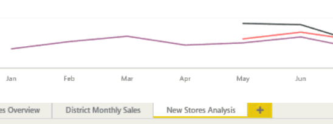

<properties
   pageTitle="Agregar una página a un informe de Power BI"
   description="Agregar una página a un informe de Power BI"
   services="powerbi"
   documentationCenter=""
   authors="mihart"
   manager="mblythe"
   backup=""
   editor=""
   tags=""
   qualityFocus="no"
   qualityDate=""/>

<tags
   ms.service="powerbi"
   ms.devlang="NA"
   ms.topic="article"
   ms.tgt_pltfrm="NA"
   ms.workload="powerbi"
   ms.date="10/08/2016"
   ms.author="mihart"/>

# Agregar una página a un informe de Power BI  
## Agregar una nueva página en blanco

Ninguna razón para multitud de una página del informe, simplemente agregue una nueva página en blanco.

Seleccione el amarillo y el icono y, a continuación, escriba un nombre nuevo para la página.  

## Duplicar una página
En la barra de control superior en [el modo de edición](powerbi-service-interact-with-a-report-in-editing-view.md), seleccione la **duplicar esta página** icono.

La nueva página se crea y se convierte en la página activa. Para cambiar el nombre, haga doble clic en el nombre de la ficha para resaltarla y escriba un nombre nuevo.  Para obtener más información, consulte [cambiar el nombre de un informe y la página del informe]()

## Consulte también  
Obtenga más información sobre [informes de Power BI](powerbi-service-reports.md)  
[Power BI: conceptos básicos](powerbi-service-basic-concepts.md)

¿Preguntas más frecuentes? [Pruebe la Comunidad de Power BI](http://community.powerbi.com/)
