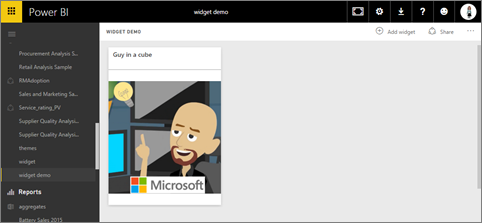
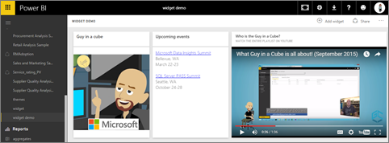
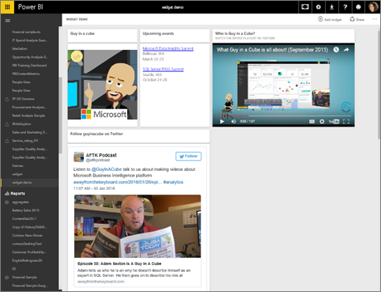

<properties
   pageTitle="Agregar una imagen, el cuadro de texto, el vídeo o el código web al escritorio"
   description="Documentación sobre cómo agregar un cuadro de texto vídeo, imagen, web código mosaico a un panel."
   services="powerbi"
   documentationCenter=""
   authors="mihart"
   manager="mblythe"
   backup=""
   editor=""
   tags=""
   featuredVideoId="HivEJ5lN3l4"
   qualityFocus="identified"
   qualityDate=""/>

<tags
   ms.service="powerbi"
   ms.devlang="NA"
   ms.topic="article"
   ms.tgt_pltfrm="NA"
   ms.workload="powerbi"
   ms.date="10/07/2016"
   ms.author="mihart"/>

# Agregar un mosaico directamente desde el panel propio

<iframe width="560" height="315" src="https://www.youtube.com/embed/HivEJ5lN3l4" frameborder="0" allowfullscreen></iframe>

>
            **NOTA**: la característica "Agregar un widget" ha sido cambiado el nombre "Agregar mosaico".

## Agregar mosaico

El **Agregar mosaico** control permite agregar directamente una imagen, cuadro de texto, vídeo, datos de transmisión o web en el panel de código.

1. Seleccione **Agregar mosaico** desde la barra de menús.

    

2. Seleccione el widget de agregar: **imagen**, **cuadro de texto**, **vídeo**, **contenido Web**, o **personalizados de transmisión de datos**.

    


## Agregar una imagen
Supongamos que desea el logotipo de su empresa en su escritorio o alguna otra imagen.

1. Seleccione **imagen** > **siguiente**.

2. Agregar información de la imagen a la **icono detalles** panel.

    

  - para mostrar un título encima de la imagen, seleccione *Mostrar el título y el subtítulo* y escriba un título y el subtítulo.

  - Escriba la dirección URL de imagen

  - para que el icono de un hipervínculo, seleccione **conjunto de vínculos personalizados** y escriba la dirección URL.  Cuando haga clic en compañeros esta imagen o un título, le dirigirá a esta dirección URL.

  - Seleccione **aplicar**.  En el panel, cambiar el tamaño y mover la imagen según sea necesario.

        

##  Agregar un encabezado de panel o cuadro de texto

1. Seleccione **cuadro de texto > siguiente**.

    

    >
            **NOTA**: agregar un encabezado del panel, escriba el título del cuadro de texto y aumentar la fuente.

2. Dar formato al cuadro de texto:

  - para mostrar un título encima del cuadro de texto, seleccione **Mostrar el título y el subtítulo** y escriba un título y el subtítulo.

  - especificar y aplicar el formato de contenido del cuadro de texto.  

  - Opcionalmente, establezca un vínculo personalizado para el título.  Sin embargo, en este ejemplo hemos agregado hipervínculos en el texto del cuadro, dejar así **conjunto de vínculos personalizados** desactivada.

3.  Seleccione **aplicar**.  En el panel, cambiar el tamaño y mover el cuadro de texto según sea necesario.

    

## Agregar un vídeo

Cuando se agrega un icono de vídeo de YouTube o Vimeo al panel, el vídeo se reproduce en el panel.

1. Seleccione **vídeo > siguiente**.

2. Agregar información de vídeo del **icono detalles** panel.

    

  - para mostrar un título y un subtítulo en la parte superior del título de vídeo, seleccione *Mostrar el título y el subtítulo* y escriba un título y el subtítulo. En este ejemplo, se agregará un subtítulo y, a continuación, convertirlo en un hipervínculo a la lista de reproducción todo en YouTube.

  - Escriba la dirección URL del vídeo

  - Agregar un hipervínculo para el título y el subtítulo.  Tal vez después de que sus colegas ver incrustado vídeo le gustaría a ver toda la lista de reproducción en YouTube: agregar un vínculo a la lista de reproducción aquí.

  - Seleccione **aplicar**.  En el panel, cambiar el tamaño y mover el mosaico vídeo según sea necesario.

      

3. Seleccione el icono de vídeo para reproducir el vídeo.

4. Seleccione el subtítulo visitar la lista de reproducción en YouTube.

## Agregar contenido web

Pegue o escriba en cualquier contenido HTML.  Power BI agrega, como un icono al escritorio. Escriba el código para insertar manualmente o copiar y pegar desde sitios como Twitter, YouTube, embed.ly y más.

1. Seleccione **contenido Web > siguiente**.

2. Agregar información a la **mosaico de contenido agregar web** panel.

    

  - para mostrar un título por encima del mosaico, seleccione *Mostrar el título y el subtítulo* y escriba un título y el subtítulo.

  - Escriba el código para insertar. En este ejemplo estamos copiando y pegando una fuente de Twitter.

  - Seleccione **aplicar**.  En el panel, cambiar el tamaño y mover el mosaico de contenido web según sea necesario.

      

### Sugerencias para la incrustación de contenido web###

- Para iframes, utilice un origen seguro. Si escribe el iframe incrustar código y obtener un mosaico en blanco, compruebe si está utilizando **http** para el origen de iframe.  Si es así, cámbielo a **https**.

  ```
  <iframe src="https://xyz.com">
  ```

- Editar la información de ancho y alto. Este código para insertar incrusta un vídeo y establece el Reproductor de vídeo a 560 x 315 píxeles.  Este tamaño no cambiará cuando se cambia el tamaño del mosaico.

  ```
  <iframe width="560" height="315"
  src="https://www.youtube.com/embed/Cle_rKBpZ28" frameborder="0"
   allowfullscreen></iframe>
  ```

  Si desea que el Reproductor para cambiar el tamaño para ajustar el tamaño del mosaico, establecer el ancho y alto de 100%.

  ```
  <iframe width="100%" height="100%"
  src="https://www.youtube.com/embed/Cle_rKBpZ28" frameborder="0"
   allowfullscreen></iframe>
  ```

- Este código se incrusta un tweet y se conserva como vínculos independientes en el panel vínculos para la **AFK** podcast, **página de Twitter de @GuyInACube**, **siga**, **#analytics**, **respuesta**, **retwittear**, y **como**.  Seleccionar el mosaico abre el podcast en Twitter.

  ```
  <blockquote class="twitter-tweet" data-partner="tweetdeck">
  <p lang="en" dir="ltr">Listen to
  <a href="https://twitter.com/GuyInACube">@GuyInACube</a> talk to
  us about making videos about Microsoft Business Intelligence
  platform
  <a href="https://t.co/TmRgalz7tv">https://t.co/TmRgalz7tv </a>
  <a href="https://twitter.com/hashtag/analytics?src=hash">
  #analytics</a></p>&mdash; AFTK Podcast (@aftkpodcast) <a
  href="https://twitter.com/aftkpodcast/status/693465456531771392">
  January 30, 2016</a></blockquote>
<script async src="//platform.twitter.com/widgets.js"
charset="utf-8"></script>
```

- Para facilitar el mover el mosaico en el panel, agregar un título y el subtítulo.

- Si desea incrustar el contenido de un sitio Web, pero no proporciona el sitio Web es incrustar código para copiar y pegar, consulte embed.ly para generar el código de incrustación de ayuda.

##  Editar un mosaico

Para realizar cambios en un mosaico...

1. Mantenga el mouse sobre la esquina superior derecha del icono y seleccione el botón de puntos suspensivos.

    

2. Seleccione el icono de edición para volver a abrir el **icono detalles** panel y realizar cambios.

    

## Consulte también  


            [Creación de paneles de Power BI](powerbi-service-create-a-dashboard.md)
[iconos de panel](powerbi-service-dashboard-tiles.md)

¿Preguntas más frecuentes? 
            [Pruebe la Comunidad de Power BI](http://community.powerbi.com/).
