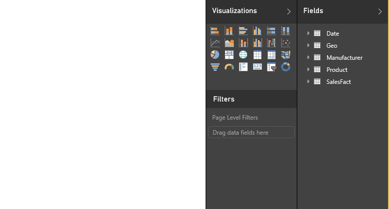
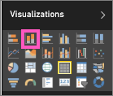

<properties
   pageTitle="Tutorial: Part I, Add visualizations to a Power BI report"
   description="Tutorial: Part I, Add visualizations to a Power BI report"
   services="powerbi"
   documentationCenter=""
   authors="mihart"
   manager="mblythe"
   backup=""
   editor=""
   tags=""
   featuredVideoId="rnMyiA6Nt6Y"
   qualityFocus="no"
   qualityDate=""/>

<tags
   ms.service="powerbi"
   ms.devlang="NA"
   ms.topic="article"
   ms.tgt_pltfrm="NA"
   ms.workload="powerbi"
   ms.date="10/09/2016"
   ms.author="mihart"/>

# Tutorial: Part I, Add visualizations to a Power BI report

This article gives a quick introduction to creating a visualization in a report.  For more-advanced content, please <bpt id="p1">[</bpt>see Part II<ept id="p1">](powerbi-service-add-visualizations-to-a-report-ii.md)</ept>. In the video below, Will shows you a few different ways to create, edit, and format visuals on the report canvas.

<iframe width="560" height="315" src="https://www.youtube.com/embed/rnMyiA6Nt6Y?list=PL1N57mwBHtN0JFoKSR0n-tBkUJHeMP2cP" frameborder="0" allowfullscreen></iframe>

Now use the <bpt id="p1">[</bpt>Sales and Marketing sample<ept id="p1">](powerbi-sample-datasets.md)</ept> to create your own report.

1.  Open a <bpt id="p1">[</bpt>report in Editing View<ept id="p1">](powerbi-service-go-from-reading-view-to-editing-view.md)</ept>. This tutorial uses the Sales and Marketing sample.

2.  If the Fields pane isn't visible, select the arrow icon to open it. 

    

3.  <bpt id="p1">[</bpt>Add a blank page to the report<ept id="p1">](powerbi-service-add-a-page-to-a-report.md)</ept>.

4.  Create a visualization by selecting a field from the <bpt id="p1">**</bpt>Fields<ept id="p1">**</ept> pane.  

    <bpt id="p1">**</bpt>Start with a numeric field: Power BI creates a column chart with a single column<ept id="p1">**</ept>.

    

    <bpt id="p1">**</bpt>Start with a category field<ept id="p1">**</ept>, such as Name or City: Power BI creates a Table and adds that field to the <bpt id="p2">**</bpt>Values<ept id="p2">**</ept> well.

    

5.  Select other fields to add to the visualization.  Select <bpt id="p1">**</bpt>Count of<ept id="p1">**</ept> <bpt id="p2">**</bpt>Product<ept id="p2">**</ept> to add it to the <bpt id="p3">**</bpt>Values<ept id="p3">**</ept> well.

    

6.  Change the visualization to a column chart by selecting the column chart icon.

    

7.  When you create visualizations in your report, you can <bpt id="p1">[</bpt>pin them to your dashboard<ept id="p1">](powerbi-service-pin-a-tile-to-a-dashboard-from-a-report.md)</ept>. To pin the visualization, select the pin icon <ph id="ph1"></ph>.

    

8.  Now you can:

    Continue on to <bpt id="p1">[</bpt>Part 2: Add visualizations to a Power BI report<ept id="p1">](powerbi-service-add-visualizations-to-a-report-ii.md)</ept>

    <bpt id="p1">[</bpt>C<ept id="p1">](powerbi-service-change-the-type-of-visualization-in-a-report.md)</ept><bpt id="p2">[</bpt>hange the visualization type<ept id="p2">](powerbi-service-change-the-type-of-visualization-in-a-report.md)</ept><bpt id="p3">[</bpt>.<ept id="p3">](powerbi-service-change-the-type-of-visualization-in-a-report.md)</ept>

    <bpt id="p1">[</bpt>Pin the visualization<ept id="p1">](powerbi-service-pin-a-tile-to-a-dashboard-from-a-report.md)</ept> to your dashboard as a tile.

    <bpt id="p1">[</bpt>Interact with the visualizations<ept id="p1">](powerbi-service-interact-with-a-report-in-reading-view.md)</ept> in the report.

    <bpt id="p1">[</bpt>Do even more with visualizations<ept id="p1">](powerbi-service-visualizations-for-reports.md)</ept>.

    <bpt id="p1">[</bpt>Save your report<ept id="p1">](powerbi-service-save-a-report.md)</ept>.

## Consulte también

More about <bpt id="p1">[</bpt>Visualizations in Power BI reports<ept id="p1">](powerbi-service-visualizations-for-reports.md)</ept>.

[Reports in Power BI](powerbi-service-reports.md)

[Power BI - Basic Concepts](powerbi-service-basic-concepts.md)

More questions? [Try the Power BI Community](http://community.powerbi.com/)
