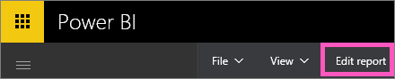
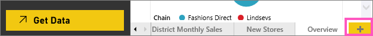
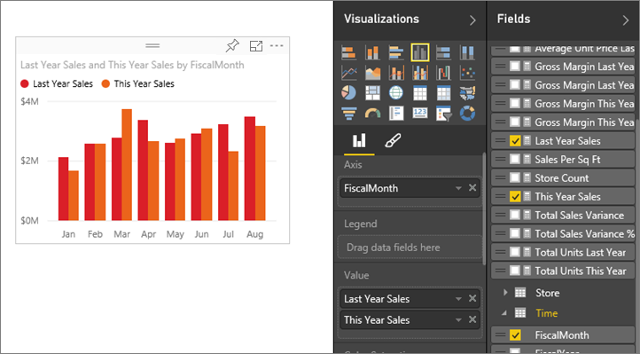
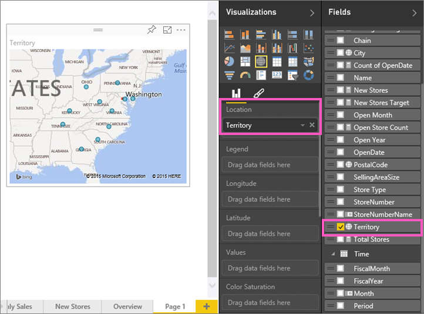

<properties
   pageTitle="Tutorial: Parte 2, visualizaciones de agregar a un informe de Power BI"
   description="Tutorial: Parte 2, visualizaciones de agregar a un informe de Power BI"
   services="powerbi"
   documentationCenter=""
   authors="mihart"
   manager="mblythe"
   backup=""
   editor=""
   tags=""
   qualityFocus="no"
   qualityDate=""/>

<tags
   ms.service="powerbi"
   ms.devlang="NA"
   ms.topic="article"
   ms.tgt_pltfrm="NA"
   ms.workload="powerbi"
   ms.date="10/08/2016"
   ms.author="mihart"/>

# Tutorial: Parte 2, visualizaciones de agregar a un informe de Power BI  

En [parte 1](https://powerbi.uservoice.com/knowledgebase/articles/441777-part-i-add-visualizations-to-a-power-bi-report), crea una visualización básica seleccionando las casillas de verificación junto a los nombres de campo.  En la parte 2 aprenderá a usar arrastrar y colocar y hacer un uso completo de la **campos** y **visualizaciones** paneles para crear y modificar las visualizaciones.

## Crear una nueva visualización  
En este tutorial crearemos adentrarse en nuestro conjunto de datos de análisis de venta directa y crear unas visualizaciones de clave.

### Abra un informe y agregue una nueva página en blanco.  
1.  Expanda el panel de navegación izquierdo, si aún no está expandido.

2.  Bajo **informes**, seleccione **ejemplo de análisis de venta** para abrir el informe en la vista de lectura.  
    

3.  Seleccione **Editar informe** para abrir el informe en la vista de edición.  
    

4.  
                [Agregar una nueva página](powerbi-service-add-a-page-to-a-report.md) seleccionando el amarillo más iconos en la parte inferior del lienzo.  

### Agregar una visualización que busca en las ventas de este año en comparación con el año pasado.  
1.  Desde el **ventas** tabla, seleccione **ventas de este año** > **valor** y **ventas del último año**. Power BI crea un gráfico de columnas.  Esto es algo interesante y desea explorar más en profundidad. ¿Qué la venta aspecto por mes?  

    

2.  En la tabla de tiempo, arrastre **mes** en el **eje** área.  
  

3.  
            [Cambiar la visualización](powerbi-service-change-the-type-of-visualization-in-a-report.md) a un gráfico de áreas.  Hay muchos tipos de visualización para elegir, consulte [las descripciones de cada uno, sugerencias de prácticas recomendadas y tutoriales](powerbi-service-visualization-types-for-reports-and-q-and-a.md) para Ayuda para decidir qué tipo. En el panel de visualizaciones, seleccione el icono del área de gráfico.

5.  
            [Cambiar el tamaño de la visualización](powerbi-service-move-and-resize-a-visualization.md) al seleccionar la visualización, arrastrar uno de los círculos de esquema. Asegúrese de que hay espacio suficiente para eliminar la barra de desplazamiento y lo suficientemente pequeño como para hacernos suficiente espacio para agregar otra visualización.

    

6.  
            [Guardar el informe](powerbi-service-save-a-report.md).

### Agregar una visualización de mapa que examina las ventas por ubicación  
1.  Desde el **almacén** haga clic **territorio**. Power BI reconoce que es una ubicación de territorio y crea una visualización de mapa.  
    

2.  Arrastre **Total almacenes** en el área de tamaño.  
    

3.  Agregar una leyenda.  Para ver los datos por nombre de tienda, arrastre **cadena** en el área de la leyenda.  
    

## Consulte también  
-   Para obtener más información acerca del panel de campos, consulte [el editor de informes... un paseo](powerbi-service-the-report-editor-take-a-tour.md).   
-   Para obtener información sobre cómo filtrar y resaltar las visualizaciones, vea [filtros y resaltado en informes de Power BI](powerbi-service-about-filters-and-highlighting-in-reports.md).  
-   Para obtener información sobre cómo utilizar y cambiar las agregaciones, consulte [agregados en los informes](powerbi-service-aggregates.md).  
-   Más información sobre [visualizaciones en informes de Power BI](powerbi-service-visualizations-for-reports.md).  
-   ¿Preguntas más frecuentes? 
            [Pruebe la Comunidad de Power BI](http://community.powerbi.com/).
