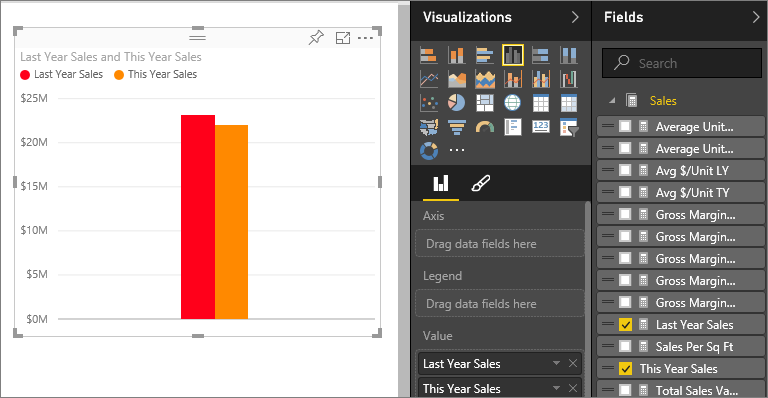
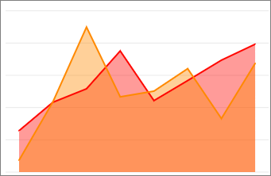

<properties
   pageTitle="Tutorial: Part 2, Add visualizations to a Power BI report"
   description="Tutorial: Part 2, Add visualizations to a Power BI report"
   services="powerbi"
   documentationCenter=""
   authors="mihart"
   manager="mblythe"
   backup=""
   editor=""
   tags=""
   qualityFocus="no"
   qualityDate=""/>

<tags
   ms.service="powerbi"
   ms.devlang="NA"
   ms.topic="article"
   ms.tgt_pltfrm="NA"
   ms.workload="powerbi"
   ms.date="10/08/2016"
   ms.author="mihart"/>

# Tutorial: Part 2, Add visualizations to a Power BI report  

In <bpt id="p1">[</bpt>Part 1<ept id="p1">](https://powerbi.uservoice.com/knowledgebase/articles/441777-part-i-add-visualizations-to-a-power-bi-report)</ept>, you created a basic visualization by selecting checkboxes next to field names.  In Part 2 you'll learn how to use drag-and-drop and make full use of the <bpt id="p1">**</bpt>Fields<ept id="p1">**</ept> and <bpt id="p2">**</bpt>Visualizations<ept id="p2">**</ept> panes to create and modify visualizations.

## Create a new visualization  
In this tutorial we'll dig into our Retail Analysis dataset and create a few key visualizations.

### Open a report and add a new blank page.  
1.  Expand the left navigation pane, if it isn't already expanded.

2.  Under <bpt id="p1">**</bpt>Reports<ept id="p1">**</ept>, select <bpt id="p2">**</bpt>Retail Analysis Sample<ept id="p2">**</ept> to open the report in Reading View.  
    

3.  Select <bpt id="p1">**</bpt>Edit Report<ept id="p1">**</ept> to open the report in Editing View.  
    

4.  <bpt id="p1">[</bpt>Add a new page<ept id="p1">](powerbi-service-add-a-page-to-a-report.md)</ept> by selecting the yellow plus icon at the bottom of the canvas.  
    

### Add a visualization that looks at this year's sales compared to last year.  
1.  From the <bpt id="p1">**</bpt>Sales<ept id="p1">**</ept> table, select <bpt id="p2">**</bpt>This Year Sales<ept id="p2">**</ept><ph id="ph1"> &gt; </ph><bpt id="p3">**</bpt>Value<ept id="p3">**</ept> and <bpt id="p4">**</bpt>Last Year Sales<ept id="p4">**</ept>. Power BI creates a column chart.  This is somewhat interesting, and you want to dig deeper. What do the sales look like by month?  

    

2.  From the Time table, drag <bpt id="p1">**</bpt>Month<ept id="p1">**</ept> into the <bpt id="p2">**</bpt>Axis<ept id="p2">**</ept> area.  
  

3.  <bpt id="p1">[</bpt>Change the visualization<ept id="p1">](powerbi-service-change-the-type-of-visualization-in-a-report.md)</ept> to an Area chart.  There are many visualization types to choose from - see <bpt id="p1">[</bpt>descriptions of each, tips for best practices, and tutorials<ept id="p1">](powerbi-service-visualization-types-for-reports-and-q-and-a.md)</ept> for help deciding which type to use. From the Visualizations pane, select the Area chart icon.

5.  <bpt id="p1">[</bpt>Resize the visualization<ept id="p1">](powerbi-service-move-and-resize-a-visualization.md)</ept> by selecting the visualization, grabbing one of the outline circles and dragging. Make it wide enough to eliminate the scrollbar and small enough to give us enough room to add another visualization.

    

6.  <bpt id="p1">[</bpt>Save the report<ept id="p1">](powerbi-service-save-a-report.md)</ept>.

### Add a map visualization that looks at sales by location  
1.  From the <bpt id="p1">**</bpt>Store<ept id="p1">**</ept> table, click <bpt id="p2">**</bpt>Territory<ept id="p2">**</ept>. Power BI recognizes that Territory is a location, and creates a map visualization.  
    

2.  Drag <bpt id="p1">**</bpt>Total Stores<ept id="p1">**</ept> into the Size area.  
    

3.  Add a legend.  To see the data by store name, drag <bpt id="p1">**</bpt>Chain<ept id="p1">**</ept> into the Legend area.  
    

## Consulte también  
-   For more information about the Fields pane, see <bpt id="p1">[</bpt>The report editor... take a tour<ept id="p1">](powerbi-service-the-report-editor-take-a-tour.md)</ept>.   
-   To learn how to filter and highlight your visualizations, see <bpt id="p1">[</bpt>Filters and highlighting in Power BI reports<ept id="p1">](powerbi-service-about-filters-and-highlighting-in-reports.md)</ept>.  
-   To learn about using and changing aggregations, see <bpt id="p1">[</bpt>Aggregates in reports<ept id="p1">](powerbi-service-aggregates.md)</ept>.  
-   More about <bpt id="p1">[</bpt>Visualizations in Power BI reports<ept id="p1">](powerbi-service-visualizations-for-reports.md)</ept>.  
-   More questions? <bpt id="p1">[</bpt>Try the Power BI Community<ept id="p1">](http://community.powerbi.com/)</ept>.
