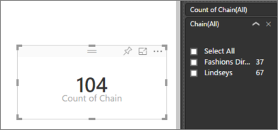

<properties
   pageTitle="Aggregates (sum, average, maximum, etc.) in Power BI"
   description="Change the aggregation in a chart (sum, average, maximum, etc.) in Power BI"
   services="powerbi"
   documentationCenter=""
   authors="mihart"
   manager="mblythe"
   backup=""
   editor=""
   tags=""
   qualityFocus="no"
   qualityDate=""/>

<tags
   ms.service="powerbi"
   ms.devlang="NA"
   ms.topic="article"
   ms.tgt_pltfrm="NA"
   ms.workload="powerbi"
   ms.date="09/21/2016"
   ms.author="mihart"/>

# Aggregates in Power BI  

## What is an aggregate?

A numeric field is a value that will be aggregated (summed or averaged, for example).  These are often referred to as <bpt id="p1">**</bpt>measures<ept id="p1">**</ept>. Measures in Power BI are imported with the data (defined in the data model your report is based on). In the Fields list, measures are shown with the ∑ symbol. For more information see <bpt id="p1">[</bpt>The report editor... take a tour<ept id="p1">](powerbi-service-the-report-editor-take-a-tour.md)</ept>.

## Change how a numeric field is aggregated

Say you have a chart that sums the sales data for different regions, but you'd rather have the average. 

1.  In report Editing view, add the measure to a visualization.

2.  Find that field in the Visualizations pane, right-click, and select the aggregate type you need.

    

>[AZURE.NOTE] The options available in the dropdown will vary depending on the field selected.

Some of the options that may be available for aggregating a field:

-   <bpt id="p1">**</bpt>Do Not Summarize<ept id="p1">**</ept>. With this option chosen, each value in that field is treated separately and not summarized. This is often used if you have a numeric ID column that shouldn't be summed.

-   <bpt id="p1">**</bpt>Sum<ept id="p1">**</ept>. This adds all the values in that field up.

-   <bpt id="p1">**</bpt>Average<ept id="p1">**</ept>. Takes an arithmetic mean of the values.

-   <bpt id="p1">**</bpt>Minimum<ept id="p1">**</ept>. Shows the smallest value.

-   <bpt id="p1">**</bpt>Maximum<ept id="p1">**</ept>. Shows the largest value.

-   <bpt id="p1">**</bpt>Count (Not Blanks).<ept id="p1">**</ept> This counts the number of values in that field that are not blank.

-   <bpt id="p1">**</bpt>Count (Distinct).<ept id="p1">**</ept> This counts the number of different values in that field.

- <bpt id="p1">**</bpt>Standard deviation.<ept id="p1">**</ept>

- <bpt id="p1">**</bpt>Variance<ept id="p1">**</ept>.

- <bpt id="p1">**</bpt>Median<ept id="p1">**</ept>.  Shows the median (middle) value. This is the value that has the same number of items above and below.  If there are 2 medians, Power BI averages them.

For example, this data:

| Country   | Amount |
|:----------|:-------|
| USA       | 100    |
| UK        | 150    |
| Canadá    | 100    |
| Alemania   | 125    |
| Francia    |        |
| Japón     | 125    |
| Australia | 150    |

Would give the following results:

-   <bpt id="p1">**</bpt>Do Not Summarize<ept id="p1">**</ept>: Each value is shown separately

-   <bpt id="p1">**</bpt>Sum<ept id="p1">**</ept>: 750

-   <bpt id="p1">**</bpt>Average<ept id="p1">**</ept>: 125

-   <bpt id="p1">**</bpt>Maximum<ept id="p1">**</ept>:  150

-   <bpt id="p1">**</bpt>Minimum<ept id="p1">**</ept>: 100

-   <bpt id="p1">**</bpt>Count (Not Blanks):<ept id="p1">**</ept> 6

-   <bpt id="p1">**</bpt>Count (Distinct):<ept id="p1">**</ept> 4

- <bpt id="p1">**</bpt>Standard deviation:<ept id="p1">**</ept> 20.4124145...

- <bpt id="p1">**</bpt>Variance:<ept id="p1">**</ept> 416.666...

- <bpt id="p1">**</bpt>Median:<ept id="p1">**</ept> 125

## Use a non-aggregated field as a numeric field

You can also use a non-aggregated field as a numeric field. For example, if you have a Product Name field, you can add it as a value and then set it to <bpt id="p1">**</bpt>Count<ept id="p1">**</ept> or <bpt id="p2">**</bpt>Distinct count<ept id="p2">**</ept>. 

1.  For example, if you select <bpt id="p1">**</bpt>Store &gt; Chain<ept id="p1">**</ept>.

    

2.  And if you change the aggregation from the default <bpt id="p1">**</bpt>Do not summarize<ept id="p1">**</ept> to <bpt id="p2">**</bpt>Count (Distinct)<ept id="p2">**</ept>, Power BI counts the number of different chains. In this case, there are 2: Fashions Direct and Lindseys.

    

3.  And if you change the aggregation to <bpt id="p1">**</bpt>Count<ept id="p1">**</ept>, Power BI counts the total number. In this case, there are 104 entries for <bpt id="p1">**</bpt>Chain<ept id="p1">**</ept>. By adding <bpt id="p1">**</bpt>Chain<ept id="p1">**</ept> as a filter, you can see that there are 37 rows for Fashions Direct and 67 rows for Lindseys.  

    

## Consulte también  
<bpt id="p1">[</bpt>Visualizations in Power BI reports<ept id="p1">](powerbi-service-visualizations-for-reports.md)</ept>  

<bpt id="p1">[</bpt>Power BI - Basic Concepts<ept id="p1">](powerbi-service-basic-concepts.md)</ept>  

More questions? <bpt id="p1">[</bpt>Try the Power BI Community<ept id="p1">](http://community.powerbi.com/)</ept>
