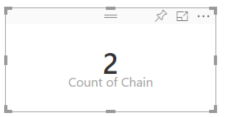

<properties
   pageTitle="Agregados (suma, promedio, máximo, etc.) en Power BI"
   description="Cambiar la agregación de un gráfico (suma, promedio, máximo, etc.) en Power BI"
   services="powerbi"
   documentationCenter=""
   authors="mihart"
   manager="mblythe"
   backup=""
   editor=""
   tags=""
   qualityFocus="no"
   qualityDate=""/>

<tags
   ms.service="powerbi"
   ms.devlang="NA"
   ms.topic="article"
   ms.tgt_pltfrm="NA"
   ms.workload="powerbi"
   ms.date="09/21/2016"
   ms.author="mihart"/>

# Agregados en Power BI  

## ¿Qué es un agregado?

Un campo numérico es un valor que se agregarán (suma o promedio, por ejemplo).  A menudo se conocen como **medidas**. Medidas en Power BI se importan con los datos (definidos en el informe se basa en el modelo de datos). En la lista de campos, las medidas se muestran con el símbolo ∑. Para obtener más información, consulte [el editor de informes... un paseo](powerbi-service-the-report-editor-take-a-tour.md).

## Cambiar cómo se agrega un campo numérico

Supongamos que tiene un gráfico que resume los datos de ventas de distintas regiones, pero prefiere que la Media. 

1.  En la vista de edición de informe, agregue la medida a una visualización.

2.  Buscar este campo en el panel de visualizaciones, con el botón secundario y seleccione el tipo agregado que necesita.

    

>[AZURE.NOTE] Las opciones disponibles en la lista desplegable varía en función del campo seleccionado.

Algunas de las opciones que pueden estar disponibles para agregar un campo:

-   
            **No resumir**. Con esta opción elegida, cada valor de ese campo se tratan por separado y no resumen. Esto se suele usar si tiene una columna de identificador numérica que no debe sumar.

-   
            **Suma**. Esta suma todos los valores de ese campo.

-   
            **Medio**. Toma la media aritmética de los valores.

-   
            **Mínimo**. Muestra el valor más pequeño.

-   
            **Máximo**. Muestra el valor más grande.

-   
            **Recuento (no vacías).** Cuenta el número de valores de ese campo que no están en blanco.

-   
            **Count (Distinct).** Cuenta el número de valores diferentes en ese campo.

- 
            **Desviación estándar.**

- 
            **Variación**.

- 
            **Mediana**.  Muestra el valor de la mediana (intermedio). Este es el valor que tiene el mismo número de elementos por encima y por debajo.  Si hay 2 medianas, Power BI calcula el promedio de ellos.

Por ejemplo, estos datos:

| Country   | Cantidad |
|:----------|:-------|
| ESTADOS UNIDOS       | 100    |
| UK        | 150    |
| Canadá    | 100    |
| Alemania   | 125    |
| Francia    |        |
| Japón     | 125    |
| Australia | 150    |

Proporcionará a los siguientes resultados:

-   
            **Hacer resumir**: cada valor se muestra por separado

-   
            **Suma**: 750

-   
            **Promedio**: 125

-   
            **Máximo**: 150

-   
            **Mínimo**: 100

-   
            **Count (no espacios en blanco):** 6

-   
            **Count (Distinct):** 4

- 
            **Desviación estándar:** 20.4124145...

- 
            **Variación:** 416.666...

- 
            **Mediana:** 125

## Utilizar un campo no agregada como un campo numérico

También puede utilizar un campo no agregada como un campo numérico. Por ejemplo, si tiene un campo de nombre de producto, puede agregarlo como un valor y, a continuación, se establece en **recuento** o **Distinct count**. 

1.  Por ejemplo, si selecciona **almacén > cadena**.

    

2.  Y si cambian la agregación predeterminada **no resumir** a **Count (Distinct)**, Power BI cuenta el número de cadenas diferentes. En este caso, hay 2: directa de moda y Lindseys.

    

3.  Cuando se modifique la agregación para **recuento**, Power BI cuenta el número total. En este caso, hay 104 entradas para **cadena**. Agregando **cadena** como un filtro, puede ver que hay 37 filas de moda directa y 67 de Lindseys.  

    

## Consulte también  

            [Visualizaciones en informes de Power BI](powerbi-service-visualizations-for-reports.md)  

            [Power BI: conceptos básicos](powerbi-service-basic-concepts.md)  

¿Preguntas más frecuentes? 
            [Pruebe la Comunidad de Power BI](http://community.powerbi.com/)
