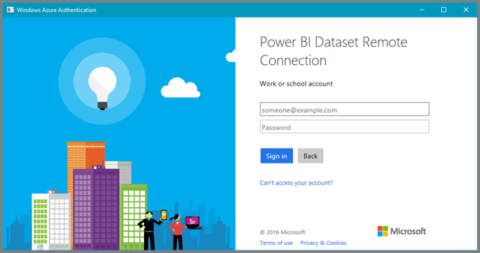

<properties
   pageTitle="Analizar en Excel"
   description="Obtenga información acerca de cómo analizar los conjuntos de datos de Power BI en Excel"
   services="powerbi"
   documentationCenter=""
   authors="davidiseminger"
   manager="mblythe"
   backup=""
   editor=""
   tags=""
   qualityFocus="complete"
   qualityDate=""/>

<tags
   ms.service="powerbi"
   ms.devlang="NA"
   ms.topic="article"
   ms.tgt_pltfrm="NA"
   ms.workload="powerbi"
   ms.date="09/27/2016"
   ms.author="davidi"/>

# Analizar en Excel
Con **analizar en Excel**, puede ver e interactuar con un conjunto de datos tiene acceso a en Power BI y, por tanto, obtener acceso a características de segmentación de datos, gráfico y tabla dinámica directamente en Excel, basado en el conjunto de datos que existe en Power BI.

## Requisitos
Hay algunos requisitos para usar **analizar en Excel**:
- 
            **Analizar en Excel** se admite para Microsoft Excel 2010 SP1 y versiones posteriores.
- Tablas dinámicas de Excel no admiten la agregación de arrastrar y colocar de campos numéricos. El conjunto de datos en Power BI *debe haber definido previamente medidas*.
- Algunas organizaciones pueden tener reglas de directiva de grupo que evita la instalación de los necesarios **analizar en Excel** actualizaciones a Excel. Si no puede instalar las actualizaciones, consulte con su administrador.

## ¿Cómo funciona?
Al seleccionar **analizar en Excel** en el menú del botón de puntos suspensivos (el...) asociado a un conjunto de datos o un informe en **Power BI**, Power BI creará una. Archivo ODC y descarga desde el explorador en su equipo.

Al abrir el archivo en Excel, vacía **tabla dinámica** y **campos** lista aparece con las tablas, campos y medidas del conjunto de datos de Power BI. Puede crear tablas dinámicas, gráficos y analizar ese conjunto de datos igual que trabaja con un conjunto de datos local en Excel.

El archivo. Archivo ODC tiene una cadena de conexión de MSOLAP que se conecta al conjunto de datos en Power BI. Al analizar o trabajar con los datos, Excel consulta ese conjunto de datos en Power BI y devuelve los resultados a Excel. Si ese conjunto de datos se conecta a un origen de datos en directo mediante DirectQuery, Power BI consulta el origen de datos y devuelve el resultado a Excel.

            **Analizar en Excel** es muy útil para los conjuntos de datos y los informes que se conectan a *Tabular de Analysis Services* o *Multidimensional* bases de datos o de Power BI Desktop archivos de Excel con modelos de datos que tienen medidas explícitas que se crean mediante expresiones de análisis de datos (DAX).

## Introducción a analizar en Excel

En Power BI, seleccione el menú del botón de puntos suspensivos junto a un informe o un conjunto de datos (el... junto al nombre de informe o conjunto de datos) y en el menú que aparece, seleccione **analizar en Excel**.

### Instalar actualizaciones de Excel
Cuando usa **analizar en Excel**, debe instalar las actualizaciones a las bibliotecas de Excel. Se le pedirá que descargar y ejecutar actualizaciones de Excel (Esto inicia la instalación de la *SQL_AS_OLEDDB.msi* paquete de Windows installer). Este paquete instala **AS proveedor Microsoft OLE DB para SQL Server 2016 RC0 (vista previa)**.

> 
            **Nota:** Compruebe **no volver a mostrar** en la **instalar Excel actualiza** cuadro de diálogo. Sólo debe instalar la actualización una vez.

Si es necesario instalar las actualizaciones de Excel para **analizar en Excel** de nuevo, puede descargar la actualización desde el **descargar** icono en Power BI, tal como se muestra en la siguiente imagen.

### Inicie sesión Power BI
Aunque haya iniciado sesión en Power BI en el explorador, la primera vez que abra una nueva. Archivo ODC en Excel, deberá iniciar sesión Power BI con su cuenta de Power BI. Esto autentica la conexión desde Excel a Power BI.

### Usuarios con varias cuentas de Power BI
Algunos usuarios tienen varias cuentas de Power BI, y los usuarios pueden producirse una situación en que inicien sesión en Power BI con una cuenta, pero la cuenta que tiene acceso al conjunto de datos que se utiliza en analizar en Excel es una cuenta diferente. En estos casos, es posible que obtenga un **prohibido** error o un error de inicio de sesión al intentar tener acceso a un conjunto de datos que se utiliza en un análisis en el libro de Excel.

Se le proporcionará una oportunidad de iniciar sesión de nuevo, momento en el que puede iniciar sesión con la cuenta de Power BI que tiene acceso al conjunto de datos que se obtiene acceso por analizar en Excel.

Para otros errores que pueden surgir, eche un vistazo la [solución de problemas de analizar en Excel](powerbi-desktop-troubleshooting-analyze-in-excel.md) artículo.

### Habilitar conexiones de datos
Para analizar los datos de Power BI en Excel, se le pide que compruebe el nombre de archivo y ruta de acceso para el archivo .odc y, a continuación, seleccione **Habilitar**.

También puede conectarse a bases de datos de Analysis Services (AS) de local mediante *DirectQuery*, e incluir datos en informes creados utilizando analizar en Excel. Debe estar en el mismo dominio de Active Directory como la base de datos de AS y debe ser local. Los administradores de una implementación de Power BI puede habilitar o deshabilitar la capacidad de conectarse a COMO bases de datos en el **del portal de administración**.

## Analizar ausente
Ahora que ha abierto Excel y dispone de una tabla dinámica vacía, está listo para realizar a todo tipo de análisis con el conjunto de datos de Power BI. Al igual que con otros libros local, con la característica analizar en Excel, puede crear tablas dinámicas, gráficos, agregar datos de otros orígenes y así sucesivamente. Y por supuesto, puede crear distintas hojas de cálculo con todos los tipos de vistas de los datos.

## Guardar
Puede guardar este conjunto de datos de Power BI conectado libro al igual que cualquier otro libro. Sin embargo, no se puede publicar o volver a importar el libro a Power BI porque sólo se pueden publicar o importar libros en Power BI que tienen datos en tablas, o que tienen un modelo de datos. Dado que el nuevo libro simplemente tiene una conexión con el conjunto de datos en Power BI, publicación o importar en Power BI iría en círculos!

## Compartir
Una vez que se guarda el libro, puede compartirlo con otros usuarios de Power BI en su organización. Para compartir un libro con otros usuarios de Power BI, deben compartir el conjunto de datos (el libro), realice una de las siguientes acciones:

-   Comparta el panel de Power BI que hospeda un elemento anclado en el informe de Power BI con el usuario
-   Compartir un paquete de contenido que contiene el conjunto de datos con el usuario
-   Agregue el usuario con los que desee compartir en el grupo que posee el conjunto de datos

Cuando un usuario con los que ha compartido el libro abre el libro, verán las tablas dinámicas y los datos como aparecían cuando el libro se guardó, lo que puede no ser la versión más reciente de los datos. Para obtener los datos más recientes, los usuarios deben utilizar el **actualizar** situado en el **datos** cinta de opciones. Y dado que el libro se conecta a un conjunto de datos en Power BI, los usuarios que intenten actualizar el libro deben iniciar sesión en Power BI e instalar las actualizaciones de Excel la primera vez que intentan actualizar con este método.

También puede establecer el archivo de libro para actualizar los datos tras la apertura, que actualiza los datos cada vez que alguien tenga acceso a los conjuntos de datos. Para actualizar el libro cada vez que se abre en, seleccione Excel **conexiones** desde el **datos** la cinta de opciones, seleccione la conexión usada para el libro y, a continuación, seleccione **propiedades** y establecer *Actualizar al abrir el archivo* a **True**, a continuación, seleccione **Aceptar**.

Puesto que los usuarios necesitarán que actualice el conjunto de datos y para las conexiones externas no se admite en Excel Online, se recomienda que los usuarios abran el libro en la versión de escritorio de Excel en su equipo.

## Véase también  

[Solución de problemas de analizar en Excel](powerbi-desktop-troubleshooting-analyze-in-excel.md)

¿Preguntas más frecuentes? [Pruebe la Comunidad de Power BI](http://community.powerbi.com/)
