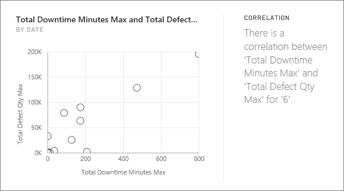

<properties
   pageTitle="Tipos de información rápidamente compatibles con Power BI"
   description="Rápida visión con Power BI."
   services="powerbi"
   documentationCenter=""
   authors="mihart"
   manager="mblythe"
   backup=""
   editor=""
   tags=""
   qualityFocus="no"
   qualityDate=""/>

<tags
   ms.service="powerbi"
   ms.devlang="NA"
   ms.topic="article"
   ms.tgt_pltfrm="NA"
   ms.workload="powerbi"
   ms.date="10/09/2016"
   ms.author="mihart"/>

# Tipos de información rápidamente compatibles con Power BI

## ¿Cómo funciona la información rápidamente?

Power BI busca rápidamente en distintos subconjuntos del conjunto de datos al aplicar un conjunto de algoritmos sofisticados para detectar información potencialmente interesantes. Power BI se analiza como gran parte de un conjunto de datos como sea posible en un intervalo de tiempo asignado.

Puede ejecutar información rápidamente en un conjunto de datos o en mosaico (visión relacionados).   

##  ¿Qué tipos de información se puede buscar?
Estos son algunos de los algoritmos que se utiliza:

### Mayoría (factores principales)
Busca los casos donde la mayoría de un valor total puede atribuirse a un único factor cuando desglosadas por otra dimensión.  

### Valores atípicos de categoría (superior o inferior)
Resalta los casos donde, para una medida en el modelo, uno o dos miembros de una dimensión tienen mucho valores mayores que otros miembros de la dimensión.  

### Valores atípicos de series de tiempo
Para los datos a través de una serie de tiempo, detecta si hay determinadas fechas u horas con valores significativamente diferente de los demás valores de fecha y hora.

### Tendencias generales de serie temporal
Detecta las tendencias hacia arriba o hacia abajo en los datos de serie temporal.

### Estacionalidad en serie temporal
Busca patrones periódicos de los datos de series temporales, como la estacionalidad semanal, mensual o anual.

### Recurso compartido de constante
Resalta los casos donde hay una correlación de elementos primarios y secundarios entre el recurso compartido de un valor de secundarios en relación con el valor global del elemento primario a través de una variable continua.

### Correlación
Detecta los casos donde varias medidas muestran una correlación entre sí al registrarse en una dimensión en el conjunto de datos.

### Cambiar los puntos de una serie de tiempo
Se resalta cuando hay cambios significativos en las tendencias de datos en una serie de tiempo.

## Consulte también

[Power BI rápida visión](powerbi-service-auto-insights.md)

[Optimizar los datos de visión rápida de Power BI](powerbi-service-auto-insights-optimize.md)

[Power BI: conceptos básicos](powerbi-service-basic-concepts.md)

[Paneles de Power BI](powerbi-service-dashboards.md)

¿Preguntas más frecuentes? [Pruebe la Comunidad de Power BI](http://community.powerbi.com/)
