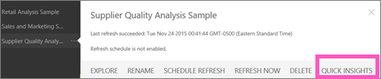
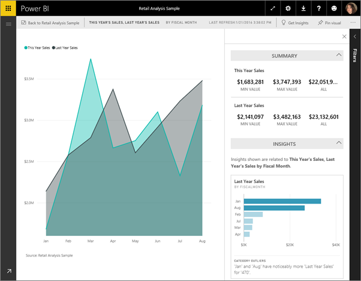

<properties
   pageTitle="Quick Insights in Power BI"
   description="Documentation for viewing Quick Insights with Power BI service."
   services="powerbi"
   documentationCenter=""
   authors="mihart"
   manager="mblythe"
   backup=""
   editor=""
   tags=""
   featuredVideoId="EOASjs5mj6s"
   qualityFocus="no"
   qualityDate=""/>

<tags
   ms.service="powerbi"
   ms.devlang="NA"
   ms.topic="article"
   ms.tgt_pltfrm="NA"
   ms.workload="powerbi"
   ms.date="10/09/2016"
   ms.author="mihart"/>

# Quick Insights with Power BI

Have a new dataset and not quite sure where to start?  Need to build a dashboard fast?  Want to quickly look for insights you may have missed?

Run Quick Insights to generate interesting interactive visualizations based on your data. Quick Insights can be run on an entire dataset (Quick Insights) or on a specific dashboard tile (Scoped Quick Insights). You can even run Quick Insights on a Quick Insight!

><bpt id="p1">**</bpt>NOTE<ept id="p1">**</ept>: Quick Insights is not available in Power BI Desktop and does not work with direct query - it only works with data uploaded to Power BI.

The Quick Insights feature is built on a growing <bpt id="p1">[</bpt>set of advanced analytical algorithms<ept id="p1">](powerbi-service-auto-insights-types.md)</ept> developed in conjunction with Microsoft Research that we’ll continue to use to allow more people to find insights in their data in new and intuitive ways.

## Run Quick Insights on a dataset

Watch Amanda run Quick Insights on a sample dataset, pin one of these Quick Insights as a tile on his dashboard, and open a Quick Insight in Focus mode.
<iframe width="560" height="315" src="https://www.youtube.com/embed/EOASjs5mj6s" frameborder="0" allowfullscreen></iframe>

Now it's your turn. Explore Quick Insights using the Supplier Quality Analysis sample.

1. In the left navigation pane, under <bpt id="p1">**</bpt>Datasets<ept id="p1">**</ept> select the ellipses (...) and choose <bpt id="p2">**</bpt>Quick Insights<ept id="p2">**</ept>.

    

2. Power BI uses <bpt id="p1">[</bpt>various algorithms<ept id="p1">](powerbi-service-auto-insights-types.md)</ept> to search for trends in your dataset.

    

3. Within seconds, your insights are ready.  Select <bpt id="p1">**</bpt>View Insights<ept id="p1">**</ept> to display visualizations.

    

    Or, in the leftnav, select the ellipses (...) and choose <bpt id="p1">**</bpt>View Insights<ept id="p1">**</ept>.

    

    ><bpt id="p1">**</bpt>NOTE<ept id="p1">**</ept>: Some datasets can't generate Insights because the data isn't statistically significant.  To learn more, see <bpt id="p1">[</bpt>Optimize your data for Quick Insights<ept id="p1">](powerbi-service-auto-insights-optimize.md)</ept>.

4. The visualizations display in a special <bpt id="p1">**</bpt>Quick Insights<ept id="p1">**</ept> canvas with up to 32 separate Insight cards. Each card has a chart or graph plus a short description.

    

## Interact with the Quick Insight cards

  

1. Hover over a card and select the pin icon to add the visualization to a dashboard.

2. Hover over a card and select the Focus mode icon to display the card fullscreen.

3. In Focus mode you can:
  - <bpt id="p1">[</bpt>filter<ept id="p1">](powerbi-service-interact-with-a-report-in-reading-view.md)</ept> the visualizations.  To display the filters, in the top right corner, select the arrow.

  - Pin the insight card to a dashboard.

  - Run Quick Insights on the card itself. This is referred to as <bpt id="p1">**</bpt>Scoped Quick Insights<ept id="p1">**</ept>. In the top-right corner, select the lightbulb icon or <bpt id="p1">**</bpt>Get Insights<ept id="p1">**</ept>.

    

    The insight displays on the left and new insight cards, based solely on the data in that single insight, display along the right.

    

4.  To return to the original Quick Insights canvas, in the top-left corner, select <bpt id="p1">**</bpt>Exit Focus mode<ept id="p1">**</ept>.

## Run Quick Insights on a dashboard tile
Instead of searching for insights against an entire dataset, narrow your search to the data used to create a single dashboard tile. This is referred to as <bpt id="p1">**</bpt>Scoped Quick Insights<ept id="p1">**</ept>.

1. <bpt id="p1">[</bpt>Open the tile in Focus mode<ept id="p1">](/powerbi-service-display-dash-in-focus-mode.md)</ept>.
2. In the top right corner, select <bpt id="p1">**</bpt>Get Insights<ept id="p1">**</ept>.

    

3. Power BI displays the insight cards along the right side of the tile.

    

4. Does one insight pique your interest? Select that insight card to dig further. The selected insight appears on the left and new insight cards, based solely on the data in that single insight, display along the right.

5. Continue digging into your data, and when you find an interesting insight, pin its visual to your dashboard by selecting <bpt id="p1">**</bpt>Pin visual<ept id="p1">**</ept> from the top-right corner. Also, you can send feedback to let the dataset owner know if a particular insight was helpful or not.

    

## Consulte también

[Optimize your data for Power BI Quick Insights](powerbi-service-auto-insights-optimize.md)

[Power BI - Basic Concepts](powerbi-service-basic-concepts.md)

[Dashboards in Power BI](powerbi-service-dashboards.md)

More questions? [Try the Power BI Community](http://community.powerbi.com/)
