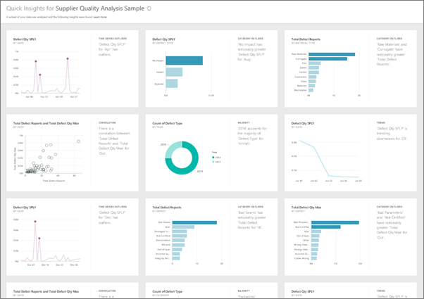

<properties
   pageTitle="Visión rápida de Power BI"
   description="Documentación para ver información rápidamente con el servicio Power BI."
   services="powerbi"
   documentationCenter=""
   authors="mihart"
   manager="mblythe"
   backup=""
   editor=""
   tags=""
   featuredVideoId="EOASjs5mj6s"
   qualityFocus="no"
   qualityDate=""/>

<tags
   ms.service="powerbi"
   ms.devlang="NA"
   ms.topic="article"
   ms.tgt_pltfrm="NA"
   ms.workload="powerbi"
   ms.date="10/09/2016"
   ms.author="mihart"/>

# Rápida visión con Power BI

¿Tiene un nuevo conjunto de datos y no bastante seguro de dónde empezar?  ¿Se necesita para crear un panel rápido?  ¿Desea buscar rápidamente información que es posible que falten?

Ejecute una visión rápida para generar interesantes visualizaciones interactivas basados en los datos. Visión rápida se puede ejecutar en un conjunto de datos completo (visión rápida) o en un icono de panel específico (con ámbito de visión rápida). ¡Incluso puede ejecutar información rápidamente en una información rápida!

>
            **NOTA**: visión rápida no está disponible en Power BI Desktop y no funciona con la consulta directa, sólo funciona con datos cargados a Power BI.

La característica información rápida se basa en un crecimiento [conjunto de algoritmos analítica avanzados](powerbi-service-auto-insights-types.md) elaborado en colaboración con Microsoft Research que seguiremos para permitir que más personas a encontrar información en sus datos de maneras nuevas e intuitivas.

## Ejecutar información rápidamente en un conjunto de datos

Vea Amanda ejecutar información rápidamente en un conjunto de datos de ejemplo, pin uno de esos conocimientos rápida como un icono en su escritorio y abrir una información rápida en modo de enfoque.
<iframe width="560" height="315" src="https://www.youtube.com/embed/EOASjs5mj6s" frameborder="0" allowfullscreen></iframe>

Ahora es su turno. Explore información rápidamente mediante el análisis de calidad de proveedor de ejemplo.

1. En el panel de navegación izquierdo, bajo **conjuntos de datos** Seleccione el botón de puntos suspensivos (...) y elija **profundas**.

    

2. Power BI usa [distintos algoritmos](powerbi-service-auto-insights-types.md) para buscar tendencias en el conjunto de datos.

    

3. En segundos, la información esté lista.  Seleccione **Visión vista** Mostrar visualizaciones.

    

    O, en el leftnav, seleccione el botón de puntos suspensivos (...) y seleccione **Visión de vista**.

    

    >
            **NOTA**: algunos conjuntos de datos no pueden generar visión porque los datos no son estadísticamente significativos.  Para obtener más información, consulte [optimizar los datos para obtener información rápidamente](powerbi-service-auto-insights-optimize.md).

4. Mostrar las visualizaciones en especial **profundas** lienzo con hasta 32 tarjetas de información independientes. Cada tarjeta tiene un gráfico o un gráfico más una breve descripción.

    

## Interactuar con las tarjetas de información rápida

  

1. Mantenga el mouse sobre una tarjeta y seleccione el icono para agregar la visualización a un panel.

2. Mantenga el mouse sobre una tarjeta y seleccione el icono de modo de foco para mostrar la pantalla completa de tarjeta.

3. En el modo de enfoque, puede:
  - 
            [filtro](powerbi-service-interact-with-a-report-in-reading-view.md) las visualizaciones.  Para mostrar los filtros, en la esquina superior derecha, seleccione la flecha.

  - NIP de la tarjeta de información a un panel.

  - Ejecute profundas en la propia tarjeta. Esto se conoce como **ámbito rápida visión**. En la esquina superior derecha, seleccione el icono de bombilla o **obtener información sobre**.

    

    La información que se muestra a la izquierda y mostrarán nuevas tarjetas de información, basadas únicamente en los datos de esta perspectiva única, en la parte derecha.

    

4.  Para volver al lienzo rápida visión original, en la esquina superior izquierda, seleccione **modo de salida enfoque**.

## Ejecutar una visión rápida en un icono de panel
En lugar de buscar información en un conjunto de datos completo, limitar la búsqueda a los datos utilizados para crear un icono de panel único. Esto se conoce como **ámbito rápida visión**.

1. 
            [Abra el mosaico en el modo de enfoque](/powerbi-service-display-dash-in-focus-mode.md).
2. En la esquina superior derecha, seleccione **obtener información sobre**.

    

3. Power BI muestra las tarjetas de información en el lado derecho del mosaico.

    

4. ¿Uno insight pique su interés? Seleccione esa tarjeta insight profundizar aún más. La información seleccionada aparece en la parte izquierda y mostrarán nuevas tarjetas de información, basadas únicamente en los datos de esta perspectiva única, en la parte derecha.

5. Continuar profundizar en los datos y cuando encuentra una idea interesante, anclar su visual al panel seleccionando **Pin visual** desde la esquina superior derecha. Además, puede enviar comentarios para informar al propietario del conjunto de datos si una determinada información ha sido útil.

    

## Consulte también

[Optimizar los datos de visión rápida de Power BI](powerbi-service-auto-insights-optimize.md)

[Power BI: conceptos básicos](powerbi-service-basic-concepts.md)

[Paneles de Power BI](powerbi-service-dashboards.md)

¿Preguntas más frecuentes? [Pruebe la Comunidad de Power BI](http://community.powerbi.com/)
