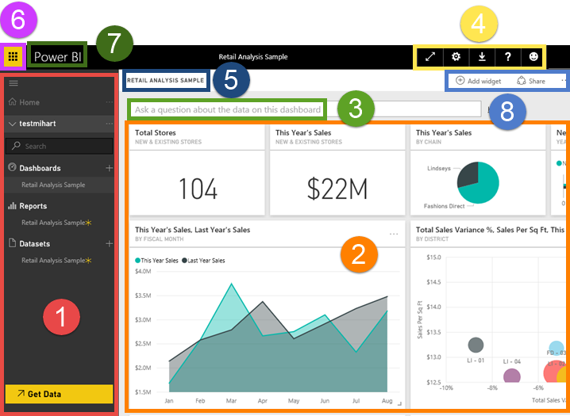
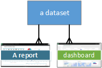

<properties
   pageTitle="Power BI: conceptos básicos"
   description="Power BI: conceptos básicos"
   services="powerbi"
   documentationCenter=""
   authors="mihart"
   manager="mblythe"
   backup=""
   editor=""
   tags=""
   featuredVideoId="Y4sRWbo8JcE"
   qualityFocus="no"
   qualityDate=""/>

<tags
   ms.service="powerbi"
   ms.devlang="NA"
   ms.topic="get-started-article"
   ms.tgt_pltfrm="NA"
   ms.workload="powerbi"
   ms.date="10/05/2016"
   ms.author="mihart"/>

# Power BI: conceptos básicos de servicio Power BI

Cuando abra por primera vez el servicio de Power BI, verá el área de trabajo. Aparece de forma destacada será su ***panel***, que es algo que diferencia el servicio Power BI de Power BI Desktop.

El área de trabajo del servicio de Power BI se compone de:

1.  barra de navegación
2.  panel con iconos
3.  Cuadro de pregunta de preguntas y respuestas
4.  botones de ayuda y comentarios
5.  título del panel
6.  Iniciador de aplicaciones de Office 365
7.  Botones de inicio de Power BI
8. Acciones adicionales

Haremos esto más adelante, pero primero vamos a revisar algunos conceptos de Power BI.

O bien, puede ver este vídeo antes de leer primero el resto de este artículo.  En el vídeo, revisa los conceptos básicos y le ofrece una visita de servicio Power BI.

<iframe width="560" height="315" src="https://www.youtube.com/embed/Y4sRWbo8JcE?list=PL1N57mwBHtN0JFoKSR0n-tBkUJHeMP2cP" frameborder="0" allowfullscreen></iframe>

## Conceptos de Power BI

Son los pilares principales 3 de Power BI: ***paneles***, ***informes***, y ***conjuntos de datos***. No se puede tener paneles o informes sin datos (bueno, puede tener paneles vacíos e informes vacíos, pero no son muy útiles hasta que tengan datos), así pues, comencemos con **conjuntos de datos**.

## Conjuntos de datos

Un *conjunto de datos* es algo que *importar* o *Conectar* a. Power BI le permite conectarse a todo tipo de conjuntos de datos y poner todo junto en un solo lugar.  

En la barra de navegación, se enumeran los conjuntos de datos que se haya conectado a bajo la **conjuntos de datos** encabezado. Cada conjunto de datos de lista representa un único origen de datos, por ejemplo, un libro de Excel en OneDrive, o un conjunto de datos local SSAS tabular o un conjunto de datos de Salesforce. Hay muchos distintos orígenes de datos compatibles y estamos agregando nuevos todo el tiempo. 
            [Consulte la lista de tipos de conjunto de datos que se pueden usar con Power BI](powerbi-service-get-data.md).

            **UN** conjunto de datos...
- puede utilizarse una y otra vez.
- puede utilizarse en muchos informes diferentes.
- Pueden mostrar visualizaciones de ese conjunto de datos en muchos paneles diferentes.

  

Para [conectarse a un conjunto de datos](powerbi-service-get-data.md), seleccione **obtener datos** (en la parte inferior de la barra de navegación) o seleccione el icono del signo más junto a la **conjuntos de datos** encabezado. Siga las instrucciones para conectarse al origen específico y agregar el conjunto de datos al área de trabajo. Nuevos conjuntos de datos se agregan a la barra de navegación izquierdo y marcados con un asterisco amarillo. El trabajo que realice en Power BI no cambia el conjunto de datos subyacente.

Conjuntos de datos se pueden actualizar, cambia el nombre, explorado y quitar. Para explorar un conjunto de datos, selecciónela. Lo que realmente está haciendo es abrir el conjunto de datos en el editor de informes donde puede empezar realmente profundizar en los datos y crear visualizaciones. Por lo tanto, vamos a pasar al tema siguiente--informes. 

### Investigar un poco más:

-   [Contenido de BI Pro Power - ¿qué es?](powerbi-power-bi-pro-content-what-is-it.md)
-   [Obtener datos para Power BI](powerbi-service-get-data.md)
-   [Módulos de conjuntos de datos y contenido de ejemplo para Power BI](powerbi-sample-datasets.md)

## Reports

Un informe de Power BI es una o más páginas de visualizaciones (gráficos, gráficos e imágenes). Todas las visualizaciones en un informe proceden de un único conjunto de datos. Informes pueden crearse desde cero en Power BI, se pueden importar con paneles que sus colegas compartan con usted o pueden crearse automáticamente cuando se conecte a conjuntos de datos desde Excel, Power BI Desktop, bases de datos, aplicaciones de SaaS y [paquetes de contenido](powerbi-service-organizational-content-packs-introduction.md).  Por ejemplo, cuando se conecta a un libro de Excel que contiene hojas de Power View, Power BI crea un informe basado en dichas hojas. Y cuando se conecta a una aplicación SaaS, Power BI importa un informe previamente creado.

Existen 2 modos para ver e interactuar con los informes: [vista lectura](powerbi-service-open-a-report-in-reading-view.md) y [vista de edición de](powerbi-service-interact-with-a-report-in-editing-view.md).  Sólo la persona que creó el informe, copropietarios y los permisos, tener acceso a todas la exploración, diseñar, crear y compartir las capacidades de ***vista de edición de*** para el informe. Y las personas que comparten el informe con pueden exploración e interactúan con el informe usando ***vista lectura***.   

En el panel de navegación, los informes aparecen en la **informa de encabezado**. Cada informe de la lista representa 1 o más páginas de visualizaciones basadas en 1 de los conjuntos de datos subyacente. Todos los informes que se muestran aquí se pueden abrir en la vista de lectura y vista de edición. Para abrir un informe, simplemente selecciónela. De forma predeterminada, el informe se abre en la vista de lectura en primer lugar.  Simplemente seleccione **Editar informe** para abrirlo en la vista de edición.  Si un panel compartido tiene informes, NO verá el informe aparece en la barra de navegación. En su lugar, abra informes compartidos directamente desde el panel compartido seleccionando un icono de panel (más adelante).

            **UNA** informe...
-  se puede asociar con varios paneles (los iconos anclados desde el informe pueden aparecer en varios paneles).
-  pueden crearse utilizando los datos de un conjunto de datos. (la excepción a esto es que Power BI Desktop puede combinar más de 1 conjunto de datos en un único informe y que se puede importar el informe en Power BI)

  

## Paneles

Un *panel* es algo que crea o algo un colega crea y comparte con usted. Es un lienzo individual que contiene cero o más mosaicos y widgets. Cada mosaico muestra una sola [visualización](powerbi-service-visualizations-for-reports.md) que se ha creado a partir de un conjunto de datos y Anclar al panel. Hay muchas maneras de agregar iconos al escritorio; Hay demasiados se tratan en este tema de información general. Para obtener más información, consulte [panel en mosaico en Power BI](powerbi-service-dashboard-tiles.md). 

En la barra de navegación "sus" paneles se enumeran bajo el **paneles** encabezado. "Su" significa que tiene acceso a ellas, no necesariamente que se crearon. Cada panel representa una vista personalizada de un subconjunto de los conjuntos de datos subyacente.  Si usted es el propietario del panel, también tendrá acceso a los conjuntos de datos subyacente y aparecerán en la barra de exploración en **conjuntos de datos**.  Si el panel se ha compartido con usted, tiene un icono para compartir  junto a ella y dependiendo de cómo se comparten, puede o no puede ver los conjuntos de datos subyacentes que aparece en la barra de exploración.

>
            **NOTA**: fijar y mosaicos se tratan con más detalle a continuación bajo el encabezado "Iconos del escritorio."

            **UNA** panel...
- puede mostrar visualizaciones de muchos conjuntos de datos diferentes
- puede mostrar visualizaciones de muchos informes diferentes

### Investigar un poco más:

            **Puede ser un panel [creado desde cero](powerbi-service-create-a-dashboard.md)** : crear un nuevo panel en blanco y, a continuación, obtener algunos datos. 

            **Usted o un colega, puede crear un panel y [compartirlo](powerbi-service-share-unshare-dashboard.md)** ; al aceptar la invitación, el panel compartido (y cualquier informe asociado y el conjunto de datos) se agregan a la barra de navegación. 

            **Algunas veces los paneles se importan con el conjunto de datos o se crean cuando se conecta al conjunto de datos**. Por ejemplo, el **obtener datos** de Salesforce le preguntará si desea que un panel o informe crear a partir del conjunto de datos. 

**¿Por qué se crean los paneles?**  Estos son sólo algunas de las razones:

-   Para ver, en una sola mirada, toda la información necesaria para tomar decisiones
-   para supervisar la información más importante sobre sus negocios
-   para asegurarse de que todos los compañeros están en la misma página, ver y utilizar la misma información
-   para supervisar el estado de un negocio o producto o unidad de negocio o campaña de marketing, etc.
-   Para crear una vista personalizada de un panel más grande: todas las métricas importantes para usted

## Mi área de trabajo
Hemos marcado a su panel de Power BI y el área de trabajo. Echemos un vistazo a las partes que componen la página de nivel superior para el servicio de Power BI; lo llamamos **Mi área de trabajo**.

### 1. **Barra de navegación** (barra de exploración)

Utilice la barra de exploración para desplazarse entre los bloques de creación de Power BI: paneles, informes y conjuntos de datos.  

  

-   Seleccione **obtener datos** a [Agregar conjuntos de datos a Power BI](powerbi-service-get-data.md).

- Expandir y contraer en la barra de exploración con este icono .

-   Use **búsqueda** para buscar elementos específicos en la barra de exploración.

-   Seleccione un icono del signo más  para crear un nuevo panel u obtener un nuevo conjunto de datos.

-   La lista **paneles, informes,** y **conjuntos de datos** están disponibles para su uso.  Paneles compartidos son de solo lectura y mostrar el icono de  .

-   Los nombres de panel, informe y conjunto de datos suelen coincidir con el nombre del archivo de conjunto de datos subyacente, pero puede [cambiarles el nombre](powerbi-service-rename-a-dashboard.md).

-   Haga clic en un panel, el informe o el conjunto de datos para mostrar el menú contextual. 

    

Solo clic

-   un encabezado para contraer o expandir
-   un panel para mostrarlo
-   un informe para abrirlo en la vista de lectura
-   un conjunto de datos para explorarlo

### 2. **Panel con iconos**

Los paneles se componen de [mosaicos](powerbi-service-dashboard-tiles.md).  Los iconos se crean alguno de los informes en vista de edición o preguntas y respuestas. Un tipo especial de mosaico llama un [widget](powerbi-service-add-a-widget-to-a-dashboard.md) se agrega directamente en el panel. Los iconos que aparecen en un panel fueron colocados específicamente ahí por un creador o propietario del informe.  La acción de agregar un icono a un panel se denomina *anclaje*.

Para obtener más información, consulte **[paneles]** (arriba).

### 3. **Cuadro de pregunta de preguntas y respuestas**

Es una manera de explorar los datos que se deben formular que una pregunta y permitir que Power BI Q & A dar una respuesta en forma de una visualización. Preguntas y respuestas no se puede usar para agregar contenido a un informe, sólo para agregar contenido, en forma de mosaico, a los paneles.

Preguntas y respuestas busca respuestas en los conjuntos de datos conectados al panel.  Un conjunto de datos conectado es aquel que tiene al menos un mosaico anclado a ese panel.

En cuanto empiece a escribir su pregunta, preguntas y respuestas le lleva a la página de preguntas y. A medida que escribe, preguntas y ayuda a formular la pregunta correcta y encontrar la mejor respuesta con rephrasings, autorrelleno, sugerencias y mucho más. Cuando tenga una visualización (respuesta) le gusta, anclar al panel. Para obtener más información, consulte [preguntas y respuestas en Power BI](powerbi-service-q-and-a.md).

### 4. **Pantalla completa, ayuda y comentarios**

Los iconos en la esquina superior derecha son los recursos para la configuración, descargas, obtener ayuda y proporcionar comentarios al equipo de Power BI. Seleccione la flecha doble para abrir el panel de **pantalla completa** m.  

### 5. **Título del panel** (también conocido como panel está activo?)

No siempre es fácil averiguar qué panel está activo.  El título del panel aparece en la página de vista de panel, en la p & una página, en la vista de edición y vista de lectura del informe y abrir un conjunto de datos.   

### 6. **Iniciador de aplicaciones de Office 365**

El iniciador de aplicaciones está diseñado para ayudarle a obtener acceso a las aplicaciones de Office 365.

### 7. **Página principal de Power BI**

Seleccionar esta opción, devuelve al panel que haya visto recientemente.

   

### 8. **Opciones**

Esta área de trabajo contiene iconos para interactuar con el escritorio.  Además **Agregar un widget** y **Compartir panel** seleccionando el botón de puntos suspensivos revela opciones para duplicar, imprimir y actualizar el panel y mucho más.

   

## Consulte también

[Introducción a Power BI](powerbi-service-get-started.md)

[Vídeos de Power BI](powerbi-videos.md)

¿Preguntas más frecuentes? [Pruebe la Comunidad de Power BI](http://community.powerbi.com/)
