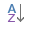

<properties
   pageTitle="Cambiar cómo se ordena un gráfico en un informe de Power BI"
   description="Cambiar cómo se ordena un gráfico en un informe de Power BI"
   services="powerbi"
   documentationCenter=""
   authors="mihart"
   manager="mblythe"
   backup=""
   editor=""
   tags=""
   qualityFocus="no"
   qualityDate=""/>

<tags
   ms.service="powerbi"
   ms.devlang="NA"
   ms.topic="article"
   ms.tgt_pltfrm="NA"
   ms.workload="powerbi"
   ms.date="10/05/2016"
   ms.author="mihart"/>

# Cambiar cómo se ordena un gráfico en un informe de Power BI

En Power BI, puede ordenar alfabéticamente los gráficos mediante los nombres de las categorías del gráfico o los valores numéricos de cada categoría. Por ejemplo, este gráfico se ordena por nombre de almacén.

Es fácil ordenan de mayor a menor ventas por pies cuadrados en su lugar.

1.  Seleccione el botón de puntos suspensivos (...) y elija **Ordenar por ventas por Sq Ft**.

2.  Si es necesario, seleccione el icono de orden  para cambiar a **descendente**.

    

    
            **NOTA**: no todos los elementos visuales se pueden ordenar.  No se pueden ordenar los elementos visuales siguientes: Treemap, asignación, asignación rellena, dispersión, medidor, tarjeta, tarjeta de varias filas, cascada.

##  Otros criterios de ordenación

A veces, desea ordenar el objeto visual con una columna diferente u otros criterios.  Por ejemplo, desea ordenar por mes (y no en orden alfabético) o desea ordenar por número completo en lugar de dígito (ejemplo, 0, 1, 9, 20 y no 0, 1, 20, 9).  Existen varias soluciones:

-   En Power BI Desktop, [Utilice la ficha Herramientas de modelado de datos para ordenar por una columna diferente](powerbi-desktop-sort-by-column.md).

-   En Excel, si posee el conjunto de datos, agregue una nueva columna que concatena el nombre del mes y el número. A continuación, actualizar o volver a importar el conjunto de datos para ver la nueva columna en el área campos.

-   En Excel, asegúrese de que las columnas numéricas se etiquetan como "número entero" o "decimal" y no como "text".

## Consulte también

Más información sobre [visualizaciones en informes de Power BI](powerbi-service-visualizations-for-reports.md).

[Power BI: conceptos básicos](powerbi-service-basic-concepts.md)

¿Preguntas más frecuentes? [Pruebe la Comunidad de Power BI](http://community.powerbi.com/)
