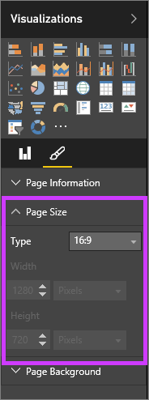

<properties
   pageTitle="Configuración de pantalla de página en un informe de Power BI"
   description="Configuración de pantalla de página en un informe de Power BI"
   services="powerbi"
   documentationCenter=""
   authors="mihart"
   manager="mblythe"
   backup=""
   editor=""
   tags=""
   featuredVideoId="5tg-OXzxe2g"
   qualityFocus="monitoring"
   qualityDate=""/>

<tags
   ms.service="powerbi"
   ms.devlang="NA"
   ms.topic="article"
   ms.tgt_pltfrm="NA"
   ms.workload="powerbi"
   ms.date="10/07/2016"
   ms.author="mihart"/>

# Configuración de pantalla de página en un informe de Power BI

Sabemos que es fundamental para mantener el píxel de diseño de informe perfecto. En ocasiones, puede resultar complicado, ya que usted y sus colegas ver esos informes en pantallas con diferentes proporciones de aspecto y tamaños. 

La vista de pantalla predeterminada es **Ajustar a la página** y el tamaño de presentación predeterminado es **16:9**. Si desea bloquear en una relación de aspecto diferente o desea ajustar su informe de manera diferente, existen dos herramientas que le ayudarán a: ***Vista página*** configuración y ***tamaño de página*** configuración.

<iframe width="560" height="315" src="https://www.youtube.com/embed/5tg-OXzxe2g" frameborder="0" allowfullscreen></iframe>

## Configuración de la vista de página

El *Vista página* configuración permite controlar la visualización de la página del informe en relación con la ventana del explorador.  Puede elegir entre:

-   
            **Ajustar a la página** (valor predeterminado): se escala para ajustarse mejor a la página de contenido
-   
            **Ajustar a ancho**: contenido se escala para que encaje dentro del ancho de la página
-   
            **Tamaño real**: se muestra el contenido en tamaño completo

Configuración de la vista de página está disponible tanto en [vista lectura](powerbi-service-interact-with-a-report-in-reading-view.md) y [vista de edición de](powerbi-service-interact-with-a-report-in-editing-view.md). En la vista de edición, el propietario de un informe puede asignar a una configuración de vista de página a páginas del informe individuales y esas configuraciones se guardan con el informe. Cuando un compañero abre ese informe en la vista de lectura, ve las páginas del informe se muestran con la configuración del propietario.  Sin embargo, al trabajar con el informe en la vista de lectura, temporalmente puede cambiar la configuración de la vista de página.  Una vez que deja el informe, la configuración de vista de página volver a aquellos que fueron establecidos por el propietario del informe.

## Configuración de tamaño de página

El *tamaño de página* opciones controlan la relación de visualización y el tamaño real (en píxeles).  Configuración de tamaño de página sólo está disponibles en la vista de edición.

-   proporción de 4:3

-   relación de 16:9 (valor predeterminado)

-   Cortana

-   Letra

-   Personalizado (alto y ancho en píxeles)

## Paso siguiente

            [Aprenda a usar la configuración de vista de página y el tamaño de página en sus propios informes de Power BI](powerbi-service-tutorial-change-report-display-settings.md).

## Consulte también

Obtenga más información sobre [informes en Power B](powerbi-service-reports.md)

[Power BI: conceptos básicos](powerbi-service-basic-concepts.md)

¿Preguntas más frecuentes? [Pruebe la Comunidad de Power BI](http://community.powerbi.com/)
